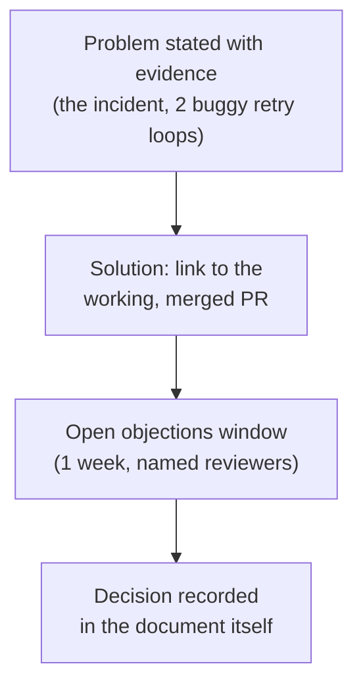
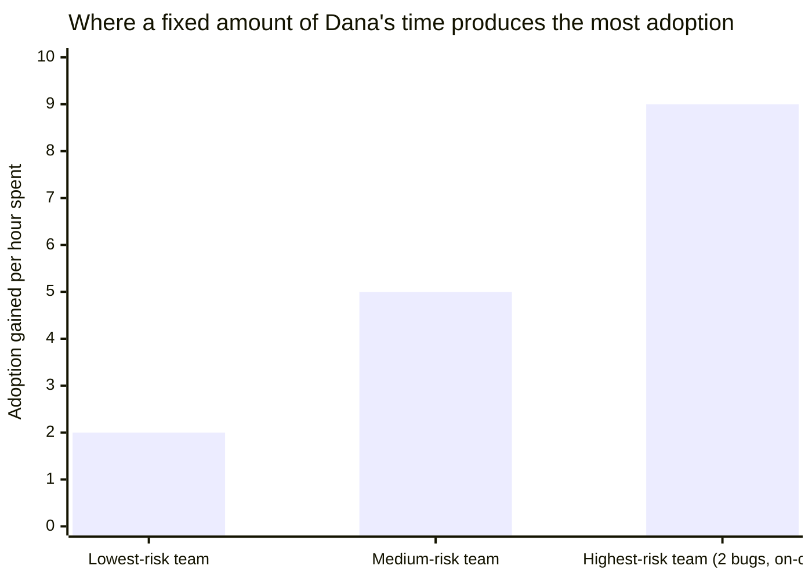

import Checkpoint from "../../../components/Checkpoint.astro";
import LevelIntro from "../../../components/LevelIntro.astro";

L1 showed Dana getting three independent teams onto one shared retry
library in six weeks with no authority over any of them. L2 breaks that
outcome down into the four channels she actually used — code, writing,
review, and relationships — and, more importantly, the order she used
them in, because doing them out of order is the single most common way
this kind of push fails.

<LevelIntro
  items={[
    "What each of the four channels actually does",
    "Why code has to come before the RFC, not after",
    "Leverage points: where a small nudge changes the most code",
  ]}
/>

## Channel 1: code — proof before proposal

Before Dana wrote a single word about the problem, she fixed it in
payments' own codebase: a small, working `withRetry()` wrapper that
checks whether an HTTP status is in a retryable set (`429`, `502`,
`503`, `504`) before retrying anything, backed by tests and already
running in production. What does a working implementation prove that an
argument for one, however well-reasoned, cannot?

A working implementation proves the idea survives contact with real
code — real edge cases, real test coverage, real production traffic —
before anyone else is asked to trust it. An argument for a retry
library can be debated forever in the abstract ("what about idempotency
keys," "what if the timeout should be configurable"); a merged PR with
tests answers most of those questions by existing. This is also why
skipping straight to the RFC is a common failure mode: a proposal with
no working code behind it reads as untested opinion, and untested
opinion is exactly what busy engineers are trained to deprioritize.

<Checkpoint question="A colleague argues Dana should have written the RFC first, so all three teams could weigh in on the design before any code existed. What does writing the code first actually buy that writing the RFC first doesn't?">

Writing the code first turns the RFC from "here's an idea, what do you
think" into "here's a working implementation, already solving the
problem in one codebase — here's why the other two should adopt it."
The second framing is dramatically cheaper for a reader to evaluate:
they're judging a concrete, tested thing instead of speculating about
one that doesn't exist yet. It also means the RFC's design questions get
resolved by what the code actually needed to handle (a real edge case in
payments' error responses, say) rather than debated hypothetically,
which tends to produce a better design in less total discussion time.
Writing the RFC first isn't wrong in every case — for a decision that's
genuinely still open, gathering input before building is the right
order (see L3's discussion of when to invert this) — but for a fix
Dana was already confident in, code-first collapsed weeks of hypothetical
debate into a much shorter round of concrete review.

</Checkpoint>

## Channel 2: writing — the artifact that outlives the conversation

A Slack thread convinces the people currently reading it, and nobody
else — three days later it's buried, and a fourth team who joins the
conversation late has no way to catch up except asking someone to
retype the whole argument. Dana's RFC did three things a conversation
structurally cannot: it named the specific problem with evidence (the
incident, the two other teams' code), it presented the working `withRetry()`
fix as the proposed solution rather than an open question, and it had an
explicit space for objections with a stated deadline for raising them.

The RFC is short — under two pages — because its job isn't to be
comprehensive, it's to be a stable reference point three different
people can point back to weeks later without re-litigating it from
scratch. A 15-page design doc that nobody finishes reading does less
work than a 1-page RFC everyone actually reads.

## Channel 3: review — the pattern lands one PR at a time

The RFC alone didn't move any code. What moved the code was Dana
reviewing pull requests on notifications and search-indexing over the
following weeks and, specifically at the moment an author was already
touching retry-adjacent code, pointing at the shared library instead of
letting them re-implement it: **"There's a `withRetry()` helper from the
payments RFC that already handles this — want to pull it in here instead
of the manual loop?"** Why does this land better than a team-wide
announcement asking everyone to migrate?

A review comment arrives exactly when the author is already thinking
about the problem the comment is about — mid-PR, with the relevant code
open in front of them — which is the cheapest possible moment to change
what they're doing. A team-wide announcement, by contrast, asks everyone
to remember a request at some unspecified future point when it becomes
relevant, which is exactly the kind of deferred, unscheduled work that
quietly never happens (the same failure mode L1 identified in "just
tell people"). Review-driven adoption is slower per-instance than a
mandate would be, but it doesn't require a mandate Dana doesn't have.

## Channel 4: relationships — why the RFC got read at all

None of the first three channels work if the people on the receiving
end don't trust Dana's judgment enough to spend their attention on it.
That trust wasn't built by this RFC — it was built over the prior year,
through unrelated interactions: pairing with the notifications lead on
an unrelated debugging session, giving specific and useful (not just
critical) code review on search-indexing's PRs, being visibly credited
with catching a subtle bug months earlier.

<Checkpoint question="Which of the four channels, if it were missing, would make the other three fail even if each was individually well-executed?">

Relationships. A perfectly-written RFC from someone with no track record
of good judgment competes with forty other unread documents in a team
lead's queue; the same RFC from someone whose past reviews and fixes
have consistently been right gets read first, because the reader is
using trust as a filter for where to spend limited attention. This is
why relationships aren't a soft add-on to the technical work — it's the
channel that determines whether the other three even get a hearing.

</Checkpoint>

| Channel       | What it proves                            | Fails if skipped                                         |
| ------------- | ----------------------------------------- | -------------------------------------------------------- |
| Code          | The idea survives contact with reality    | RFC reads as untested opinion                            |
| Writing       | A stable, citable statement of the plan   | Discussion re-litigates from scratch every time          |
| Review        | The pattern reaches code one PR at a time | Adoption depends on everyone remembering an announcement |
| Relationships | The other three channels get attention    | The RFC sits unread; the review comment reads as pushy   |

## Where the leverage actually concentrates

Not every team, PR, or conversation is worth the same amount of Dana's
limited time. The teams with the worst version of the bug (the two
retrying non-retryable errors) and the engineers whose code review
comments carry the most weight with their own teams are the highest-
leverage places to spend the review and relationship channels — fixing
the one instance that's already on fire, and getting the pattern
endorsed by someone other than Dana, does more to spread adoption than
spending equal time on the team that already had a mostly-correct
implementation.

L3 walks through Dana's actual six weeks against this model — including
the one team lead who pushed back on the RFC, what specifically changed
their mind, and where the "code first" order from Channel 1 gets
inverted on purpose.
