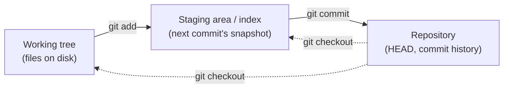
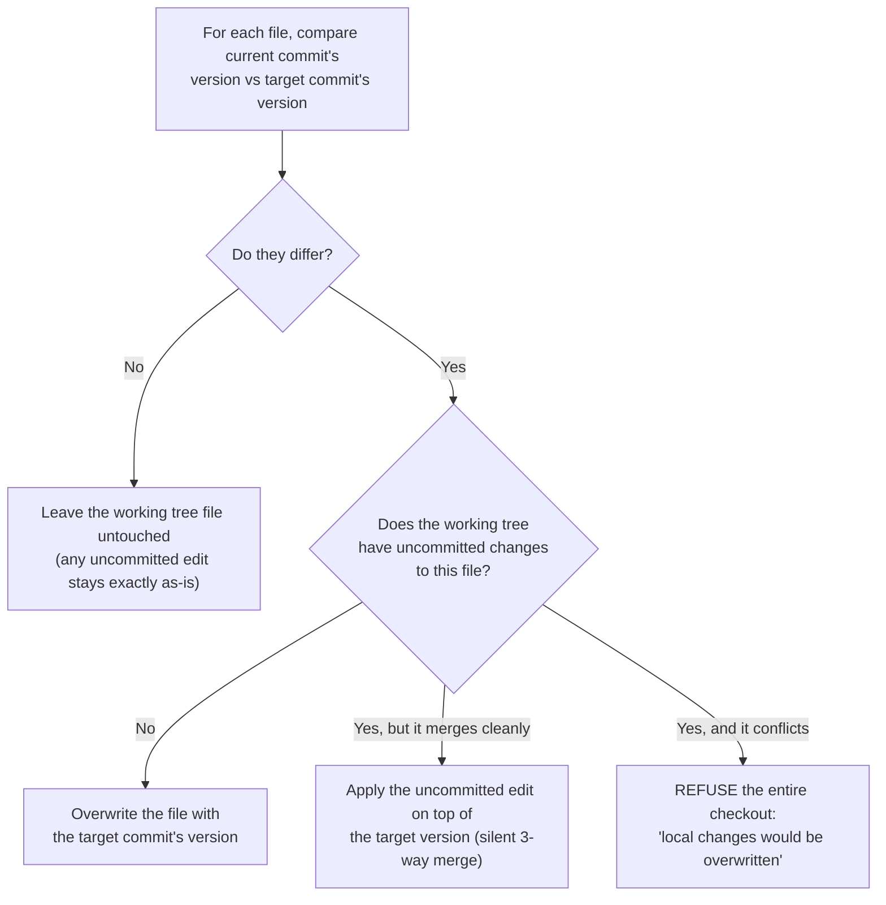

import LevelIntro from "../../../components/LevelIntro.astro";
import Checkpoint from "../../../components/Checkpoint.astro";

L1 showed _that_ an uncommitted edit can silently follow you across a branch switch and
then vanish. L2 opens up the mechanism behind that: what `git status` is actually
comparing, and the exact per-file decision `git checkout` makes.

<LevelIntro
  items={[
    "The two diffs behind git status",
    "The per-file decision checkout makes",
    "Reproducing both outcomes from a real repo",
  ]}
/>

## Three areas, two diffs

**`git status` reports things like "changes not staged for commit" and "changes to be
committed" — what exactly is being compared to produce those two different categories?**



`git status` runs two independent diffs: **working tree vs. index** ("changes not staged
for commit" — edits you've made but haven't `git add`ed yet), and **index vs. HEAD**
("changes to be committed" — edits you've staged but haven't `git commit`ted yet). A file
can be in a different state in all three areas simultaneously — edited on disk, staged at
an older version, and committed at an even older one — which is exactly why `git status`
needs two separate diffs, not one, to describe it precisely.

## What `checkout <branch>` actually decides, per file

**Given that a checkout has to update potentially thousands of files at once, how does it
decide what to leave alone?** Per file, checkout effectively asks one question: _does this
file's content differ between the current commit and the target commit?_



This is the exact mechanism from L1's incident: `shared-config.js` was identical between
`feature-a` and `feature-b`'s last commits, so branch B was taken — the uncommitted edit
was never at risk, because checkout never needed to touch that file at all.

Tracked and untracked files add one more beginner distinction:

| File kind      | What Git knows                                            | What checkout compares                                            |
| -------------- | --------------------------------------------------------- | ----------------------------------------------------------------- |
| Tracked file   | The file exists in commits or has been added to the index | The committed versions on the current and target branch           |
| Untracked file | The file is on disk, but not promised to history yet      | Usually nothing, because there is no committed version to compare |

That means a brand-new file can be visible in `git status` without belonging to any branch
or commit yet. It is at least as easy to forget as a modified tracked file, so the same
habit applies: check status before switching, restoring, or cleaning.

<Checkpoint question="A file has uncommitted edits in the working tree, and it is identical between the current branch's last commit and the target branch's last commit. Per the flowchart above, which path does checkout take, and does the edit survive the switch?">

Path B → "No" → "Leave the working tree file untouched." Checkout only has a reason to
touch a file when its committed content differs between the two branches; since this
file's committed content is identical on both, checkout has nothing to reconcile and
simply leaves the working tree copy exactly as it is — uncommitted edit included. The
edit survives, not because Git specially protected it, but because Git never needed to
look at it in the first place.

</Checkpoint>

## Reproducing the two different outcomes for real

**The same starting point — an uncommitted edit — leads to two very different outcomes
depending on one fact: did the target branch's committed version of the file actually
change?** Both transcripts below are real, run against an actual two-branch repo.

**Case 1 — the file is identical on both branches (silent carry-over):**

```
$ git checkout feature-a
$ echo "shared config v1 - my local tweak" > shared-config.js
$ git status --short
 M shared-config.js

$ git checkout feature-b
Switched to branch 'feature-b'
M	shared-config.js

$ git status --short
 M shared-config.js
$ cat shared-config.js
shared config v1 - my local tweak
```

No warning, no conflict — the edit is now sitting on `feature-b`'s working tree, exactly
as it was on `feature-a`, because `shared-config.js` never differed between the two
branches' commits in the first place.

**Case 2 — the file genuinely diverged between branches (refused):**

```
$ git checkout feature-a
$ echo "feature-a uncommitted divergent edit" > shared-config.js
$ git status --short
 M shared-config.js

$ git checkout feature-b
error: Your local changes to the following files would be overwritten by checkout:
	shared-config.js
Please commit your changes or stash them before you switch branches.
Aborting
```

Here, `feature-b`'s committed version of `shared-config.js` genuinely differs from
`feature-a`'s, and applying the uncommitted edit on top of it would conflict — so Git
stops the entire checkout rather than risk silently discarding or corrupting the edit.
This is the one case where Git's default behavior actively protects you; the "gone
without warning" experience in L1 only happens in Case 1's silent-carry-over path.

<Checkpoint question="Case 1 succeeds silently and Case 2 is refused with an error. Which of the two is actually the riskier outcome for the developer's uncommitted work, and why?">

Case 1 (the silent success) is the riskier one, precisely because nothing about it looks
risky. Case 2 stops the developer in their tracks with an explicit error naming the file
at risk — it is impossible to lose that edit by accident, because Git will not proceed
until the developer deals with it. Case 1 gives no such signal: the edit is carried over
correctly this time, but nothing marks it as "still uncommitted, still fragile," so a
later unrelated command on the new branch (as in L3's incident) can discard it without
any indication that anything of value was even there.

</Checkpoint>

## The practical takeaway

The single fact that resolves the confusion in both directions: **an uncommitted edit is
not "on" any branch — it's sitting in the working tree, independent of whatever branch is
currently checked out.** Whether it follows you silently, gets refused, or eventually gets
discarded by an unrelated cleanup command depends entirely on whether the target branch's
committed version of that specific file happens to match what you started from — not on
which branch you "meant" the edit for.
