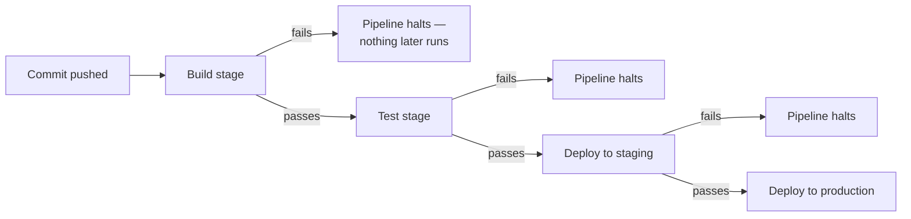

import LevelIntro from "../../../components/LevelIntro.astro";
import Checkpoint from "../../../components/Checkpoint.astro";

L1 named the stages and warned that a bypassed gate can turn "all green"
into a lie. This level builds the actual mental model of what a gate is,
how an artifact is supposed to move between environments, and why
rollback can't be improvised.

<LevelIntro
  items={[
    "Gates as the thing that makes a pipeline protective",
    "Build-once, promote-everywhere artifact handling",
    "Rollback as a decision made before an incident, not during one",
  ]}
/>

## A pipeline as a chain of gates

**What actually determines whether a commit ends up running in
production — is it just "the pipeline finished"?**



"The pipeline finished" and "the pipeline finished because every gate
passed" are different claims. A pipeline that always reaches the final
stage regardless of intermediate results isn't a safety mechanism — it's
a sequence of steps that happen to run one after another. The gates
between stages, not the stages themselves, are what make a pipeline
protective. A **gate** is a door with a condition: if the condition
fails, the next room should not open.

## Continue-on-error: a scalpel, not a permanent setting

**Is there ever a legitimate reason to let a pipeline continue after a
step reports failure?** Yes — a genuinely flaky, non-blocking check (like
a slow integration test known to occasionally time out for infrastructure
reasons unrelated to code correctness) is a real, if imperfect, case for
tolerating failure temporarily. The problem in the incident wasn't that
the flag exists — it's that it was applied to the actual test suite
itself, the one gate specifically responsible for catching real bugs, and
then left there long after its original justification (the specific flaky
test) was gone:

```text
Legitimate temporary use:
  A known-flaky, LOW-STAKES check, with a ticket to fix it,
  and a plan for when the override gets removed

What happened instead:
  Applied to the actual correctness gate (the test suite)
  No ticket, no removal plan
  Stayed in place indefinitely after its original reason vanished
```

<Checkpoint question="A team adds continue-on-error: true to a linting step that only checks code style, with a ticket filed to remove it once a legacy module is reformatted. Is this the same mistake as the incident described above?">

No. The distinguishing factor isn't whether `continue-on-error` is used
at all — it's _what gate it's applied to_ and _whether there's a removal
plan_. A linting step checking style conventions is advisory: a style
violation doesn't mean the code is broken, only that it doesn't match a
convention. Tolerating failure there temporarily, with a ticket tracking
its removal, is exactly the "legitimate temporary use" case. The incident
happened because the same flag was applied to the test suite — the one
stage whose entire job is catching actual bugs — and then nobody tracked
its removal. The flag itself isn't the problem; applying it to a
correctness gate with no expiration plan is.

</Checkpoint>

## Artifact promotion: build once, deploy the same thing everywhere

**If staging and production are separate environments, does the pipeline
rebuild the application separately for each one?** A well-structured
pipeline builds the deployable artifact exactly once, then promotes that
identical artifact through staging and production in sequence — it never
rebuilds from source for each environment. This matters because rebuilding
per-environment reopens the exact risk environment-parity practices exist
to close: a dependency resolving to a slightly different version between
builds, a compiler flag differing by environment, anything that could make
"tested in staging" and "running in production" refer to two subtly
different artifacts instead of the same one. The everyday version is:
inspect the same sealed box in each room, not a freshly-packed box that
only looks similar.

<Checkpoint question="A team's pipeline runs 'npm run build' separately inside the staging deploy job and again inside the production deploy job, using the same source commit both times. Does using the same commit guarantee staging and production are running the same artifact?">

No. "Same commit" guarantees the same _source_, not the same _build
output_. Rebuilding separately means each build resolves its own
dependency versions at that moment, runs on whatever build-tool version
happens to be installed on that runner, and applies whatever environment
variables or flags are set for that specific job — any of which can
differ between the two runs even with identical source. That's precisely
the drift artifact promotion is designed to prevent: build the artifact
once, then move that exact file (or container image, or package) through
staging and into production unchanged, so "it passed in staging" is a
claim about the literal thing running in production, not about a
similar-looking rebuild of it.

</Checkpoint>

## Rollback has to be a decision made in advance, not during an incident

**Once a bad deploy reaches production, is "roll back" always
straightforward?** Only if the pipeline was built with rollback in mind
before the incident — keeping the previous artifact readily deployable,
and having a fast, well-rehearsed path back to it. Deciding how rollback
will work _during_ an active incident, under pressure, with a team that's
never actually exercised the rollback path before, is far slower and
riskier than a path that was designed and tested in advance. The next
unit, `/infra-delivery/deployment-automation/`, continues the same idea:
deployment steps should be repeatable enough that recovery is not a
guessing exercise.

## The generalizable lesson

**Is the fix "never allow any pipeline step to continue past a
failure"?** Not quite — some checks genuinely are advisory rather than
blocking, and forcing every failure to halt the pipeline would make
legitimately non-critical flakiness as disruptive as a real bug. The
actual skill is being deliberate about _which_ gates are allowed to be
bypassed and under what conditions, keeping that list short and reviewed,
and treating "we bypassed a gate" as something that needs a visible,
time-bound reason — not a setting that quietly becomes permanent.
