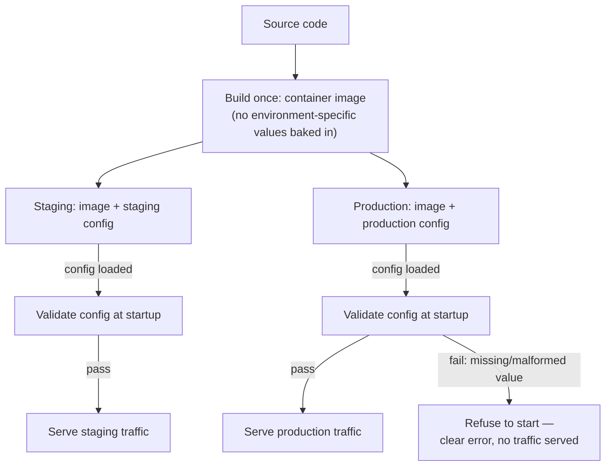

import Scenario from "../../../components/Scenario.astro";
import LevelIntro from "../../../components/LevelIntro.astro";
import Checkpoint from "../../../components/Checkpoint.astro";

L1's timeout bug wasn't a code bug — the exact same container image ran in
both environments. It was a config bug: a value that should have been set
explicitly in production was instead silently supplied by a default deep
inside the code. To see why that happened, and how to stop it happening
again, start from a more basic question:

**If the code is genuinely identical in staging and production, where
should the values that _are_ allowed to differ actually live — and who's
responsible for making sure they're set correctly?**

<LevelIntro
  items={[
    '"Build once, configure per environment" and how it differs from parity',
    "The three places config can live, and the real trade-off between them",
    "Fail-fast validation: catching bad config at startup, not mid-request",
  ]}
/>

## Build once, configure per environment

`deployment-automation` covers _how_ a build gets promoted through a
pipeline without being rebuilt per stage. This unit is about what makes
that safe in the first place: the build artifact itself must not contain
anything environment-specific. If a database URL or an API key were
baked into the container image at build time, promoting that same image
from staging to production would either point production at staging's
database, or require a separate rebuild per environment — which defeats
the entire point of "the thing you tested is the thing you ship."

The artifact is identical; only the config **injected at deploy time**
differs. That's the whole model: code answers "what should happen,"
config answers "what's true about this environment right now."

This is a narrower problem than `environment-parity`, and it's worth being
precise about the difference. Parity is about eliminating _accidental_
drift — nobody decided the CI runner should have a different Node version
than production, it just happened. Config management is the opposite
situation: staging is **supposed** to point at a different database than
production, **supposed** to use a lower rate limit, **supposed** to have
different API keys. The goal here isn't to make the values identical —
it's to make sure the differences are the ones someone actually chose,
not values that silently diverged because nobody double-checked them.

<Checkpoint question="A teammate says: 'if config values are allowed to differ between environments on purpose, isn't that just... drift? Isn't that the exact thing environment-parity is trying to prevent?'">

No — these are different axes. Parity is about the environment
_executing_ the code: the OS, the runtime version, installed libraries —
things that should be identical everywhere so the code's behavior doesn't
depend on where it runs. Config is about environment-specific _inputs_ to
that identical code: a database URL, a timeout, a rate limit — values
that are supposed to differ because staging and production are genuinely
different systems with different scale and different downstream
dependencies. The failure mode this unit cares about isn't "config
differs" (that's expected); it's "config differs by accident, or a value
that should be set explicitly is silently missing" — L1's timeout bug is
exactly that: not an intentional difference, a forgotten one.

</Checkpoint>

## Where config actually lives

| Mechanism                                            | What it's good for                           | Real trade-off                                                                                                         |
| ---------------------------------------------------- | -------------------------------------------- | ---------------------------------------------------------------------------------------------------------------------- |
| Environment variables                                | Simple, universal, no extra tooling          | Easy to typo or forget to set — nothing enforces it exists until code runs it                                          |
| Per-environment config files                         | Versioned, diffable, reviewable in a PR      | Can't safely hold secrets (API keys, DB passwords) in version control                                                  |
| Secrets manager (e.g. Vault, cloud KMS-backed store) | Encrypted at rest, access-audited, rotatable | Adds a real runtime dependency and operational surface — the service can't start if it can't reach the secrets manager |

In practice, most real services use a mix: non-sensitive, per-environment
values (a timeout, a feature flag, a rate limit) as environment variables
or a config file; sensitive values (API keys, database credentials,
signing secrets) from a secrets manager, injected as environment
variables at deploy time so the application code still reads them the
same way regardless of where they came from.

None of these three mechanisms, by itself, would have caught L1's bug —
an environment variable that's simply never set doesn't announce itself.
A config file with a missing key doesn't either. The mechanism that
catches it is the next one.

## Fail-fast validation: check before you serve traffic

**If a required config value is missing, when should the service find
out — the moment it starts, or the moment the first request that needs
it arrives?**

The answer that avoids L1's outage is: at startup, before the service
accepts any traffic at all. A service that starts successfully with a
missing or malformed value is a service that looks healthy — passes its
health check, accepts connections — while quietly running in a broken
state. The first real signal anyone gets is a failure deep inside a
request path, exactly like L1's payment timeout: no crash, no startup
error, just individual requests failing for a reason nobody can see from
the outside.

Fail-fast validation inverts that: read every required config value at
startup, check each one is present and well-formed, and if anything is
wrong, refuse to start and print exactly what's missing or invalid. A
service that never starts is loud and immediate. A service that starts
broken is quiet and delayed — often until the exact moment real load
exposes it, which is precisely what happened in L1.

<Checkpoint question="Why does 'the service passed its health check' not prove the service is correctly configured?">

A typical health check verifies the process is up and can respond to a
basic ping — it doesn't inspect whether every config value the service
depends on is present, well-formed, or reasonable for this environment.
L1's production service passed every health check: it started, it
accepted connections, it served most requests fine. The payment timeout
default was only ever exercised by requests that actually hit the slow
path — which a shallow health check never does. "Started successfully"
and "configured correctly" are different claims, and only fail-fast
config validation checks the second one.

</Checkpoint>

L3 builds this validation layer for real: a typed config loader with
explicit defaults, a startup check that catches L1's exact bug class
before a single request is served, and the harder line to draw — telling
a legitimate per-environment difference apart from an actual mistake.
