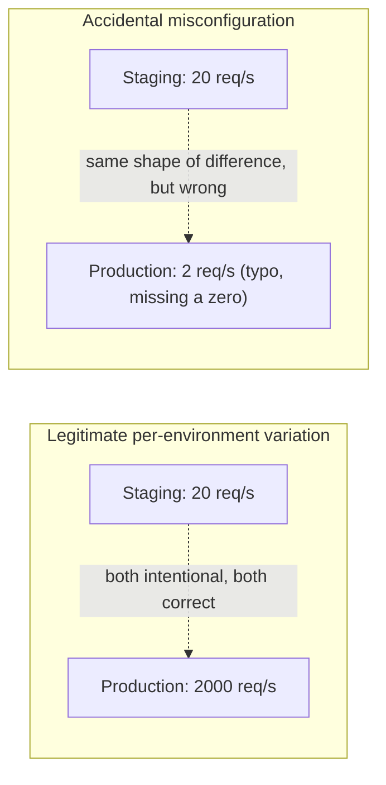

import Scenario from "../../../components/Scenario.astro";
import LevelIntro from "../../../components/LevelIntro.astro";
import Checkpoint from "../../../components/Checkpoint.astro";

<Scenario label="Same bug, different consequence">
  <Fragment slot="facts">
    <div class="not-prose flex flex-col gap-1.5 text-sm text-slate-700 dark:text-slate-300">
      <div class="flex items-center gap-1.5"><span>❌</span> Without validation: bug found by customers, in production, mid-incident</div>
      <div class="flex items-center gap-1.5"><span>✅</span> With validation: bug found by the deploy process, before any traffic is served</div>
    </div>
    <div class="not-prose mt-3 rounded border border-amber-300 bg-amber-50 p-1.5 text-xs dark:border-amber-800 dark:bg-amber-950">
      Same missing environment variable. The only thing that changed is
      <em>when</em> the service checks for it.
    </div>

  </Fragment>

L1's outage and this section's fix are the same bug, caught at two
different points in time. Without a validation layer, `PAYMENT_GATEWAY_TIMEOUT_MS`
being unset in production is discovered by a customer's failed checkout.
With one, it's discovered by the deploy itself, seconds after the new
container starts — before it's added to the load balancer, before it
serves a single request.

</Scenario>

<LevelIntro
  items={[
    "A typed config loader with explicit (not silent) defaults",
    "A startup validator that fails fast on missing or malformed values",
    "Telling a legitimate per-environment difference from an actual bug",
  ]}
/>

## The loader: read config once, with types, not scattered `process.env` reads

The first structural problem in L1's code wasn't the missing environment
variable — it was that the fallback lived inline, next to the one call
site that happened to use it, with no record anywhere that this value was
supposed to be set explicitly in production. A config loader centralizes
every value the service depends on into one typed object, built once at
startup:

```typescript
// config.ts — one place that knows every config value this service needs
interface AppConfig {
  paymentGatewayTimeoutMs: number;
  paymentApiKey: string;
  rateLimitPerSecond: number;
  featureFlagNewCheckout: boolean;
}

// Source of truth for env vars. In production this reads process.env;
// tests and the sandboxed exercises below pass a plain object instead,
// so the same logic is testable without a real process environment.
function readConfig(env: Record<string, string | undefined>): AppConfig {
  return {
    paymentGatewayTimeoutMs: env.PAYMENT_GATEWAY_TIMEOUT_MS
      ? Number(env.PAYMENT_GATEWAY_TIMEOUT_MS)
      : NaN, // no silent numeric default — see why below
    paymentApiKey: env.PAYMENT_API_KEY ?? "",
    rateLimitPerSecond: env.RATE_LIMIT_PER_SECOND
      ? Number(env.RATE_LIMIT_PER_SECOND)
      : NaN,
    featureFlagNewCheckout: env.FEATURE_NEW_CHECKOUT === "true",
  };
}
```

Notice what's deliberately absent: no `?? 3000` fallback for the timeout.
L1's bug wasn't that a default existed — sensible defaults are fine for
genuinely optional values. It's that a _required_ value (a payment
gateway timeout materially affects correctness) had a default that made
a missing environment variable indistinguishable from a deliberately
chosen one. `NaN` here is a deliberate "not yet validated" placeholder —
the validator below is what turns a missing value into a startup failure
instead of a silently-accepted 3000.

## The validator: fail fast, with a clear message

```typescript
// config.ts (continued)
class ConfigError extends Error {}

function validateConfig(config: AppConfig): AppConfig {
  const errors: string[] = [];

  if (!config.paymentApiKey) {
    errors.push("PAYMENT_API_KEY is required and was not set");
  }

  if (!Number.isFinite(config.paymentGatewayTimeoutMs)) {
    errors.push(
      "PAYMENT_GATEWAY_TIMEOUT_MS is required and must be a number " +
        `(got: ${config.paymentGatewayTimeoutMs})`,
    );
  } else if (
    config.paymentGatewayTimeoutMs < 1000 ||
    config.paymentGatewayTimeoutMs > 60000
  ) {
    // A "reasonable range" check, not an exact-value check — see below
    // for why the line has to be drawn this way, not tighter.
    errors.push(
      `PAYMENT_GATEWAY_TIMEOUT_MS is outside a sane range (1000-60000ms), ` +
        `got: ${config.paymentGatewayTimeoutMs}`,
    );
  }

  if (
    !Number.isFinite(config.rateLimitPerSecond) ||
    config.rateLimitPerSecond <= 0
  ) {
    errors.push(
      `RATE_LIMIT_PER_SECOND must be a positive number, got: ${config.rateLimitPerSecond}`,
    );
  }

  if (errors.length > 0) {
    throw new ConfigError(
      `Refusing to start — invalid configuration:\n  - ${errors.join("\n  - ")}`,
    );
  }

  return config;
}

function loadValidatedConfig(
  env: Record<string, string | undefined>,
): AppConfig {
  return validateConfig(readConfig(env));
}
```

Run against L1's actual production environment (no `PAYMENT_GATEWAY_TIMEOUT_MS`
set), this throws immediately:

```text
ConfigError: Refusing to start — invalid configuration:
  - PAYMENT_GATEWAY_TIMEOUT_MS is required and must be a number (got: NaN)
```

That's the whole fix, structurally: the exact same missing value, but
discovered by a deploy failing loudly in a terminal instead of by
customers failing quietly at checkout.

<Checkpoint question="Why does the validator check that the timeout falls within a range (1000-60000ms) instead of just checking that it's present and numeric?">

Presence-and-type checks alone would have let a technically-valid but
operationally absurd value through — a timeout of `1` millisecond, or
`5000000` (over an hour), is a real number and would pass a bare
`Number.isFinite` check, but either one is almost certainly a typo, not a
deliberate choice. A range check catches the class of mistake that's
"valid-shaped but not a value anyone would sanely configure," which
presence checks alone can't. It still isn't a guarantee of correctness —
that limitation is the subject of the next section.

</Checkpoint>

## The harder line: legitimate variation vs. an actual bug

L1 and the validator above cover one failure mode: a required value
that's simply missing. But config management has a second, subtler
failure mode, and it's the one strict validation can make _worse_ if
you're not careful about where the line goes.

Consider `RATE_LIMIT_PER_SECOND`. Staging realistically needs something
like 10-50 requests/second — that's roughly what a handful of engineers
poking at a test environment generates. Production needs 500-5000,
because it's serving real traffic at real scale. **Both of these are
correct.** They're supposed to differ by two orders of magnitude — that's
not drift, it's the entire point of having separate environments sized
for separate loads.



A validator that says "rate limit must be within 20% of staging's value"
would correctly catch the second case — but it would also **reject the
first one**, which is exactly the config a healthy production deployment
needs. That's the trap of over-strict validation: a check tight enough to
catch every accidental typo is usually also tight enough to block every
legitimate scaling difference, and a validator that blocks legitimate
deploys gets disabled or worked around within a week, at which point it
catches nothing at all.

The range check used above (`1000 <= paymentGatewayTimeoutMs <= 60000`,
`rateLimitPerSecond > 0`) draws the line differently: it defines the
outer bounds of _anything a human would ever sanely configure_, not the
expected value for any one environment. It will happily accept both
staging's 20 req/s and production's 2000 req/s — and it will still catch
a negative number, a zero, or a value with a missing digit that lands
outside all plausible bounds. What it explicitly does **not** try to do
is guess whether 2000 is the _right_ number for production specifically
— that's a capacity-planning judgment a human makes deliberately, not
something a startup check can infer from the number alone.

<Checkpoint question="A new engineer proposes tightening the rate-limit check so staging and production must each match a hardcoded expected value exactly, to 'really' catch misconfiguration. What's the problem with that?">

It would work right up until the next time either environment's traffic
pattern legitimately changes — a traffic spike that calls for temporarily
raising production's limit, or a load test that needs staging's limit
raised for a day, would now fail validation and block a deploy that is
otherwise completely correct. Hardcoding an expected value conflates
"this differs from what I expect right now" with "this is wrong," and
those aren't the same claim. The range check's job is to catch
values nobody would ever sanely choose, not to freeze each environment's
config at today's specific number — the latter isn't validation, it's
just moving the maintenance burden from "the app might misbehave" to
"the validator constantly needs updating by hand."

</Checkpoint>

This is also validation's real ceiling, worth stating plainly: a range
check can confirm a rate limit is a positive number under a sane cap. It
cannot tell you that 2000 req/s is actually too low for this Black
Friday, or that 20 req/s in staging is now too tight for a new load test
someone's about to run. **Config validation catches shape and presence
bugs — a value that's missing, malformed, or absurd. It cannot catch "the
number is technically valid but still wrong for this environment right
now."** That second class of problem is a human capacity-planning
decision, revisited deliberately, not something more validation code can
resolve on its own.

**Two extensions worth thinking through beyond this worked example:**

What changes if a value like the feature flag needs to be toggled at
runtime — turned off during an incident — without waiting for a
redeploy? Startup validation alone doesn't help here: it only runs once,
at boot. A runtime-toggleable flag needs its own mechanism (a config
service the app polls or subscribes to, not just an environment
variable read once at startup), and that mechanism now needs its _own_
validation on every change, not just at deploy time — the fail-fast
principle still applies, but it has to run continuously instead of once.

And what changes if two config values need to be consistent _with each
other_, not just individually valid — say, a connection-pool size that
must stay below the database's own max-connections limit, or a timeout
that must stay shorter than a caller's own timeout upstream? Each value
in isolation can pass every check above and the combination can still be
wrong. That needs a validation rule that looks across multiple config
values at once, not a per-field check — a real extension of the same
`errors.push(...)` pattern above, just comparing two fields against each
other instead of one field against a range.
