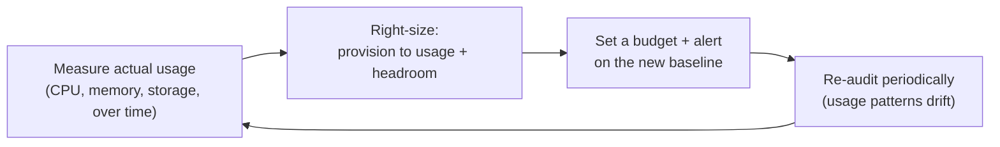

import LevelIntro from "../../../components/LevelIntro.astro";
import Checkpoint from "../../../components/Checkpoint.astro";

L1's bill tripled without a single dramatic incident. That's the pattern
worth understanding precisely: cost waste doesn't announce itself the way
a crashing service does. So start from the sharper question:

**If nothing pages anyone when spend creeps up, what has to exist instead
to catch it — and what, specifically, was each of L1's three decisions
actually wasting?**

<LevelIntro
  items={[
    "Right-sizing: measured usage vs. guessed-high capacity, with real numbers",
    "Why cost needs the same proactive visibility infra-observability builds for reliability",
    "The three waste patterns from L1, each with a concrete fix",
  ]}
/>

## Right-sizing: provision to measured usage, not a guess

**Staging was sized like production "just in case." How far off was that
guess from what staging actually needed?**

Right-sizing means provisioning a resource's capacity to match what it
actually, measurably uses — plus a deliberate, justified safety margin —
instead of a number chosen because it sounded safe. L1's staging
environment was provisioned assuming it might need 4x normal capacity for
occasional load tests. Once someone actually measured it:

| Metric                    | Guessed need ("just in case") | Measured actual need            |
| ------------------------- | ----------------------------- | ------------------------------- |
| Peak CPU utilization      | Sized for 4x normal load      | Never exceeded 1.2x normal load |
| Instance size             | Same as production (16 vCPU)  | Comfortably fits in 4 vCPU      |
| Monthly cost at that size | ~$3,600                       | ~$900 right-sized               |

The gap between "guessed 4x capacity" and "measured need was 1.2x" is the
entire waste — nobody was being reckless, nobody made an obviously bad
call. The instance was provisioned once, before there was any usage data
to measure against, and then never revisited once real data existed. That
second half — the missing revisit — is the actual failure. Right-sizing
isn't a one-time sizing exercise; it's a loop: measure, size to what was
measured plus headroom, and come back later and measure again.

The loop only works if step D actually happens — a right-sizing decision
made once and never revisited quietly drifts stale the same way any
one-time snapshot does, as traffic patterns, team size, or the product
itself changes.

<Checkpoint question="Staging was originally sized for '4x normal load, just in case.' Suppose measured peak usage really did spike to 3.5x normal load once a quarter during a real load test. Does that mean the original 4x sizing was justified after all?">

Not necessarily, and this is the trap right-sizing has to avoid: a rare,
predictable, occasional spike doesn't require the resource to be
permanently provisioned at that peak size all month. The right-sized
answer is closer to "provision for the actual day-to-day usage (around
1.2x), and either temporarily scale up for the known quarterly load test
or accept a deliberate, budgeted spend spike for that one event" — not
"pay for peak capacity 24/7 for a need that occurs a few days a year."
Right-sizing to the 99th-percentile case, forever, is the same
over-provisioning mistake wearing a more defensible-sounding number.

</Checkpoint>

## The visibility problem: you can't right-size what you never look at

**None of L1's three decisions were hidden. Why did it still take a
finance invoice to surface them?**

This is the same "you don't know what you can't see" theme
`infra-observability` covers for reliability, applied to cost instead. A
runaway CPU metric gets seen because someone built a dashboard and an
alert threshold specifically to watch it. A runaway cloud bill has no
equivalent by default — most teams' only recurring look at total spend is
whenever the invoice happens to arrive, which can be weeks after the
spend already happened. Cost visibility means building the same kind of
deliberate, proactive tracking:

| Reliability version (infra-observability)              | Cost version (this unit)                                      |
| ------------------------------------------------------ | ------------------------------------------------------------- |
| SLI dashboard tracked continuously                     | Cost-by-resource dashboard, tracked continuously              |
| SLO — a committed target on the SLI                    | Budget — a committed spend ceiling for a period               |
| Burn-rate alert — pages before the error budget's gone | Budget-forecast alert — flags before the spend ceiling is hit |
| Periodic SLO review as traffic patterns change         | Periodic right-sizing re-audit as usage patterns change       |

Without this, cost visibility only exists retroactively — after the
money's already spent, the same way L1's twelve green dashboards existed
retroactively to a user-facing outage that had already happened by the
time anyone noticed. The fix in both cases is the same shape: watch the
signal that actually matters, proactively, before it becomes a surprise.

## Three waste patterns, and the fix for each

L1's three contributors aren't unique to that scenario — they're the
common shapes cloud waste takes almost everywhere:

| Pattern                              | What it looks like                                                                                      | Fix                                                                                        |
| ------------------------------------ | ------------------------------------------------------------------------------------------------------- | ------------------------------------------------------------------------------------------ |
| **Idle / forgotten resources**       | Test databases, old staging stacks, unused volumes left running after a project ends                    | Tag resources with an owner and an expiry; automate teardown or a recurring review         |
| **"Just in case" over-provisioning** | An instance or database sized well above measured need, "for safety," never revisited                   | Right-size against real utilization data; re-check on a schedule, not once                 |
| **Unbounded auto-scaling**           | A scaling group with no ceiling — a traffic spike or retry storm can scale cost as high as a bug allows | Set an explicit maximum instance count; alert (don't just silently scale) past a threshold |

<Checkpoint question="A team fixes the 'idle/forgotten resources' pattern by writing a one-time script that deletes every currently-unused test database. Six months later, a new batch of forgotten databases has accumulated again. What did the fix actually miss?">

The one-time cleanup treated this as an incident to resolve rather than a
recurring pattern to prevent. Deleting the current batch of idle
resources fixes today's waste but does nothing about the process gap that
created it — nobody owns tearing resources down when a project ends, and
nothing tags a resource with an expiry or an owner at creation time. The
durable fix is closer to the loop from the right-sizing diagram above:
build recurring visibility (a tagging convention, a scheduled audit) so
the next batch of forgotten resources gets caught in weeks, not
discovered again by accident in another six months.

</Checkpoint>

L3 builds both real halves of this: a right-sizing calculator that turns
observed utilization data into a concrete recommended size and a dollar
savings figure, and a budget-forecast function that flags spend on track
to exceed a threshold before the billing period ends — plus the real
trade-off that right-sizing and unbounded autoscaling both sit in a
genuine tension with reliability, not just cost.
