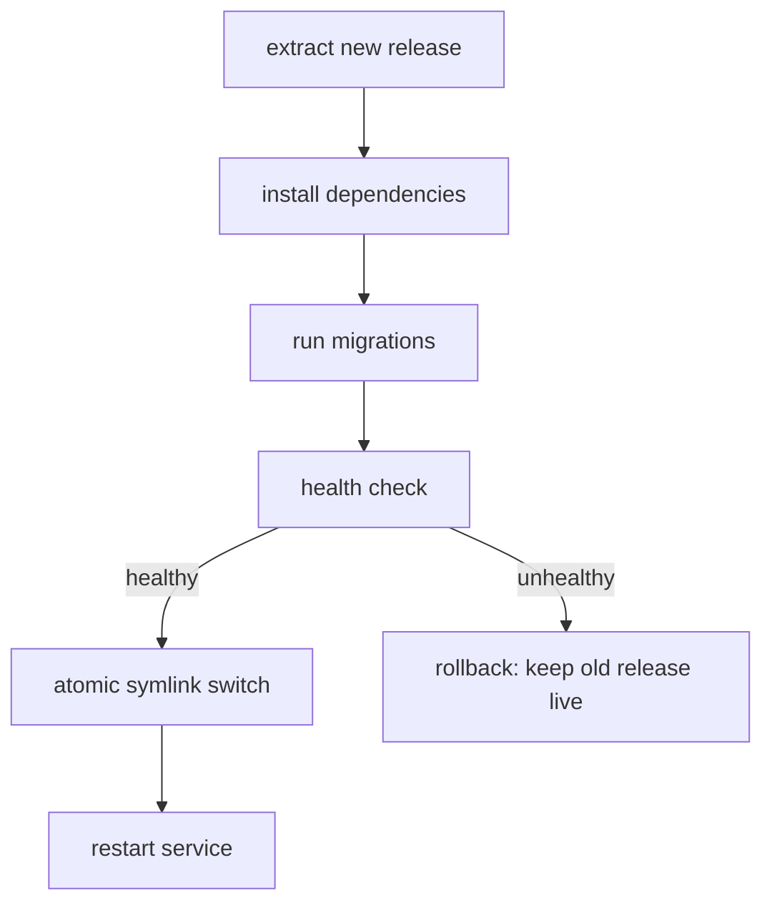

import LevelIntro from "../../../components/LevelIntro.astro";
import Checkpoint from "../../../components/Checkpoint.astro";

L1 named the failure mode behind Deploy 9 — a manual checklist depends on
a human remembering and correctly sequencing every step. L2 works through
what a scripted deploy pipeline actually looks like, step by step, and why
each part of it is specifically what a checklist can't reliably guarantee.

<LevelIntro
  items={[
    "The fixed step order of a scripted pipeline",
    "Why the health check runs before the atomic switch",
    "How an automatic rollback replaces a remembered one",
  ]}
/>

## Turning the checklist into a fixed pipeline

**If the steps were already written down on a wiki page, why did skipping
one still cause an outage?** Because a wiki page is a _suggestion_ —
nothing stops a step from being skipped, reordered, or run against the
wrong release. A scripted pipeline turns the same steps into a fixed
sequence a machine executes exactly the same way every time, with no
step optional and no step reachable out of order.

Before the diagram, translate the infrastructure words into ordinary
objects:

| Term                  | Read it as                                                                              |
| --------------------- | --------------------------------------------------------------------------------------- |
| Release directory     | A separate folder containing one complete version of the app                            |
| Traffic               | The real user requests arriving at the service                                          |
| Health check          | An automatic question: "does this candidate version answer correctly?"                  |
| Migration             | A database shape change the new code needs before it can run safely                     |
| Atomic symlink switch | Changing one pointer so users go from the old folder to the new folder in a single step |

**Why does the health check sit _before_ the atomic switch, not after?**
Because the whole point of checking health at all is to decide whether
traffic should ever reach the new release — checking after the switch
would mean users already hit the broken version before anyone found
out. In a real pipeline, that pre-switch health check normally probes a
candidate process, temporary port, or preview route for the new release
while the old release is still serving users. The switch itself is
deliberately the very last thing that can affect user traffic:
extracting, installing, migrating, and proving the candidate healthy all
happen while the _old_ release is still live and serving every request.

<Checkpoint question="In the diagram above, extract, install, migrate, and the health check all run while the old release is still serving traffic. If a fresh production incident showed that users had briefly received a mix of old and new code during a deploy, which single step in the diagram would you suspect first, and why?">

The atomic symlink switch — specifically, whether it was actually atomic
in the real implementation, or whether something upstream of it (like
extracting the new release directly into the live directory instead of a
separate one) let partially-written files become reachable before the
switch happened. Every step before the switch is deliberately inert with
respect to user traffic: extract, install, migrate, and health-check all
operate on a release directory nobody is being routed to yet. If users
saw a mix of old and new code, the boundary that's supposed to make that
impossible — the single-pointer flip — is the first place to look,
because every earlier step should be invisible to traffic by design.

</Checkpoint>

## What "atomic" actually buys you

**Could the pipeline just overwrite the old release's files in place
instead of switching a symlink?** It could, but then there's a window
— however short — where some files on disk belong to the old version
and some to the new one, and a request arriving in that window could
read a mix of both. A symlink switch has no such window: the pointer
either points at the old release directory or the new one, never
something in between, so every request either gets a fully-old or
fully-new version of the code.

## The rollback is automatic, not remembered

**In the Deploy 9 incident, what would have actually prevented the
outage?** Not a stricter checklist — a health check that runs _before_
traffic ever reaches the new release, wired to automatically restore
the old release if it fails. Nobody has to notice the crash, page
anyone, or remember the rollback command; the pipeline's own next step
_is_ the rollback, conditioned on the health check's result.

|                              | Manual checklist                             | Scripted pipeline                                        |
| ---------------------------- | -------------------------------------------- | -------------------------------------------------------- |
| Step order                   | Enforced by memory/documentation             | Enforced by the script itself                            |
| Skipped step                 | Possible, and often invisible until it fails | Not reachable — each step runs unconditionally           |
| Detecting a bad deploy       | Someone notices symptoms, then investigates  | Health check runs automatically, before traffic switches |
| Recovering from a bad deploy | Someone manually re-runs the old steps       | Rollback step runs automatically on health-check failure |

<Checkpoint question="The table above says a scripted pipeline detects a bad deploy 'before traffic switches.' Given what you now know about step order, would a health check that only ran after 'restart service' still count as catching Deploy 9's mistake before users were affected?">

No. By the time `restart service` has run, the atomic switch has
already happened, which means real traffic is already being routed to
the new release. A health check placed after that point can still
detect the failure and trigger a rollback, but it can no longer prevent
users from having been served the broken version in the meantime — it
would be closer to the manual checklist's "someone notices symptoms,
then investigates" row than to the scripted pipeline's actual guarantee.
The ordering in the diagram — health check strictly before the switch —
is what turns "detect and recover" into "prevent in the first place."

</Checkpoint>

## The generalizable lesson

**Is this really about `npm install` specifically, or about something
more general?** More general: any process where a human is trusted to
remember and correctly sequence multiple steps will eventually fail
that trust, not because people are careless, but because human memory
under time pressure isn't a reliable substitute for a machine that
executes the same steps the same way regardless of how the day is
going. The fix generalizes to any multi-step operational process, not
just deploys — the fewer steps depend on a human doing the right thing
in the right order, the fewer ways there are for a "normal" day to
become an incident.
