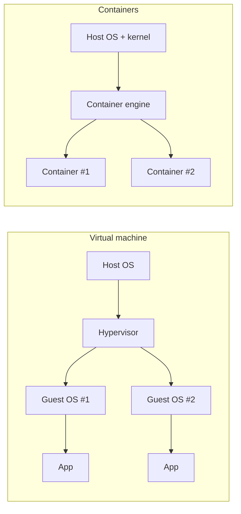

import Scenario from "../../../components/Scenario.astro";
import LevelIntro from "../../../components/LevelIntro.astro";

<Scenario>
  <Fragment slot="facts">
    

      
💻 <strong>Local</strong> — Node 20.11, `npm install` ran months ago, an environment variable set once and forgotten

      
☁️ <strong>Prod</strong> — Node 18.4, a fresh install, none of that environment variable's history

    

    

      

        
Local

        Passes every test, ships with confidence
      

      

        
Prod

        Crashes on the first request, 2 a.m. page
      

    

  </Fragment>

A payments service passes every test on an engineer's laptop and ships. Ten
minutes later it's crash-looping in production. The code didn't change
between the two — the Node version did, and so did a system library the
code silently depended on. Nobody wrote that dependency down anywhere;
it was just _true_ on the laptop and _not true_ on the server.

| Where       | Node version | System libraries     | Result                 |
| ----------- | ------------ | -------------------- | ---------------------- |
| Laptop      | 20.11        | Whatever macOS ships | Every test passes      |
| Prod server | 18.4         | A minimal Linux base | Crash on first request |

**The code was identical in both places. What wasn't identical was
everything around the code — and nothing forced that gap to be visible
before it became an outage.**

</Scenario>

Docker's whole reason for existing is to close that exact gap — by
packaging not just the code, but everything the code assumes is true
around it, into one artifact that's byte-identical everywhere it runs.

<LevelIntro
  items={[
    "Image, container, and layer — what each word actually means",
    "Why the same image can run identically on any machine",
    "Containers vs. VMs, at a glance",
  ]}
/>

Before the Docker words, name the everyday pieces:

| Term        | Plain version                                                               |
| ----------- | --------------------------------------------------------------------------- |
| App         | The program you want to run                                                 |
| Environment | Everything around the app: language version, OS libraries, variables, files |
| Dockerfile  | The recipe that says how to build the package                               |
| Image       | A sealed box with the app and its runtime assumptions                       |
| Container   | That image started up as a running process                                  |
| Registry    | A warehouse where built images are stored and pulled by name/tag            |

- An **image** is a built, immutable artifact — a stack of filesystem layers plus metadata (entrypoint, exposed ports, environment defaults). A **container** is a _running instance_ of an image — the same relationship as a class and an object, or a program file and a running process.
- Building an image (`docker build`) happens once per version; running it (`docker run`) can happen many times, on many machines, from the same unchanged image — this is the mechanical basis of the environment-parity guarantee covered in `infra-delivery/environment-parity`. It's also the direct fix for the scenario above: the Node version, the OS libraries, everything the laptop had that prod didn't — all of it ships inside the image now, instead of living only in one engineer's head.
- **Images are built in layers**, one per Dockerfile instruction, and layers are cached and reused: if an early instruction's inputs haven't changed, Docker reuses the cached layer instead of re-executing it — this is why instruction _order_ in a Dockerfile has real, measurable performance consequences, not just stylistic ones.
  As a beginner model, think "one important build instruction, one layer";
  later Docker details get more precise because metadata-only
  instructions such as `CMD` or `ENV` may update image configuration
  rather than adding a new filesystem layer.
- A **registry** (Docker Hub, a private registry) is where built images are stored and retrieved by name and tag (`node:20.11-bookworm-slim`) — pushing an image publishes it there; pulling retrieves it; this is what lets a CI pipeline build once and have production pull the exact same artifact, rather than rebuilding (and risking a rebuild landing on a different Node patch version than what was tested).
- **Multi-stage builds** let a Dockerfile use one stage to compile/build (with all the heavy build tooling) and a second, separate stage to produce the final runtime image containing only what's needed to run — the build tools never end up in the shipped image, which matters for both image size and attack surface.
- Containers share the host machine's kernel (unlike a VM, which virtualizes a whole OS) — this is why containers start in milliseconds-to-seconds instead of a VM's tens-of-seconds-to-minutes, at the cost of a narrower isolation boundary (covered as a trade-off, not a flaw, in `environment-parity`).

Each VM carries a full guest OS; each container shares the host's kernel and carries only the app plus its own filesystem layers — smaller, faster to start, but isolated one level less deeply.

This unit's practical goal: understand the image/container/layer/registry mechanics precisely enough to reason about _why_ a Dockerfile behaves the way it does — slow rebuilds, unexpectedly large images, cache misses — not just how to copy a working Dockerfile from somewhere else.
