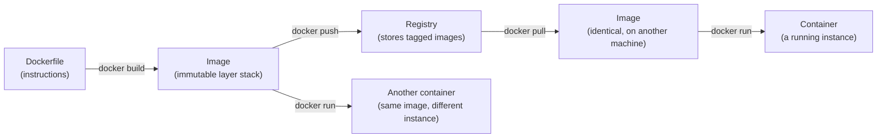

## Image vs. container, and where layers fit



The same image can produce many independent containers (each with its own writable layer on top and its own running process), and the same image can move between machines via a registry without being rebuilt — both properties depend on the image being a fixed, content-addressed artifact, the same underlying idea as Git's content-addressed objects from `git-teamwork/snapshots-manual-copies`.

## Layer caching, made concrete

```
FROM node:20.11-bookworm-slim      <- layer 1 (base image)
WORKDIR /app                        <- layer 2
COPY package.json package-lock.json ./   <- layer 3 (cache key: these two files' content)
RUN npm ci                          <- layer 4 (cache key: layer 3's output + this command)
COPY . .                            <- layer 5 (cache key: entire source tree's content)
CMD ["node", "server.js"]
```

Each instruction produces a layer, cached by a hash of its inputs (the previous layer plus the instruction itself, plus any files it copies in). Editing `server.js` changes layer 5's cache key — layers 1 through 4 are untouched and reused instantly, so `npm ci` doesn't rerun. Editing `package.json` changes layer 3's cache key, which cascades: layers 3, 4, and 5 all rebuild, because each depends on the one before it. This is exactly why dependency-manifest files are copied and installed _before_ the rest of the source in a well-ordered Dockerfile — it maximizes how often the expensive `npm ci` layer gets reused.

## Multi-stage builds: separating "build tools" from "runtime"

```dockerfile
# Stage 1: has the full build toolchain, TypeScript compiler included
FROM node:20.11-bookworm-slim AS build
WORKDIR /app
COPY package.json package-lock.json ./
RUN npm ci
COPY . .
RUN npm run build   # compiles TypeScript -> plain JS in /app/dist

# Stage 2: starts completely fresh — none of stage 1's layers carry over
FROM node:20.11-bookworm-slim AS runtime
WORKDIR /app
COPY package.json package-lock.json ./
RUN npm ci --omit=dev
COPY --from=build /app/dist ./dist   # only the COMPILED OUTPUT crosses over
CMD ["node", "dist/server.js"]
```

The final image (built from `runtime`) never contains the TypeScript compiler, dev dependencies, or raw source files stage 1 used — only what `COPY --from=build` explicitly pulled across. This directly serves two things: a smaller final image (less to pull, less disk), and a smaller attack surface (a compiler or dev tool sitting in a production image is one more thing that could be exploited if the container is ever compromised, for no runtime benefit).

## Registries: where "build once, run everywhere" actually connects

A registry is a content-addressable store for images, keyed by name and tag (`myapp:1.4.2`) and, more precisely, by a content digest under the hood — pushing an image uploads its layers (skipping any the registry already has, since layers are also individually cached and shared); pulling downloads only the layers the local machine doesn't already have cached. This is the mechanism that actually connects a CI pipeline's build step to a production deploy: CI builds and pushes exactly one image, and every environment that later pulls that same tag/digest gets the byte-identical artifact — not a re-built approximation of it.
