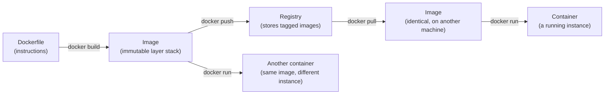

import Scenario from "../../../components/Scenario.astro";

<Scenario label="The rebuild that shouldn't take 20 seconds">
  <Fragment slot="facts">
    <div class="not-prose flex flex-col gap-1.5 text-sm text-slate-700 dark:text-slate-300">
      <div class="flex items-center gap-1.5"><span>📝</span> Edited: <code>server.js</code> only</div>
      <div class="flex items-center gap-1.5"><span>📦</span> Dependencies: unchanged</div>
      <div class="flex items-center gap-1.5"><span>⏱️</span> Rebuild took: 24 seconds — same as the first build</div>
    </div>
    <div class="not-prose mt-3 rounded border border-amber-300 bg-amber-50 p-1.5 text-xs dark:border-amber-800 dark:bg-amber-950">
      A one-line source edit re-ran <code>npm ci</code> from scratch. The dependency install didn't need to happen again — but the Dockerfile made it happen anyway.
    </div>

  </Fragment>

A teammate edits one line in `server.js` — no new dependencies, nothing
touching `package.json` — and reports that `docker build` still takes 24
seconds, same as the very first build. Something that should be instant
is behaving as if nothing was ever cached at all.

**If the dependency install (`npm ci`) is the expensive step, and
dependencies didn't change, why did it rerun?**

</Scenario>

The answer isn't a caching bug — it's a Dockerfile that puts the expensive
step in the wrong order, relative to what actually changed. Understanding
_why_ requires seeing where layers fit between an image and a container.

## Where do layers fit between "a Dockerfile" and "a running container"?



The same image can produce many independent containers (each with its own writable layer on top and its own running process), and the same image can move between machines via a registry without being rebuilt — both properties depend on the image being a fixed, content-addressed artifact, the same underlying idea as Git's content-addressed objects from `git-teamwork/snapshots-manual-copies`.

## What actually determines whether a layer reruns?

```
FROM node:20.11-bookworm-slim      <- layer 1 (base image)
WORKDIR /app                        <- layer 2
COPY package.json package-lock.json ./   <- layer 3 (cache key: these two files' content)
RUN npm ci                          <- layer 4 (cache key: layer 3's output + this command)
COPY . .                            <- layer 5 (cache key: entire source tree's content)
CMD ["node", "server.js"]
```

Read the cascade like a row of stacked boxes:

| If this changes             | Docker must rebuild                                          |
| --------------------------- | ------------------------------------------------------------ |
| Only `server.js`            | The source-copy layer and anything after it                  |
| `package.json` or lockfile  | The manifest-copy layer, `npm ci`, and the source-copy layer |
| Base image tag/digest       | Everything after `FROM`, because the foundation changed      |
| Nothing in a layer's inputs | That layer can be reused from cache                          |

Each instruction produces a layer, cached by a hash of its inputs (the previous layer plus the instruction itself, plus any files it copies in). Editing `server.js` changes layer 5's cache key — layers 1 through 4 are untouched and reused instantly, so `npm ci` doesn't rerun. Editing `package.json` changes layer 3's cache key, which cascades: layers 3, 4, and 5 all rebuild, because each depends on the one before it. This is exactly why dependency-manifest files are copied and installed _before_ the rest of the source in a well-ordered Dockerfile — it maximizes how often the expensive `npm ci` layer gets reused. **The teammate's slow rebuild above is what happens when `COPY . .` comes before the dependency install instead** — every source edit then invalidates the install layer too, because the install now depends on the whole source tree, not just the two manifest files.

## What happens to the build tools once the app is actually shipped?

A single-stage Dockerfile keeps everything it ever used — compilers, dev dependencies, raw source — in the final image, whether or not the running app needs any of it. Multi-stage builds separate "what's needed to build" from "what's needed to run":

```dockerfile
# Stage 1: has the full build toolchain, TypeScript compiler included
FROM node:20.11-bookworm-slim AS build
WORKDIR /app
COPY package.json package-lock.json ./
RUN npm ci
COPY . .
RUN npm run build   # compiles TypeScript -> plain JS in /app/dist

# Stage 2: starts completely fresh — none of stage 1's layers carry over
FROM node:20.11-bookworm-slim AS runtime
WORKDIR /app
COPY package.json package-lock.json ./
RUN npm ci --omit=dev
COPY --from=build /app/dist ./dist   # only the COMPILED OUTPUT crosses over
CMD ["node", "dist/server.js"]
```

The final image (built from `runtime`) never contains the TypeScript compiler, dev dependencies, or raw source files stage 1 used — only what `COPY --from=build` explicitly pulled across. This directly serves two things: a smaller final image (less to pull, less disk), and a smaller attack surface (a compiler or dev tool sitting in a production image is one more thing that could be exploited if the container is ever compromised, for no runtime benefit).

## How does any of this actually reach production?

A registry is a content-addressable store for images, keyed by name and tag (`myapp:1.4.2`) and, more precisely, by a content digest under the hood — pushing an image uploads its layers (skipping any the registry already has, since layers are also individually cached and shared); pulling downloads only the layers the local machine doesn't already have cached. This is the mechanism that actually connects a CI pipeline's build step to a production deploy: CI builds and pushes exactly one image, and every environment that later pulls that same tag/digest gets the byte-identical artifact — the exact fix for the laptop-vs-prod gap from L1's opening scenario, not a re-built approximation of it.
