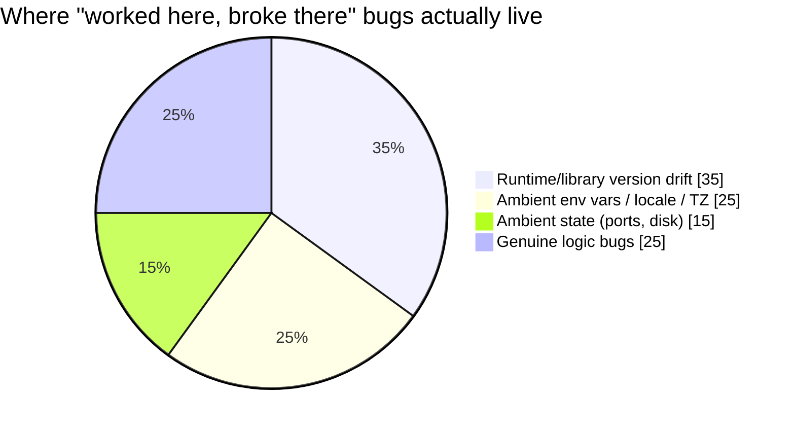

import Scenario from "../../../components/Scenario.astro";
import LevelIntro from "../../../components/LevelIntro.astro";

<Scenario label='The bug that only "happens in prod"'>
  <Fragment slot="facts">
    

      
💻 <strong>Laptop</strong> — Node 20.11, `America/New_York`, passes every test

      
🤖 <strong>CI runner</strong> — Node 18.9, `UTC`, also green

      
☁️ <strong>Production</strong> — Node 20.4, `UTC`, silently returns wrong answers

    

    

      

        
Laptop

        Ships with confidence
      

      

        
CI

        Green, nobody looks twice
      

      

        
Prod

        Wrong output, no crash, no alert
      

    

  </Fragment>

A "compute today's report" feature ships. It passes on the author's laptop.
It passes in CI. Three days later, someone notices a handful of reports
from the previous night are silently dated wrong — no error, no crash,
just quietly incorrect output that nobody's test caught, because nobody's
test ran in the one environment where it actually mattered.

| Where      | Node version | Timezone         | Result                  |
| ---------- | ------------ | ---------------- | ----------------------- |
| Laptop     | 20.11        | America/New_York | Every test passes       |
| CI runner  | 18.9         | UTC              | Every test still passes |
| Production | 20.4         | UTC              | Wrong dates, no crash   |

**The code is identical in all three places. The three places are not.**
Nothing in the diff review could have caught this — the bug isn't in the
code, it's in what the code silently assumed about the machine running it.

</Scenario>

<LevelIntro
  items={[
    "What environment drift actually is",
    "Where drift hides beyond obvious code differences",
    "Why containers are the dominant parity mechanism",
  ]}
/>

- "Works on my machine" is a symptom of **environment drift**: your laptop, the CI runner, and production have quietly diverged in OS version, installed libraries, environment variables, or even just what else happens to be running — and the code depends on that context without declaring it.
- The dependency isn't always obvious in the code. It hides in: a system library version, a locale/timezone setting, a globally-installed tool version, a port that happens to be free on your machine, file paths that only exist on your OS.
- **Environment parity** means dev, CI, and production are running the _same_ environment — not "similar," not "same versions on paper" — down to the OS, the runtime, and the exact dependency versions, so a class of "worked here, broke there" bugs becomes structurally impossible rather than something you hope doesn't happen.
- **Containers** are the dominant modern answer: a container packages an application together with its entire runtime environment (OS libraries, language runtime, dependencies) into one artifact that runs identically wherever a container engine exists — the same container that ran on a laptop is, byte-for-byte, the same one that runs in production.
- This is different from a VM: a VM virtualizes an entire OS kernel per instance (heavy, minutes to boot); a container shares the host's kernel and only isolates the process/filesystem view (light, seconds to boot) — the isolation is weaker in theory but the parity guarantee is just as strong for "same dependencies, same behavior."
- The underlying engineering principle this unit is really about: **make the environment part of the versioned, reviewed artifact**, not tribal knowledge in someone's setup notes or a wiki page that goes stale the day after it's written.

That last slice matters: parity doesn't make every bug disappear — it removes
an entire _category_ of bugs (the other 75% above) so that when something
does still break, it's more likely to be an actual logic bug worth
debugging, not a scavenger hunt through two machines' installed software.
