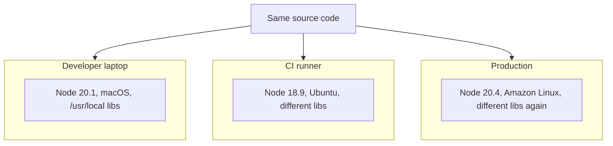
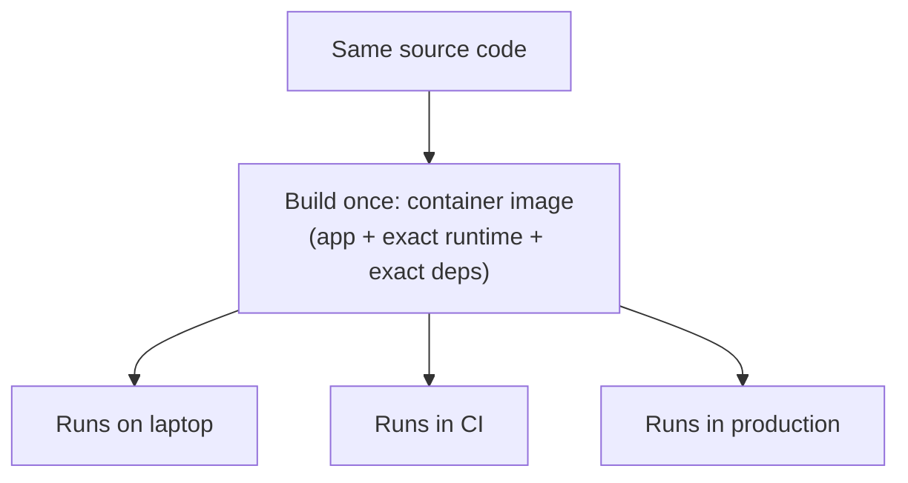

## Without parity: three environments, three quiet divergences



Nothing here is a mistake in the traditional sense — nobody configured this deliberately. Each environment was set up at a different time, by a different process (a developer's personal install history, a CI image's release schedule, a production base image's own patch cadence), and all three drifted independently. The code is identical; the environment executing it is not, and the bug that only reproduces on one of the three is a direct consequence of that gap — not a mystery, once you know to look there.

## With parity: one artifact, three places it runs unchanged



The shift is subtle but total: instead of three environments independently trying to match a specification, there's **one built artifact** that gets _run_ in three places — nothing about it is re-installed or re-resolved per environment, so there's nothing left to drift.

## Common sources of drift, concretely

| Category                | Example                                                            | Why it's invisible until it breaks                              |
| ----------------------- | ------------------------------------------------------------------ | --------------------------------------------------------------- |
| Runtime version         | Node 18 on CI, Node 20 on your laptop                              | Code using a Node-20-only API works locally, fails in CI        |
| System libraries        | A locally-installed image library with different default behavior  | Only surfaces on inputs that hit the behavioral difference      |
| Environment variables   | `TZ` set locally but not in prod, so date math differs             | Passes every test that doesn't cross a timezone boundary        |
| Ambient state           | A port that happens to be free on your machine, occupied elsewhere | "Just works" locally, connection-refused errors elsewhere       |
| Installed tool versions | A globally installed CLI tool at a different version per machine   | A build step behaves differently depending on who/where runs it |

## The container's core mechanism

```python
function build_image(app_source, dependency_manifest, base_os_image):
    # Every dependency is resolved and baked in ONCE, at build time,
    # against a pinned base image — not re-resolved per environment.
    image = base_os_image.copy()
    image.install(dependency_manifest)   # exact versions, pinned
    image.add(app_source)
    return image  # a single, immutable, content-addressed artifact

function run(image):
    # No installation, no version resolution happens here — the
    # environment is already fully baked into `image` from build time.
    return start_process(image, isolated=True)
```

The crucial property: `build_image` runs exactly once per release, and `run` is executed identically on a laptop, in CI, and in production — none of them re-run `install`, so none of them can independently drift from what was actually tested.
