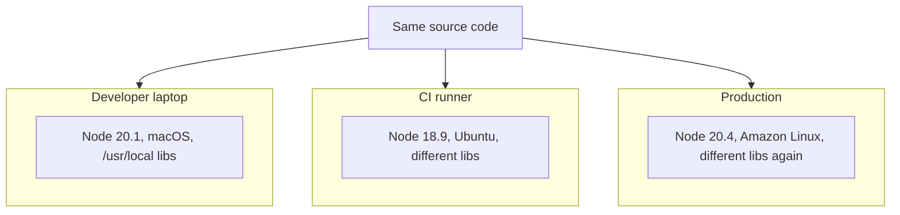
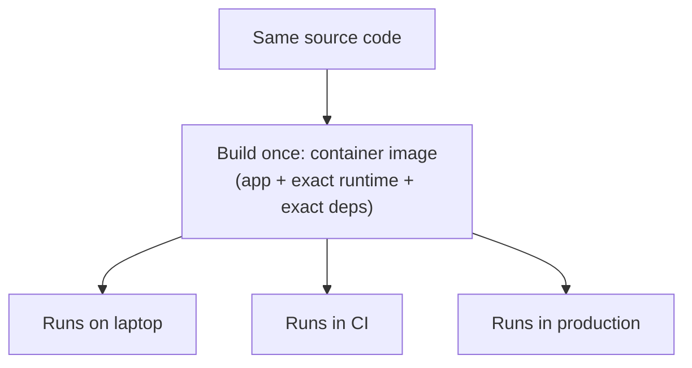
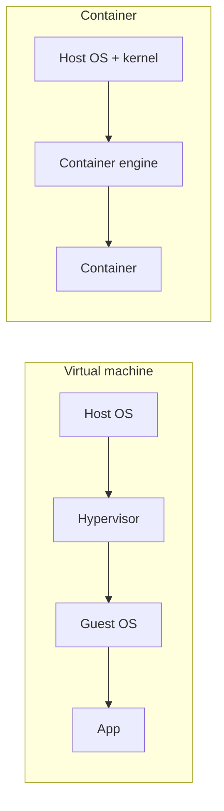

import Scenario from "../../../components/Scenario.astro";

<Scenario label="Three environments, set up independently">
  <Fragment slot="facts">
    <div class="not-prose flex flex-col gap-1.5 text-sm text-slate-700 dark:text-slate-300">
      <div class="flex items-center gap-1.5"><span>💻</span> Laptop installed by hand, 8 months ago</div>
      <div class="flex items-center gap-1.5"><span>🤖</span> CI image last rebuilt on its own schedule</div>
      <div class="flex items-center gap-1.5"><span>☁️</span> Prod base image patched by a different team</div>
    </div>
    <div class="not-prose mt-3 rounded border border-amber-300 bg-amber-50 p-1.5 text-xs dark:border-amber-800 dark:bg-amber-950">
      Nobody configured a divergence on purpose — three independent setup
      histories just produced three different environments running the same
      source code.
    </div>

  </Fragment>

A new hire spends a full afternoon debugging a deploy that fails only in
CI. The code runs fine locally. Nobody touched the CI config recently.
Eventually it turns out CI's Node version is two minors behind the
laptop's — nobody decided that, it's just what each environment happened
to end up running, installed at different times by different processes.

**If nobody configured this divergence on purpose, where does it actually
come from — and what would it take to make it structurally impossible
instead of something you have to notice and fix each time?**

</Scenario>

## Without parity: three environments, three quiet divergences



Nothing here is a mistake in the traditional sense — nobody configured this deliberately. Each environment was set up at a different time, by a different process (a developer's personal install history, a CI image's release schedule, a production base image's own patch cadence), and all three drifted independently. The code is identical; the environment executing it is not, and the bug that only reproduces on one of the three is a direct consequence of that gap — not a mystery, once you know to look there.

## With parity: one artifact, three places it runs unchanged



The shift is subtle but total: instead of three environments independently trying to match a specification, there's **one built artifact** that gets _run_ in three places — nothing about it is re-installed or re-resolved per environment, so there's nothing left to drift.

## What actually counts as "drift," concretely?

| Category                | Example                                                            | Why it's invisible until it breaks                              |
| ----------------------- | ------------------------------------------------------------------ | --------------------------------------------------------------- |
| Runtime version         | Node 18 on CI, Node 20 on your laptop                              | Code using a Node-20-only API works locally, fails in CI        |
| System libraries        | A locally-installed image library with different default behavior  | Only surfaces on inputs that hit the behavioral difference      |
| Environment variables   | `TZ` set locally but not in prod, so date math differs             | Passes every test that doesn't cross a timezone boundary        |
| Ambient state           | A port that happens to be free on your machine, occupied elsewhere | "Just works" locally, connection-refused errors elsewhere       |
| Installed tool versions | A globally installed CLI tool at a different version per machine   | A build step behaves differently depending on who/where runs it |

**Why does every row in that table share the same shape — "invisible until it breaks"?** Because none of these are declared anywhere the code review process looks. A diff shows what changed in the source; it says nothing about what the source is implicitly relying on already being true on the machine that runs it.

## The container's core mechanism

Why does packaging the app into a container actually close this gap, rather than just moving it somewhere else? Because it changes _when_ dependency resolution happens — from "every time, on every machine" to "once, at build time":

```
function build_image(app_source, dependency_manifest, base_os_image):
    # Every dependency is resolved and baked in ONCE, at build time,
    # against a pinned base image — not re-resolved per environment.
    image = base_os_image.copy()
    image.install(dependency_manifest)   # exact versions, pinned
    image.add(app_source)
    return image  # a single, immutable, content-addressed artifact

function run(image):
    # No installation, no version resolution happens here — the
    # environment is already fully baked into `image` from build time.
    return start_process(image, isolated=True)
```

The crucial property: `build_image` runs exactly once per release, and `run` is executed identically on a laptop, in CI, and in production — none of them re-run `install`, so none of them can independently drift from what was actually tested.

## Does this mean containers and VMs solve the same problem the same way?

Not quite — they solve _isolation_ differently, even though both can deliver parity:



A VM virtualizes an entire OS kernel per instance — heavy, minutes to boot, deep isolation. A container shares the host's kernel and only isolates the process/filesystem view — light, seconds to boot, narrower isolation. **For the specific problem this unit is about**, that isolation depth difference barely matters: what buys parity is that the dependency environment is baked into one artifact at build time, and that property holds for containers regardless of the weaker isolation boundary. The isolation trade-off is a separate concern from the parity guarantee — covered on its own terms in `infra-delivery/docker`.
