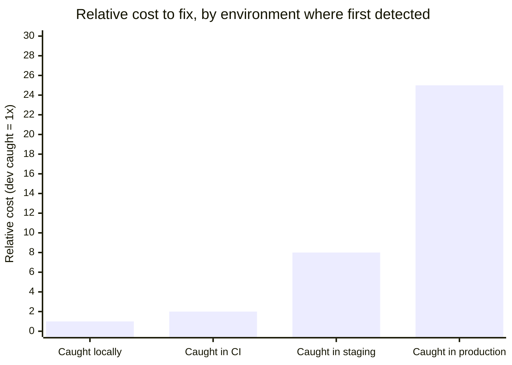

import Scenario from "../../../components/Scenario.astro";
import LevelIntro from "../../../components/LevelIntro.astro";
import Checkpoint from "../../../components/Checkpoint.astro";

<Scenario label='The "only happens in CI" bug, isolated down to one function'>
  <Fragment slot="facts">
    <div class="not-prose flex flex-col gap-1.5 text-sm text-slate-700 dark:text-slate-300">
      <div class="flex items-center gap-1.5"><span>💻</span> Laptop: <code>TZ=America/New_York</code> — test passes</div>
      <div class="flex items-center gap-1.5"><span>🤖</span> CI: <code>TZ=UTC</code> — same input, test fails</div>
      <div class="flex items-center gap-1.5"><span>🔍</span> Function logic never changed between runs</div>
    </div>
    <div class="not-prose mt-3 rounded border border-amber-300 bg-amber-50 p-1.5 text-xs dark:border-amber-800 dark:bg-amber-950">
      The bug isn't in <code>isToday</code>'s logic — it's in what the
      function silently reads from the host machine's clock settings.
    </div>

  </Fragment>

L2 named "environment variables" as one row in a table of drift sources.
Here's what that looks like as an actual bug, isolated down to a single
ten-line function — not a hypothetical, the exact kind of thing that
produces a "works on my machine, fails in CI" ticket with no obvious
repro steps.

**Given that the function's logic is genuinely correct, and the input is
identical in both places — what's left that could possibly differ?**

</Scenario>

<LevelIntro
  items={[
    "A worked timezone drift bug, and its actual fix",
    "A minimal, real Dockerfile that eliminates its class",
    "What container parity does and doesn't cover, with real failure modes",
  ]}
/>

## A real drift bug: implicit timezone dependence

This function looks correct and passes locally, because "locally" happens to share a timezone assumption with the test author:

```js
// report.mjs — computes "is this timestamp today?" using local time
function isToday(timestampMs) {
  const now = new Date();
  const then = new Date(timestampMs);
  return (
    now.getFullYear() === then.getFullYear() &&
    now.getMonth() === then.getMonth() &&
    now.getDate() === then.getDate()
  );
}

// On a laptop set to America/New_York, at 11pm local time:
console.log(isToday(Date.now())); // true — correct, "now" is today

// The exact same code, same input, on a CI runner set to UTC
// (11pm New_York == 3-4am UTC the *next* day):
console.log(isToday(Date.now())); // false — the "bug" that "only happens in CI"
```

Nothing about the code changed between the two runs — `getFullYear`/`getMonth`/`getDate` all read the **system's local timezone**, which the laptop and the CI runner disagree on. This is textbook environment drift: an ambient setting (`TZ`), not a code path, determines the outcome, and no amount of staring at `isToday`'s logic finds the bug — it's not in the logic.

```js
// report-fixed.mjs — pins the comparison to an explicit, injected timezone
// instead of relying on whatever the host environment happens to be set to
function isToday(timestampMs, timezone, referenceNowMs = Date.now()) {
  const fmt = new Intl.DateTimeFormat("en-CA", { timeZone: timezone }); // en-CA => YYYY-MM-DD
  return fmt.format(referenceNowMs) === fmt.format(timestampMs);
}
```

The fix isn't "set `TZ=UTC` everywhere and hope" (that's still an ambient, easy-to-forget setting) — it's removing the function's dependence on ambient environment state entirely by making the timezone an explicit parameter. This is the same principle containers apply at the infrastructure level, applied to a single function: don't let correctness depend on something outside the artifact itself.

<Checkpoint question="A teammate proposes fixing the CI failure by adding `ENV TZ=UTC` to the CI runner's setup instead of changing `isToday`. Would that actually fix the bug, or just relocate it?">

It would relocate it, not fix it. Pinning `TZ=UTC` on the CI runner makes CI's behavior match production's UTC setting by coincidence, but `isToday` still silently reads whatever the host's ambient timezone happens to be — it's still an implicit dependency, just one that now happens to agree across two of the three environments instead of disagreeing. The bug reappears the moment any environment's `TZ` differs again (a new hire's laptop, a future CI migration, a customer running the code in their own region). `report-fixed.mjs`'s explicit `timezone` parameter is the only version of the fix that removes the dependency itself rather than getting lucky about what value it currently resolves to.

</Checkpoint>

## A minimal real Dockerfile

This is a genuinely runnable, minimal image definition for a small Node service — small enough to read end to end, but every line is doing real work, not filler:

```dockerfile
# Pin the exact base image by digest-eligible tag, not a moving "latest"
FROM node:20.11-bookworm-slim

WORKDIR /app

# Copy dependency manifests first, install, THEN copy source — this
# layer-ordering means `npm ci` only reruns when dependencies actually
# change, not on every source edit, and it's not optional for parity:
# npm ci (unlike npm install) refuses to proceed if package-lock.json
# doesn't exactly match package.json, guaranteeing the exact dependency
# tree that was locked, not "whatever resolves today."
COPY package.json package-lock.json ./
RUN npm ci --omit=dev

COPY . .

ENV NODE_ENV=production
EXPOSE 3000
CMD ["node", "server.js"]
```

Building this (`docker build -t my-service .`) produces one immutable image. Running it (`docker run -p 3000:3000 my-service`) on a laptop, in CI, or on a production host executes the _exact same bytes_ — same Node binary, same OS libraries, same `node_modules` tree — every time. The only thing that can differ between environments now is what's explicitly passed in at `docker run` time (environment variables, mounted volumes), which is deliberate configuration, not accidental drift.

Note what this Dockerfile does **not** do: it doesn't set `TZ`. That's deliberate — pinning the container's ambient timezone would paper over the exact bug above rather than fix it. `report-fixed.mjs`'s explicit `timezone` parameter is the actual fix; a container-level `TZ` pin is a second, weaker line of defense at best, not a substitute for removing the ambient dependency from the code itself.

<Checkpoint question="If a teammate edits this Dockerfile to swap `npm ci --omit=dev` for `npm install --omit=dev` to 'save a step,' what specifically breaks about the parity guarantee this image is supposed to provide?">

`npm ci` requires `package-lock.json` to exactly match `package.json` and installs precisely the locked dependency tree, refusing to proceed otherwise; `npm install` will happily resolve slightly different transitive dependency versions if the lockfile and the registry's available versions have drifted since the lockfile was last written. That reopens exactly the gap this whole Dockerfile exists to close: two builds of the "same" image, run at different times, could end up with different transitive dependencies baked in — drift moved from between environments to between builds of a single environment, but still drift, and still invisible until something built on one of the differing versions breaks.

</Checkpoint>

## How much does an undetected drift bug actually cost, as a function of where it's caught?



This is the actual economic case for parity, not just a tidiness argument: a drift bug caught on a laptop costs a few minutes of confusion; the same underlying bug caught in production costs an incident, a rollback, and possibly a customer-facing outage — for a bug that was, mechanically, always the same gap between what the code assumed and what the environment actually provided. Parity doesn't make bugs impossible; it collapses this curve by making "the environment" identical everywhere, so a bug that would only have shown up in production now shows up on the laptop instead, at 1x cost instead of 25x.

## Failure modes

| #   | Mistake                                              | What it silently breaks                                                                                  |
| --- | ---------------------------------------------------- | -------------------------------------------------------------------------------------------------------- |
| 1   | Pinning the tag but not the digest                   | A tag can technically be repointed — "pinned" isn't the same guarantee as "immutable"                    |
| 2   | Using `npm install` instead of `npm ci` in the build | Transitive dependency versions can silently drift between builds even with an unchanged lockfile         |
| 3   | Baking secrets/env-specific config into the image    | Reintroduces "one image per environment," the exact drift risk containers exist to remove                |
| 4   | Assuming container parity covers everything          | A database schema, a downstream API, host kernel/network config are all outside the container's boundary |

- **Pinning the base image tag but not the digest, and treating "pinned" as "immutable."** `node:20.11-bookworm-slim` is far more specific than `node:latest`, but a tag can still technically be repointed (rare, but possible for a registry maintainer to push a new image under the same tag) — production-grade pipelines pin by content digest (`node:20.11-bookworm-slim@sha256:...`) when true byte-for-byte reproducibility matters, not just version-number stability.
- **Letting `npm install` run instead of `npm ci` in the image build.** `npm install` will happily resolve slightly different transitive dependency versions if the lockfile and registry state have drifted since the lockfile was written; `npm ci` refuses to do this and fails loudly instead — silently drifting dependency versions between builds defeats the entire point of a pinned build step.
- **Baking secrets or environment-specific config into the image.** The parity goal is "same artifact, different config injected per environment at run time" (via `docker run -e` or an orchestrator's config), not "one image per environment" — building a separate image per environment reintroduces exactly the drift risk containers exist to remove, just one layer up.
- **Assuming container parity extends to things outside the container.** A container guarantees parity for what's _inside_ it — the OS, runtime, and app dependencies. It says nothing about a database schema being out of sync, a downstream API behaving differently in staging vs. prod, or the host kernel/network configuration differing — parity has to be reasoned about at each layer, not assumed to propagate automatically just because one layer achieved it.

The timezone bug above is one worked example — a single function, one ambient dependency — not the whole territory. **What would change about diagnosing this if the drift weren't in application code at all, but in a downstream service's clock — say, a payments provider's API returning timestamps in its own server's local time instead of UTC?** The fix pattern is identical (stop trusting an ambient/implicit value, make the timezone explicit at the boundary), but the failure is now completely invisible to your own container's parity guarantee, because the drift lives in a system your image never controlled in the first place — exactly the "assuming container parity extends to things outside the container" failure mode above, encountered for real instead of as a bullet point.
