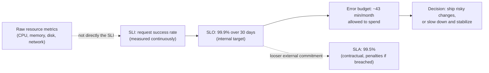

import LevelIntro from "../../../components/LevelIntro.astro";
import Checkpoint from "../../../components/Checkpoint.astro";

L1's incident had twelve green dashboards and one silent, real outage. The
gap wasn't a missing metric — it was that none of those metrics were
connected to a target that meant anything to a user, or to a decision
about when to act. To close that gap, start from a more basic question:

**Given a pile of raw infrastructure metrics, how do you turn any of them
into a single number that tells you, unambiguously, "we are currently
meeting our commitment to users" — and what do you do the moment that
number says you aren't?**

<LevelIntro
  items={[
    "SLI vs. SLO vs. SLA, with one worked example carried through all three",
    "The error budget as a spendable resource, not a compliance report",
    "Why alerting on the SLI beats alerting on every raw metric",
  ]}
/>

## SLI, SLO, SLA: a signal, a target, and a contract

These three terms get used loosely, but they name three genuinely
different things, and the difference matters for what each one is _for_.

| Term    | What it is                                                             | Worked example (this unit's checkout service)                             |
| ------- | ---------------------------------------------------------------------- | ------------------------------------------------------------------------- |
| **SLI** | A measurable signal reflecting actual service health                   | Request success rate, measured every minute across all checkout requests  |
| **SLO** | An internal target threshold on that signal, that the team commits to  | 99.9% of checkout requests succeed, measured over a rolling 30-day window |
| **SLA** | An external, often contractual commitment, usually looser than the SLO | 99.5% success guaranteed to the customer, with a service credit if missed |

The SLA is deliberately looser than the SLO — that gap is a buffer. If the
internal SLO (99.9%) and the external SLA (99.5%) were set to the same
number, there'd be zero room to notice and fix a real problem before it
becomes a contractual breach with financial consequences. The SLO is the
team's own early-warning target; the SLA is what happens if things get
bad enough that even the buffer doesn't hold.

Notice what's explicitly **not** in that top box: raw resource metrics
feed into infrastructure health, but they are not themselves the SLI. CPU
at 90% might mean nothing to users if requests still succeed; CPU at 40%
told L1's team nothing useful while a connection pool was actively
rejecting requests. The SLI has to be chosen close to what a user actually
experiences, not close to what's easy to instrument.

<Checkpoint question="A team sets their SLO and SLA to the exact same number: 99.9% for both. What's the practical problem with that?">

There's no buffer between "we're not meeting our own internal bar" and
"we're in contractual breach with real financial consequences." The whole
point of an SLO being tighter than the SLA is that crossing the SLO gives
the team a warning and time to react — slow down risky deploys, investigate,
fix — before the SLA (with its penalties) is also at risk. Setting them
equal means the team only finds out there's a problem at the exact moment
it's already the worst version of the problem.

</Checkpoint>

## The error budget: a spendable resource, not a compliance number

**If the SLO is 99.9% over 30 days, what does "0.1% allowed to fail"
actually mean in a way a team can use to make a decision this week?**

Do the arithmetic in plain terms: a 30-day month has 30 × 24 × 60 = 43,200
minutes. A 99.9% availability target allows (100% − 99.9%) = 0.1% of that
time to be "down" — 0.1% of 43,200 minutes is 43.2 minutes. That's the
error budget: **about 43 minutes of allowed downtime (or equivalent
failed-request-time) for the entire month.**

That budget is real and spendable — every incident, every failed
deployment that gets rolled back, every brief blip draws down the same
43-minute pool, and the pool resets each period. What makes it useful
isn't the number itself, it's what it changes about a decision a team
would otherwise make on gut feeling:

| Situation this month                              | Budget remaining            | Reasonable call                                                                                |
| ------------------------------------------------- | --------------------------- | ---------------------------------------------------------------------------------------------- |
| Two minor incidents, ~5 minutes total downtime    | ~38 of 43 minutes left      | Ship the risky database migration this week as planned                                         |
| One bad incident already burned 35 minutes        | ~8 of 43 minutes left       | Delay the risky migration; only ship low-risk, easily-reverted changes until the budget resets |
| Budget already fully spent, 10 days left in month | 0 minutes left, over budget | Freeze non-essential risky changes; focus entirely on stability until the window resets        |

This is the part that's easy to miss if "error budget" gets treated as
just a compliance metric to report upward: it's meant to be looked at
_before_ deciding how aggressively to ship, the same way a real budget
gets checked before an expense — not just tallied after the fact to see
how the month went.

<Checkpoint question="A team has burned their entire 43-minute error budget by day 5 of a 30-day window, from one bad incident. A director asks why the team is refusing to ship a moderately risky feature that's ready to go. What's the answer, in terms of the error budget?">

The 43-minute budget for this window is already gone — anything additional
that goes wrong for the rest of the month pushes the service below its
committed SLO, with the SLA's tighter, contractually-penalized threshold
getting closer too. Shipping a moderately risky change right now spends
against a budget that's already at zero, which is a materially different
risk than shipping the same change in a month where 38 of 43 minutes are
still unspent. The budget isn't a report card — it's the actual
information that should decide whether this specific week is a good time
to take on additional risk.

</Checkpoint>

## Symptom-based alerting: alert on the SLI, not on every raw metric

L1's incident makes the case directly: twelve raw-metric dashboards, zero
alerts, one real 40-minute outage. The problem wasn't a lack of
monitoring — it was monitoring the wrong layer. **Alerting on every raw
resource metric individually** (CPU above X, memory above Y, disk above
Z, per node, per cluster) produces two failure modes at once: it misses
real problems that don't show up as a resource-threshold breach (L1's
connection-pool failure), and it produces a flood of noisy alerts for
resource fluctuations that never actually affected a single user (a brief
CPU spike that autoscaling absorbed in 30 seconds, alerted on anyway).

**Symptom-based alerting** flips the target: alert on the SLI itself —
the signal that directly reflects whether users are being served
correctly — and specifically on whether that signal is burning through
the error budget at a rate that matters. A request-success-rate SLI
dropping from 99.95% to 83% is one unambiguous alert. Twelve raw-metric
thresholds, none of which technically breached, is zero alerts and one
real incident that took 40 minutes to notice.

This connects directly to a theme from `test-suite-architecture` and
`quality-culture`: an alert that fires too often for things that turn out
not to matter gets the same treatment a flaky test gets — ignored, then
muted, then eventually nobody trusts any alert from that system at all.
Alert fatigue from raw-metric noise is trust erosion, just in an
on-call rotation instead of a CI pipeline. Alerting on the SLI directly
— a signal that's already been chosen because it reflects real user
impact — is what keeps every alert that does fire worth waking up for.

L3 builds both halves of this for real: an error-budget calculator that
turns an SLO target and observed failure data into "how much budget is
left," and a symptom-based alerting function that decides whether to page
based on how fast the budget is burning — not just how much has been
spent so far.
