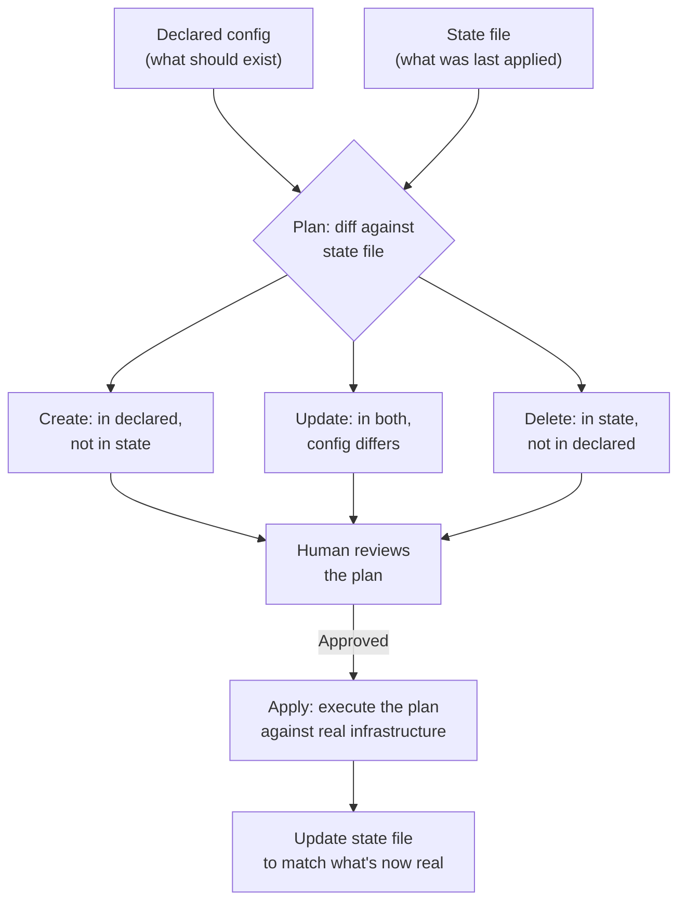
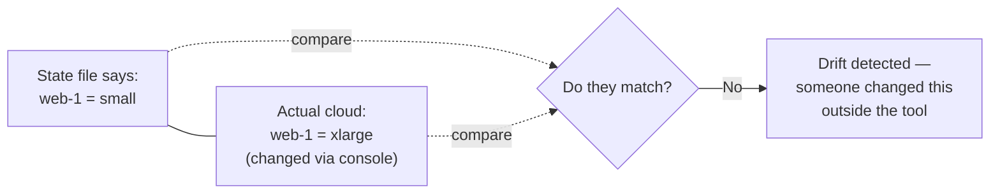

## Declarative vs. imperative: two different questions to answer

**If someone hands you a script that runs `resize-server web-1 large`,
and someone else hands you a file that says `web-1: size = large`,
what's actually different between them?** The script answers "what
steps do I run," while the file answers "what should exist" — and
that difference is exactly what determines whether re-running it
twice is safe:

|                    | Imperative (a script of steps)                                         | Declarative (a description of state)                     |
| ------------------ | ---------------------------------------------------------------------- | -------------------------------------------------------- |
| Answers            | "What commands do I run?"                                              | "What should this look like?"                            |
| Running it twice   | May run the resize command twice — depends on the script being careful | Second run computes zero changes — nothing to do         |
| Detecting drift    | Nothing — the script doesn't know or check current state               | The tool compares declared state to what it last applied |
| What IaC tools use | Rarely, for exactly this reason                                        | Almost universally (Terraform, CloudFormation, Pulumi)   |

A script that says "resize `web-1` to `large`" doesn't know or care
whether `web-1` is already `large` — it just runs the command. A
declarative tool is asked "make reality match this description," and
computing _whether anything needs to change at all_ is the first
thing it does, before touching anything.

## The plan → apply cycle

**If a tool is about to make real, sometimes-expensive-to-reverse
changes to running infrastructure, should it just make them?** No —
a plan step exists specifically to show the _computed_ difference
before anything is touched, so a human can review it first:

**Why compute a plan at all instead of just applying every time?**
Because "what changed" is exactly the information a reviewer needs
before approving a change that might delete a database or resize a
production server — showing "3 to create, 1 to update, 0 to delete"
lets a human catch a mistake (like an accidental delete from removing
a line in the wrong file) before it happens, not after.

## Why the state file is what makes drift detectable at all

**If the console change from the opening scenario had happened, but
the team used IaC, would the tool have noticed?** Only because of the
state file — it's the one place that remembers what the tool
_believes_ is true, separate from what's _actually_ true:

Without a state file, there's nothing to compare the actual
infrastructure _against_ — a script has no memory of what it did
last time. A declarative tool's state file is exactly that memory,
and drift detection is just "does the state file's record still
match reality" — the same comparison a plan does against declared
config, but against what actually exists instead.

## Idempotency: why re-running the same apply twice has to be safe

**If an `apply` fails halfway through (network blip, a transient
cloud API error) and gets re-run, what has to be true for that to be
safe rather than dangerous?** The second run has to compute the same
plan a fresh run would — creating only what's still missing, updating
only what still differs, and doing nothing to what already matches.
This is what "idempotent" means in practice: not "running it twice
does nothing," but "running it twice produces the same end state as
running it once," which is exactly what a diff-based plan naturally
gives you, and exactly what a raw imperative script doesn't guarantee
without deliberate, careful checks at every single step.

## Failure modes at this level

- **Treating a script of cloud CLI commands as "Infrastructure as
  Code."** Being version-controlled isn't the same as being
  declarative — a script of imperative commands still can't detect
  drift or guarantee idempotency on its own.
- **Manually editing infrastructure "just this once" during an
  incident, without a plan to reconcile it afterward.** This is
  exactly the opening scenario — the fix is real short-term, but
  becomes invisible drift the moment nobody updates the declared
  config to match.
- **Skipping the plan step, or approving it without actually reading
  it.** The plan's entire value is catching an unexpected delete or
  an unintended change before it's applied — approving on autopilot
  defeats the purpose of having one.
