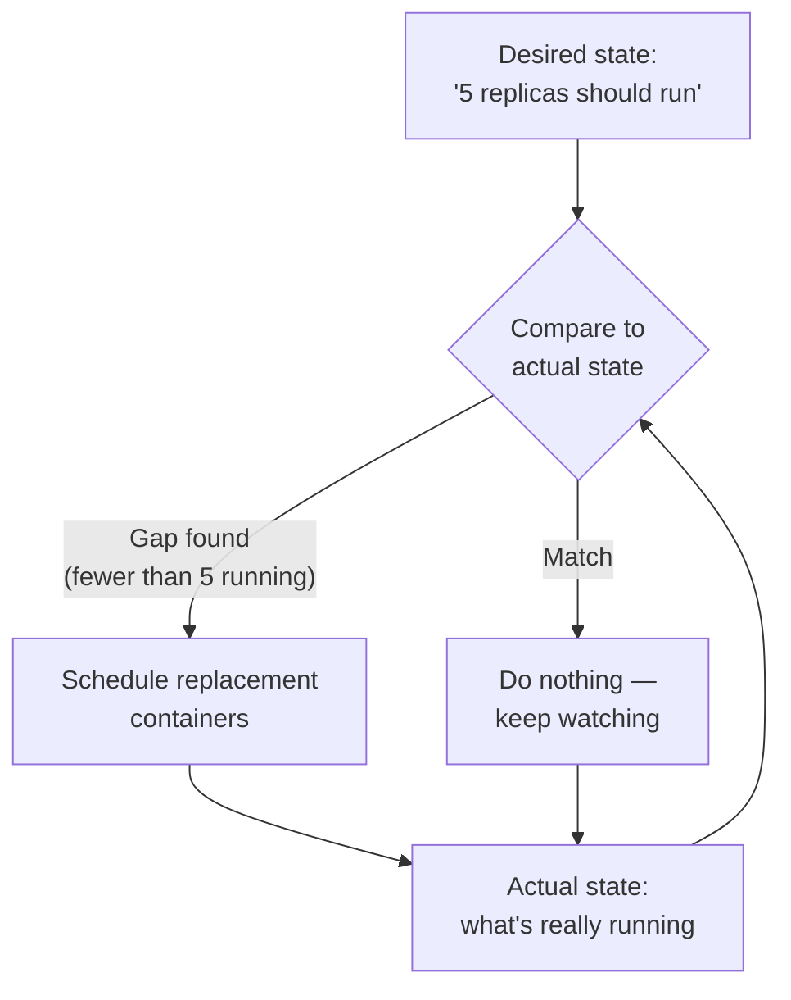

## The reconciliation loop: comparing desired state to actual state

**If nobody is watching the cluster, how does a dead node's containers
ever get noticed, let alone replaced?** An orchestrator doesn't wait
for a human — it runs a loop, continuously, that compares what was
declared ("5 replicas should exist") against what's actually observed
running, and acts on any gap:

This loop runs constantly, not just when something breaks — most
iterations find no gap and do nothing. The moment a node dies and
takes containers with it, the very next comparison finds a gap, and
the loop reacts within seconds, not whenever a human happens to be
paged and awake.

## The scheduler: where does each container actually go?

**Once the reconciliation loop decides a container needs to exist,
which of the cluster's machines should it land on?** This is the
scheduler's job — and it needs each node's available capacity and
each container's declared resource requirements to make the call:

| Concept               | What it means                                                                  |
| --------------------- | ------------------------------------------------------------------------------ |
| Node capacity         | Total CPU/memory a machine has available for containers                        |
| Pod resource request  | CPU/memory a container declares it needs, up front                             |
| Placement decision    | Pick a node with enough _remaining_ capacity for that request                  |
| Spreading vs. packing | Favor nodes with more free capacity (spread) vs. filling one node first (pack) |

A scheduler that always _packs_ the fullest node first leaves other
nodes empty — efficient on paper, but a single node failure then takes
out everything packed onto it. A scheduler that _spreads_ containers
across nodes with the most free capacity trades some packing
efficiency for exactly the property that makes self-healing
practical: no single node failure wipes out an outsized share of the
fleet.

## Manual ops vs. an orchestrator: what actually changes

| Responsibility                                     | Manual ops (2-server scenario)                              | Orchestrator                                                                                  |
| -------------------------------------------------- | ----------------------------------------------------------- | --------------------------------------------------------------------------------------------- |
| Noticing a node died                               | A human notices, or gets paged by an external monitor       | The reconciliation loop's next comparison finds the gap directly                              |
| Deciding where replacements go                     | A human picks a server, hopefully checking capacity by hand | The scheduler evaluates every node's remaining capacity automatically                         |
| Time to recovery                                   | However long it takes a human to wake up and act            | Seconds to the next reconciliation cycle                                                      |
| What happens if there's no spare capacity anywhere | The human discovers this the hard way, mid-incident         | The reconciliation loop reports the gap as unresolved (pending), rather than silently failing |

That last row matters: an orchestrator doesn't manufacture capacity
that isn't there. If every surviving node is already full, the
reconciliation loop still runs, still notices the gap, and still
can't close it — which is exactly why headroom (deliberately unused
capacity) has to be planned for, not assumed.
