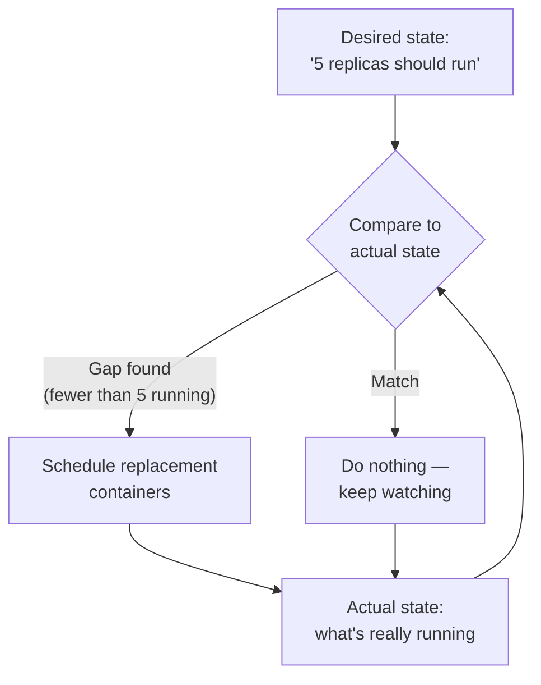

import LevelIntro from "../../../components/LevelIntro.astro";
import Checkpoint from "../../../components/Checkpoint.astro";

L1 named the missing piece in the 3am scenario as something that
constantly checks desired state against actual state and acts on any
gap. L2 works out exactly how that reconciliation loop operates, and
how the scheduler it depends on decides which node each container
lands on.

<LevelIntro
  items={[
    "The reconciliation loop's compare-and-act cycle",
    "How a scheduler picks a node from available capacity",
    "Spreading vs. packing, and what each trades away",
  ]}
/>

## The reconciliation loop: comparing desired state to actual state

**If nobody is watching the cluster, how does a dead node's containers
ever get noticed, let alone replaced?** An orchestrator doesn't wait
for a human — it runs a loop, continuously, that compares what was
declared ("5 replicas should exist") against what's actually observed
running, and acts on any gap:

Think of desired state like a classroom attendance target: "there
should be 5 students in this group." If you count only 3, you do not
need to guess whether the group is complete — the difference tells you
that 2 are missing. The reconciliation loop does that count again and
again for containers.

This loop runs constantly, not just when something breaks — most
iterations find no gap and do nothing. The moment a node dies and
takes containers with it, the very next comparison finds a gap, and
the loop normally reacts far faster than waiting for a human to be
paged and awake. The exact time depends on the platform's checks,
timeouts, and type of failure, but the important change is that recovery
starts from the system observing a gap, not from a person noticing one.

<Checkpoint question="A reconciliation loop just found a gap — 2 fewer replicas running than desired — and scheduled 2 replacement containers. Ten seconds later, before those replacements have finished starting up, the loop runs its comparison again. Does it schedule 2 more replacements on top of the first 2?">

No — as long as the loop's actual-state observation counts containers
that are scheduled-but-still-starting as already accounted for, not
just fully-running ones. If it didn't, every comparison cycle would
re-detect the same gap and pile on duplicate replacements faster than
they could start, which is exactly the kind of bug a real
reconciliation loop has to guard against. The loop's whole value comes
from comparing against the true current state, including
in-flight work, not just a stale snapshot from before the last
corrective action — otherwise "continuously compare and act" turns
into "continuously over-correct."

</Checkpoint>

## The scheduler: where does each container actually go?

**Once the reconciliation loop decides a container needs to exist,
which of the cluster's machines should it land on?** This is the
scheduler's job — and it needs each node's available capacity and
each container's declared resource requirements to make the call:

| Concept               | What it means                                                                  |
| --------------------- | ------------------------------------------------------------------------------ |
| Node capacity         | Total CPU/memory a machine has available for containers                        |
| Pod resource request  | CPU/memory a pod asks the scheduler to reserve before it is placed             |
| Placement decision    | Pick a node with enough _remaining_ capacity for that request                  |
| Spreading vs. packing | Favor nodes with more free capacity (spread) vs. filling one node first (pack) |

The resource request is not "how much CPU this pod is using this exact
millisecond." It is the amount the scheduler promises not to overbook,
like reserving seats before a trip: if a pod asks for 2 CPU and 4 GB of
memory, the scheduler only places it where that much room is still
available.

A scheduler that always _packs_ the fullest node first leaves other
nodes empty — efficient on paper, but a single node failure then takes
out everything packed onto it. A scheduler that _spreads_ containers
across nodes with the most free capacity trades some packing
efficiency for exactly the property that makes self-healing
practical: no single node failure wipes out an outsized share of the
fleet.

<Checkpoint question="Two nodes, A and B, both currently have identical free capacity: 4 CPU and 8 GB memory. A new pod requesting 1 CPU and 1 GB memory needs to be placed. Does a spreading scheduler's choice between A and B matter much here, and why would spreading start to matter more as more pods get placed?">

Not much for this single placement — with equal free capacity, either
node works equally well right now. Spreading's benefit compounds over
many placements, not one: each time the scheduler picks the node with
the most remaining room, it keeps every node's free capacity roughly
balanced as pods accumulate, rather than letting one node quietly fill
up first. That balance is what matters later, because it determines
how much spare room is left on any given node if it has to absorb a
failed neighbor's containers — a single early placement barely moves
that number, but hundreds of placements without spreading would leave
some nodes packed tight and others nearly empty.

</Checkpoint>

## Manual ops vs. an orchestrator: what actually changes

| Responsibility                                     | Manual ops (2-server scenario)                              | Orchestrator                                                                                  |
| -------------------------------------------------- | ----------------------------------------------------------- | --------------------------------------------------------------------------------------------- |
| Noticing a node died                               | A human notices, or gets paged by an external monitor       | The reconciliation loop's next comparison finds the gap directly                              |
| Deciding where replacements go                     | A human picks a server, hopefully checking capacity by hand | The scheduler evaluates every node's remaining capacity automatically                         |
| Time to recovery                                   | However long it takes a human to wake up and act            | Seconds to the next reconciliation cycle                                                      |
| What happens if there's no spare capacity anywhere | The human discovers this the hard way, mid-incident         | The reconciliation loop reports the gap as unresolved (pending), rather than silently failing |

That last row matters: an orchestrator doesn't manufacture capacity
that isn't there. If every surviving node is already full, the
reconciliation loop still runs, still notices the gap, and still
can't close it — which is exactly why headroom (deliberately unused
capacity) has to be planned for, not assumed.
