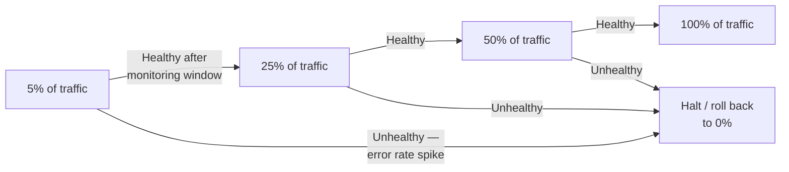

## Three techniques that solve different problems, not the same one

**If canary, blue-green, and feature flags are all "safer deployment"
techniques, why does it matter which one is used for the Scenario's
problem?** Because each one optimizes for a different failure mode,
and picking the wrong one leaves the actual risk unaddressed:

| Technique             | What it actually controls                                                | What it doesn't solve                                                                            |
| --------------------- | ------------------------------------------------------------------------ | ------------------------------------------------------------------------------------------------ |
| Canary deployment     | How many users are exposed to a new version before it's fully rolled out | Doesn't make rollback instant — reverting still means redeploying the old version                |
| Blue-green deployment | How fast a full rollback can happen (an instant traffic switch)          | Doesn't limit how many users hit a bug before someone notices and switches back                  |
| Feature flag          | Whether a specific piece of code runs at all, independent of deploys     | Doesn't control infrastructure-level or non-code-gated risks (like the underlying deploy itself) |

**Would blue-green deployment alone have prevented the Scenario's
20-minute incident?** Not on its own — blue-green makes the _rollback_
fast once the bug is noticed, but the Scenario's algorithm still would
have gone to 100% of traffic immediately, meaning every user would
still hit the bug in the time it takes to _notice_ it, before any
rollback (fast or slow) even starts.

## The staged-rollout model canary deployments actually use

**Does a canary deployment mean routing 5% of traffic forever, or
something else?** In practice, canary rollouts move through defined
stages, each gated by a health check before advancing:

Each stage is a real checkpoint, not just a delay — if the error rate
or another health signal crosses a threshold at any stage, the
rollout halts and rolls back to the previous known-good state,
automatically or via a human decision, before advancing further.

**Why not just start at 50% instead of 5%, to reach full rollout
faster?** Because the whole point is limiting exposure while the
signal is still uncertain — starting small means a bug caught at the
first stage affects the smallest possible number of users, and each
successful stage is itself evidence that increases confidence before
increasing exposure.

## Failure modes at this level

- **Treating any one of these three techniques as covering all the
  others.** Blue-green without canary still exposes 100% of traffic
  to a new bug immediately, just with a faster fix once it's found;
  canary without a fast rollback mechanism still takes time to fully
  revert even after a problem is caught early.
- **Skipping stages or moving too fast through them.** Jumping
  straight from 5% to 100% because the 5% stage "looked fine" after
  only a minute defeats the purpose of gradual, evidence-based
  expansion.
- **Monitoring the wrong signal at each stage.** A canary stage that
  only checks "did the server crash" misses the Scenario's exact
  failure mode — a subtle correctness bug that doesn't crash anything,
  just quietly returns wrong results.
