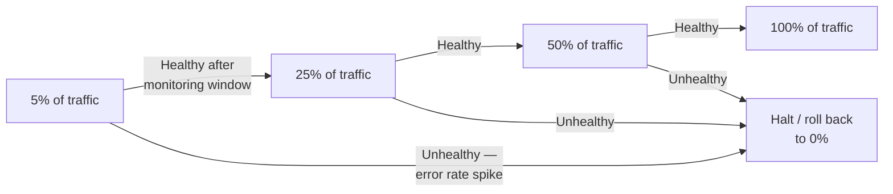

import LevelIntro from "../../../components/LevelIntro.astro";
import Checkpoint from "../../../components/Checkpoint.astro";

L1 named canary, blue-green, and feature flags as three distinct
techniques. This level works through what each one actually optimizes
for, why they don't substitute for each other, and the staged-rollout
model most canary systems use in practice.

<LevelIntro
  items={[
    "What each technique controls vs. doesn't",
    "The staged canary rollout model",
    "Failure modes: wrong tool, wrong pace, wrong signal",
  ]}
/>

## Three techniques that solve different problems, not the same one

**If canary, blue-green, and feature flags are all "safer deployment"
techniques, why does it matter which one is used for the Scenario's
problem?** Because each one optimizes for a different failure mode,
and picking the wrong one leaves the actual risk unaddressed:

Plain version before the table: canary decides **how many people try
the new version**, blue-green decides **how fast traffic can switch
back to a known-good environment**, and a feature flag decides **whether
one behavior inside the app is turned on**.

| Technique             | What it actually controls                                                | What it doesn't solve                                                                                                                                |
| --------------------- | ------------------------------------------------------------------------ | ---------------------------------------------------------------------------------------------------------------------------------------------------- |
| Canary deployment     | How many users are exposed to a new version before it's fully rolled out | Doesn't by itself define the rollback mechanism — reverting may mean lowering canary to 0%, switching environments, disabling a flag, or redeploying |
| Blue-green deployment | How fast a full rollback can happen (an instant traffic switch)          | Doesn't limit how many users hit a bug before someone notices and switches back                                                                      |
| Feature flag          | Whether a specific piece of code runs at all, independent of deploys     | Doesn't control infrastructure-level or non-code-gated risks (like the underlying deploy itself)                                                     |

**Would blue-green deployment alone have prevented the Scenario's
20-minute incident?** Not on its own — blue-green makes the _rollback_
fast once the bug is noticed, but the Scenario's algorithm still would
have gone to 100% of traffic immediately, meaning every user would
still hit the bug in the time it takes to _notice_ it, before any
rollback (fast or slow) even starts.

<Checkpoint question="A team has blue-green deployment set up, but no canary and no feature flag. They ship a new version to 100% of traffic in the green environment. A bug affecting every user appears 10 minutes later. Did blue-green fail here, or is this what blue-green was always going to do without canary alongside it?">

This is exactly what blue-green does on its own — it was never
designed to limit how many users see a new version, only to make the
switch back to the known-good version fast once someone decides to
revert. Blue-green didn't fail; it did its one job (fast rollback)
while a different job (limiting exposure before the bug is even
noticed) went uncovered, because nothing here was routing only a small
slice of traffic to the new version first. The 10 minutes it took to
notice the bug is 10 minutes at 100% exposure regardless of how fast
the rollback itself is — that gap is canary's job, not blue-green's.

</Checkpoint>

## The staged-rollout model canary deployments actually use

**Does a canary deployment mean routing 5% of traffic forever, or
something else?** In practice, canary rollouts move through defined
stages, each gated by a health check before advancing:

Each stage is a real checkpoint, not just a delay — if the error rate
or another health signal crosses a threshold at any stage, the
rollout halts and rolls back to the previous known-good state,
automatically or via a human decision, before advancing further.
An **error rate** is "bad requests divided by total requests"; a
**threshold** is the agreed limit; a **monitoring window** is the period
you watch before deciding whether the stage is healthy. For the
recommendation Scenario, "healthy" cannot only mean "the server did not
crash" — it might also include recommendation-click rate, empty-result
rate, support reports, or a product-quality metric tied to that feature.

**Why not just start at 50% instead of 5%, to reach full rollout
faster?** Because the whole point is limiting exposure while the
signal is still uncertain — starting small means a bug caught at the
first stage affects the smallest possible number of users, and each
successful stage is itself evidence that increases confidence before
increasing exposure.

<Checkpoint question="A canary rollout is sitting at the 25% stage, healthy so far. The next scheduled stage is 50%. Why does advancing to 50% still need its own health check, instead of treating 'healthy at 25%' as proof the rollout is now safe all the way to 100%?">

Because each stage exposes a different, larger slice of real traffic,
and a bug can be scale-dependent or segment-dependent in ways a
smaller slice never revealed — a subtle issue that only shows up under
higher concurrent load, or that disproportionately affects a user
segment underrepresented in the first 25%, can pass cleanly at one
stage and still surface at the next. "Healthy at 25%" is evidence
about the 25% population and load level, not a guarantee about
everyone else, which is exactly why the staged model gates every
step with its own check rather than treating an early pass as
clearance for the rest of the rollout.

</Checkpoint>

## Failure modes at this level

- **Treating any one of these three techniques as covering all the
  others.** Blue-green without canary still exposes 100% of traffic
  to a new bug immediately, just with a faster fix once it's found;
  canary without a fast rollback mechanism still takes time to fully
  revert even after a problem is caught early.
- **Skipping stages or moving too fast through them.** Jumping
  straight from 5% to 100% because the 5% stage "looked fine" after
  only a minute defeats the purpose of gradual, evidence-based
  expansion.
- **Monitoring the wrong signal at each stage.** A canary stage that
  only checks "did the server crash" misses the Scenario's exact
  failure mode — a subtle correctness bug that doesn't crash anything,
  just quietly returns wrong results.
