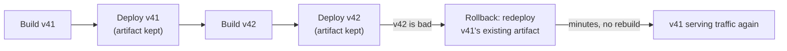
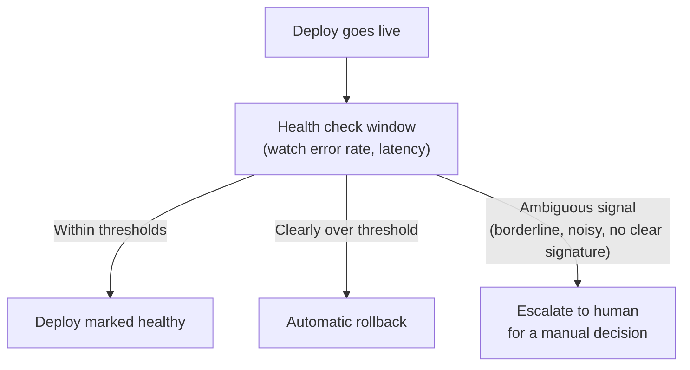

import LevelIntro from "../../../components/LevelIntro.astro";
import Checkpoint from "../../../components/Checkpoint.astro";

L1's Scenario showed a 20x gap between two teams with the same bug,
decided entirely by preparation made before the incident. This level
works through the three things that preparation actually consists of:
what makes reverting fast, what makes it safe, and who — or what —
decides to pull the trigger.

<LevelIntro
  items={[
    "Fast: ready artifacts, not rebuilds",
    "Safe: the database migration trap",
    "Triggers: automatic vs. manual",
  ]}
/>

## What actually makes a rollback fast

**If the previous version's code still exists in version control,
why did the Scenario's rollback take 40 minutes instead of being
instant?** Because "the code still exists" and "a running version is
ready to serve traffic" are not the same thing. Between them sits a
build step — compiling, bundling, containerizing — that `ci-cd-pipeline-anatomy`
covers as the normal cost of shipping forward, but which becomes an
unwelcome tax when it has to happen again, urgently, during an
incident.

The fix is a direct consequence of how `deployment-automation` already
works in a mature pipeline: every deploy's build artifact — the exact
container image or binary that was actually running — gets kept, not
discarded, for some retention window after it's superseded. A rollback
then means pointing the deployment system at an artifact that already
exists, the same mechanism an ordinary forward deploy uses, just
aimed at an older tag:

Blue-green deployments and feature flags, from `progressive-delivery`,
are two concrete ways this shows up in practice: blue-green keeps a
whole previous environment warm and ready, and flipping a feature flag
off is itself a rollback that requires no redeploy at all. Neither is
a separate idea from "keep the old artifact ready" — they're both
instances of it, at different layers of the system.

<Checkpoint question="A team deletes old container images from their registry after every successful deploy, to save storage costs, keeping only the currently-running version. Is their next rollback going to be fast or slow, and why?">

Slow — deleting the previous artifact is exactly what turns a
rollback into a rebuild. Even though the old code still exists in
version control, "fast" requires a ready-to-run artifact sitting idle,
not source that has to be rebuilt under incident pressure. This team
has traded a small, predictable storage cost for an unpredictable,
much larger cost at exactly the worst time to pay it — during an
active incident, the 2am scenario from L1.

</Checkpoint>

## The database migration trap

**If keeping old artifacts ready solves the speed problem, is
redeploying the previous application code always a safe rollback?**
No — and this is the single trickiest part of rollback strategy.
Application code and the database it talks to are deployed on
different schedules but have to agree with each other at every
moment, including the moment right after a rollback.

Consider a bad deploy that, alongside a code change, also ran a
migration dropping a column the old code still reads:

| Step                                  | Code version | Schema state                  | Result                                                   |
| ------------------------------------- | ------------ | ----------------------------- | -------------------------------------------------------- |
| Before the deploy                     | v41 (old)    | has `legacy_status` column    | working                                                  |
| Bad deploy: v42 ships, migration runs | v42 (new)    | `legacy_status` dropped       | v42 doesn't read that column, so it looks fine           |
| Naive rollback: redeploy v41          | v41 (old)    | `legacy_status` still dropped | v41 reads `legacy_status` on every request — **crashes** |

The rollback here didn't fix the incident — it replaced one failure
mode (a bug in v42) with a worse one (v41 crashing on every request
against a schema it no longer matches). "Just redeploy the old
version" is only actually safe when the schema underneath it hasn't
moved in a way the old code can't handle.

**So does that mean database migrations should just be avoided during
risky deploys entirely?** No — it means migrations need to be written
so both versions of the code can run against the same schema at once,
for as long as a rollback might still happen. This is usually done
with an **expand-contract** pattern: add the new column first and
ship code that writes both old and new columns, without yet removing
anything; only drop the old column in a later, separate deploy, after
the rollback window for the code change has safely passed.

| Migration pattern                                               | Rollback-compatible?          | Why                                                                                                                  |
| --------------------------------------------------------------- | ----------------------------- | -------------------------------------------------------------------------------------------------------------------- |
| Drop a column the old code still reads                          | No                            | Old code crashes or errors reading a column that no longer exists                                                    |
| Rename a column in place                                        | No                            | Old code looks for the old name, new code looks for the new name — a rollback breaks whichever version doesn't match |
| Add a new nullable column, old code ignores it                  | Yes                           | Old code never references the new column, so it's unaffected                                                         |
| Expand-contract: add new column, write both, drop old one later | Yes (during the expand phase) | Both code versions can read/write correctly until the old column is deliberately retired in its own separate step    |

<Checkpoint question="A team wants to rename a `status` column to `order_status` for clarity. Using the expand-contract idea, what's the rollback-safe way to do this in a single deploy of the code change, versus the unsafe way?">

The unsafe way is a straight rename: the moment the migration runs,
whichever code version doesn't match the new name breaks — the old
code looks for `status`, which no longer exists. The rollback-safe way
splits it into separate steps spread across deploys: first add
`order_status` as a new column and ship code that writes to both
`status` and `order_status` while still reading from `status` (or
either, since both are being kept in sync) — this deploy is safe to
roll back, because the old column is untouched. Only in a later,
separate deploy, once the new column has been live long enough that a
rollback to before it existed is no longer a realistic concern, does
`status` actually get dropped. The rename becomes rollback-safe by
never having a single deploy where one code version depends on
something the other doesn't have.

</Checkpoint>

## Automatic vs. manual rollback triggers

**Once a rollback is both fast and safe to perform, who — or what —
decides to actually do it?** The Scenario's 2am incident spent time
not just rebuilding, but also being noticed and diagnosed by a human
before rollback even started. A **health check** — an automated signal
like error rate or latency, watched continuously after every deploy —
can close that gap by deciding on its own, without waiting for someone
to notice:

The reason this isn't "always automate it" is that not every bad
signal has the same certainty. A sharp, sustained spike in 500 errors
right after a deploy is an unambiguous, well-understood failure
signature — safe to let a machine act on immediately. A slow, mild
uptick in latency that might be the deploy, or might be an unrelated
traffic pattern, is exactly the kind of ambiguous case where an
automatic rollback risks reverting a perfectly good deploy over noise
— that's a judgment call better left to a human who can look at more
context than a single threshold captures. Where that line sits — how
sharp a signal has to be before it's trusted to a machine — is a
tuning problem L3 works through concretely.

## Failure modes at this level

- **Treating "we have version control" as equivalent to "we can roll
  back fast."** Source history isn't a ready-to-run artifact — without
  keeping the previous build around, every rollback pays a rebuild
  tax at the worst time.
- **Assuming code rollback is always safe.** A deploy that pairs a
  code change with a non-backward-compatible migration turns "just
  redeploy the old version" into a second, different outage.
- **Automating every rollback trigger, or automating none of them.**
  An unambiguous, well-understood failure signature is safe to
  automate; an ambiguous one handed to a machine risks false-positive
  rollbacks, while an unambiguous one left to a slow human process
  wastes the exact speed a fast rollback mechanism was built to
  provide.
