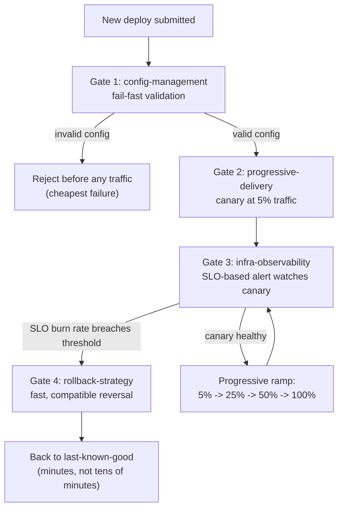

import LevelIntro from "../../../components/LevelIntro.astro";
import Checkpoint from "../../../components/Checkpoint.astro";

L1's Team B didn't invent anything new. Every piece it used — a canary
rollout, an SLO-based alert, a compatible migration, a config check — is
a technique this track already covers on its own. So the sharper question
for this level is:

**If none of the individual pieces are new, what exactly is the "staff-level"
work here — and in what order do they actually have to fire relative to
each other?**

<LevelIntro
  items={[
    "The four pieces and the exact order they trigger in: validate, expose, detect, reverse",
    "Why the whole chain must be designed and load-tested before a real incident, not during one",
    "The honest cost of each safety layer, and how to decide how much is worth paying",
  ]}
/>

## The pipeline: four gates, in a specific order

**Team A had all the raw ingredients available too — canaries, alerting
tools, rollback commands all exist as products they could buy. Why did
none of it help?**

Having the tools isn't the same as having them wired together in the
right sequence. A canary that runs _after_ a bad config already reached
100% of traffic doesn't help. An alert that fires on the right signal but
after a rollback has already been attempted doesn't help either. The
order matters because each gate exists to catch a different class of
failure, as early and cheaply as possible:

The sequence is deliberate, not arbitrary: each gate is ordered by how
cheap it is to catch a problem there versus letting it slip to the next
one.

| Prior unit's technique                          | What it catches                                                                                   | Why it sits where it does in the chain                                                          |
| ----------------------------------------------- | ------------------------------------------------------------------------------------------------- | ----------------------------------------------------------------------------------------------- |
| `config-management` (fail-fast validation)      | "The config was wrong, not the code" — a missing env var, an out-of-range timeout, a typo'd value | Cheapest possible failure: catches the bug before a single request is served on the new version |
| `progressive-delivery` (canary / feature flags) | Bugs validation can't see — real logic errors, like L1's null-pointer regression                  | Limits blast radius to a small slice of traffic while the bug is still undetected               |
| `infra-observability` (SLO-based alerting)      | Whether the canary is actually healthy, using the signal that matches user experience             | Answers "is this canary actually bad?" fast enough to act inside the canary window              |
| `rollback-strategy` (safe, compatible reversal) | Turns a detected bad deploy into a fast, low-risk exit                                            | Only works fast if earlier deploys were already written to make this safe — see next section    |

<Checkpoint question="Suppose a team has a working canary and a working SLO alert, but no fail-fast config validation gate. A bad config value (not a code bug) gets deployed. Does the canary + alert combination still catch it before it's a problem?">

Usually yes, eventually — a canary running the bad config would likely
show degraded SLO metrics just like a code bug would, and the alert would
still fire. But it's strictly worse than catching it at the config gate:
the bad config still reaches real production traffic (even if only 5% of
it) before anything reacts, and it costs a full canary-and-alert cycle
(often several minutes) instead of being rejected in seconds before any
traffic is served. The config-validation gate isn't redundant with the
canary — it's the cheaper, earlier catch for the specific failure class
it targets, which is exactly why it sits first in the chain rather than
being skipped in favor of "the canary will catch it anyway."

</Checkpoint>

## Why rollback has to be designed in before the deploy, not during the incident

**Team A's rollback took 31 extra minutes because of a migration
incompatibility. Was that bad luck, or a predictable consequence of how
the deploy was built?**

This is the connective tissue between `progressive-delivery` and
`rollback-strategy` that makes the whole chain actually work: a canary
and an alert only buy time to react _if_ reacting is actually fast once
the alert fires. If the deploy that goes out at 4:45pm includes a
database migration that isn't backward-compatible with the previous
code version, then "roll back the code" and "the database schema still
matches what the old code expects" become mutually exclusive — the fast
rollback the whole pipeline was built to enable simply isn't available
when it's needed.

This is why `rollback-strategy`'s expand/contract migration discipline
isn't a nice-to-have alongside this pipeline — it's a hard prerequisite
for the pipeline's fast-detection half to actually pay off. Detecting a
bad deploy in 3 minutes is worthless if reversing it still takes 31.
The whole architecture only works end-to-end if every piece holds:
validate early, expose a little, detect fast, **and be able to actually
reverse fast** once detection fires.

## Designed in advance, not improvised

**If all four pieces are well-understood individually, why does this
still take deliberate staff-level effort to get right, rather than each
team just picking them up as needed?**

The failure mode this unit is really about isn't "we don't have a
canary" or "we don't have alerting" — most teams past a certain size have
each piece _somewhere_. The failure mode is that nobody has verified the
pieces actually work together, end-to-end, under the exact conditions a
real bad deploy creates. Team A almost certainly had a rollback runbook.
What it didn't have was a rollback runbook that had ever been rehearsed
against a deploy carrying an incompatible migration — so the
incompatibility was discovered live, during the incident, instead of
during a planned failure drill weeks earlier.

The staff-level work is specifically:

- Making sure the four gates exist **and are wired in the right order**
  relative to each other (validate → expose → detect → reverse), not
  scattered as unconnected tools each team reaches for independently.
- Making sure the chain is **tested before it's needed** — a rehearsed
  rollback against a real migration, a canary alert that's been forced to
  fire on purpose at least once, not just configured and assumed to work.
- Deciding, deliberately, **how much of this to build for a given
  service** — which the next section covers, because none of this is
  free.

## The honest cost of safety margin

**If this pipeline is strictly better at catching bad deploys, why
wouldn't every team build the full version of it for every service?**

Because every gate in this chain has a real cost, and `cost-awareness`'s
central lesson — that safety margin is a real, ongoing expense, not a
free upgrade — applies here exactly as much as it applies to
over-provisioned infrastructure. A canary stage adds real deploy latency
(minutes per stage, multiplied by however many stages exist before
100%). Running SLO-based alerting well takes real engineering investment
to define good SLIs and tune thresholds so they don't just add noise.
Rehearsing rollback drills takes real engineer time that isn't spent
building features. None of that is free, and none of it should be
maximized reflexively.

The right amount of investment scales with what's actually at stake: a
payment checkout path justifies the full chain, because a bad deploy
there is expensive in real, measurable ways (lost revenue, damaged
trust, possibly compliance exposure). A low-traffic internal admin tool
used by six people on the team usually doesn't — a simpler, faster,
cheaper release process is the right call there, and building the full
canary/SLO/rollback machinery for it would be over-engineering past the
point the actual risk justifies. L3 makes this trade-off concrete with
real numbers instead of leaving it as a vague "it depends."
