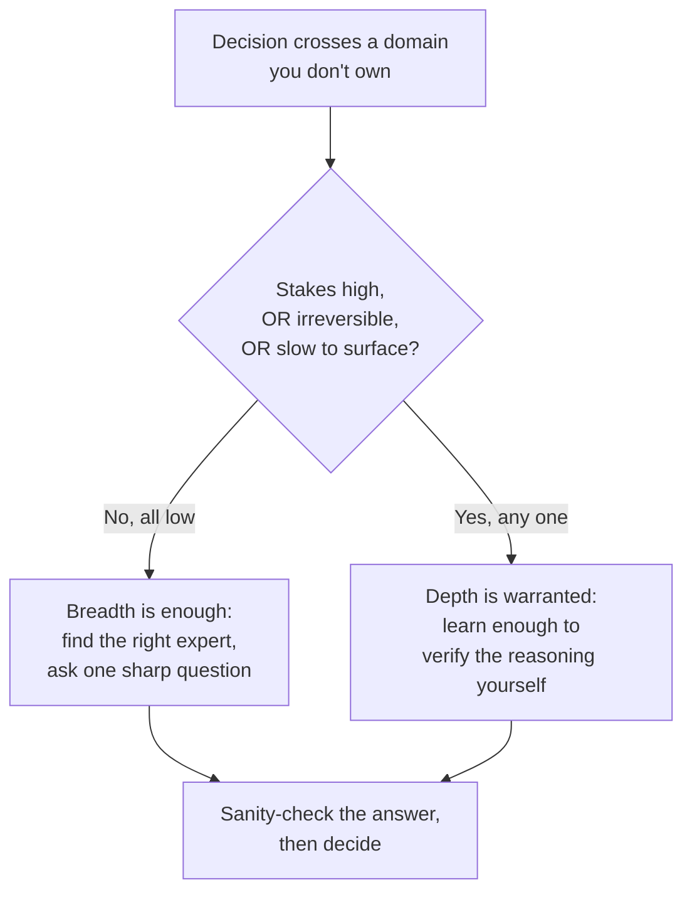

import LevelIntro from "../../../components/LevelIntro.astro";
import Checkpoint from "../../../components/Checkpoint.astro";

L1 left Priya at the fork: go learn Android power management herself,
or find the right twenty-minute conversation. That fork isn't unique to
mobile battery drain — it recurs every time a decision crosses into a
domain someone doesn't own. This level builds the model for making that
call on purpose, and for running the conversation well once "depth
isn't required, but borrowed judgment is" turns out to be the answer.

<LevelIntro
  items={[
    "The three factors that decide breadth vs. depth",
    "A decision flow from those factors to an action",
    "How to find, question, and sanity-check the right expert",
  ]}
/>

## What actually decides whether a call needs real depth?

Priya could ask herself "is this important?" — but almost everything a
VP escalates to a staff engineer feels important in the moment. **What
question actually separates "read two paragraphs and ask one sharp
question" from "block three days and get genuinely fluent in this"?**

Three factors, taken together, do the separating — no single one of
them is enough on its own:

| Factor         | The question                                    | Low value → breadth is enough              | High value → depth is warranted                                                          |
| -------------- | ----------------------------------------------- | ------------------------------------------ | ---------------------------------------------------------------------------------------- |
| Stakes         | How much damage does a wrong call do?           | A staging config, one team's internal tool | User data, revenue, safety, irreversible data loss                                       |
| Reversibility  | How cheaply can a wrong call be undone?         | A feature flag flipped back in minutes     | A schema migration, a public API contract, a legal commitment                            |
| Time-to-signal | How fast would a wrong call surface on its own? | Breaks in the next hour's dashboard        | Silently degrades something over months (battery life, security posture, technical debt) |

A call is safe to handle on breadth alone when it's **low-stakes,
reversible, and fast-to-signal** — even if it happens to sit in an
unfamiliar domain. A call earns real personal depth when it's **high
in any one of the three**, because borrowed judgment stops being a
safe substitute exactly where a wrong call is expensive, hard to undo,
or would go unnoticed until it's already caused damage.

Priya's mobile-battery call: real users, a public release, and a
drain problem that would surface slowly over weeks of complaints rather
than an immediate crash — high on two of the three factors. That
doesn't mean Priya personally needs to learn Android internals by
tomorrow; it means the decision is exactly the kind where borrowed
judgment has to be treated carefully, not skipped or trusted blindly.

<Checkpoint question="A staff engineer is asked to approve a one-line copy change to an internal admin tool's error message, in a domain they've never touched. Using the three factors, does this call need real depth?">

No — this is close to the clean "breadth is enough" case. Stakes are
low (an internal tool, not user-facing revenue or safety), it's
trivially reversible (revert the copy change in seconds), and any
problem would surface immediately (someone reads the wrong message and
says so). None of the three factors is high, so there's no reason to
block time learning that tool's internals — a quick glance and a
one-line question to whoever owns it is the right-sized response, not
under-caution and not over-caution.

</Checkpoint>

## How do you find and question the right expert, fast?

Deciding breadth is enough doesn't finish the job — it just changes
what "doing the work" means. **Once Priya knows she doesn't need to
personally understand wakelocks, what does she actually need to do
instead, in the time she has?**

Three moves, in order:

- **Find the actual owner, not the nearest available person.** The
  right expert is whoever has real depth in the specific mechanism at
  play — not the most senior person in the room, not whoever answers
  fastest on chat, and not necessarily whoever has the relevant job
  title. For Priya, that's the engineer who wrote the background-sync
  scheduler, not the mobile team's manager.
- **Frame a question sharp enough to be answered in minutes.** "Is
  this safe?" invites a vague, hedged answer because it doesn't say
  what "safe" means or what Priya already knows. "If this job runs
  every 15 minutes instead of every hour, does it hold a wakelock long
  enough to matter for battery, and how would we know if it did?" gives
  the expert a specific, checkable question they can actually answer
  well — this is the same specificity signal from `weighing-credibility`
  applied to a live conversation instead of a written claim.
- **Sanity-check the answer before acting on it.** Getting an answer
  from a real expert is not the same as verifying it. Ask for the
  reasoning, not just the verdict ("what would actually go wrong, and
  how would we catch it early?") and notice whether the explanation is
  specific and falsifiable or just confident-sounding — the same
  distinction `weighing-credibility` draws between a source who names a
  checkable mechanism and one who's merely fluent. This is also where
  `calibration` matters: the goal isn't zero uncertainty, it's an
  honest sense of how confident this borrowed judgment should make
  Priya, not blind trust dressed up as diligence.

<Checkpoint question="Priya asks the scheduler's owner 'is this safe?' and gets back 'yeah, should be fine.' Has she gotten a useful answer?">

Not really — and the problem is the question, not the answer. "Is this
safe?" doesn't tell the expert what dimension of safety matters here
(battery? crash risk? data loss?) or give them anything specific to
reason about, so "should be fine" is a perfectly honest response to a
vague prompt — it just isn't load-bearing. A sharper question ("does
holding a wakelock this way meaningfully increase battery drain, and
under what condition would it?") would force a specific, checkable
answer that Priya could actually sanity-check, instead of a shrug she
has no way to evaluate.

</Checkpoint>

The two halves connect: get the depth-vs-breadth call right, then
treat "ask the right expert" as a skill with its own technique — not
just showing up and hoping someone explains it well unprompted. L3
walks this exact sequence through Priya's actual day, including a
place where it goes wrong before it goes right.
