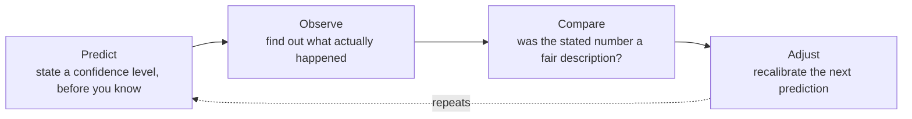

import LevelIntro from "../../../components/LevelIntro.astro";
import Checkpoint from "../../../components/Checkpoint.astro";

L1 showed the gap between Ben and Rosa: same twenty years, wildly
different calibration, because only one of them ever checked her
stated confidence against what actually happened. Here's the model
underneath that — what "well-calibrated" precisely means, and the loop
that actually builds it.

<LevelIntro
  items={[
    "The calibration curve — stated confidence vs. actual hit rate",
    "Overconfident, underconfident, and well-calibrated as distinct patterns",
    "Why the predict → observe → compare → adjust loop is the mechanism",
  ]}
/>

## What does "well-calibrated" precisely mean?

Saying "I'm 80% confident" isn't a single data point you can check —
you can't know if one 80%-confidence guess was "fair" just because it
happened to be right or wrong. Calibration is a claim about a _whole
group_ of predictions at the same confidence level. **If you bucket
every time someone said "80% confident" across many separate
predictions, a well-calibrated person should turn out right about 80%
of those — not 95%, not 60%.**

```mermaid
xychart-beta
    title "Stated confidence vs. actual hit rate, by pattern"
    x-axis ["Said 60%", "Said 80%", "Said 95%"]
    y-axis "Actual hit rate (%)" 0 --> 100
    bar [60, 80, 95]
    bar [82, 93, 99]
```

The first bar series is the "perfectly calibrated" line — actual hit
rate exactly matching stated confidence at every level. The second
series is Ben: at every confidence level he names, he's actually right
_more_ often than a matched, calibrated forecaster would predict at the
low end, and _less_ often at the high end — a common real pattern
where someone is timid about medium confidence but reckless about high
confidence. The gap between the two bars at a given stated level, not
the bars in isolation, is what "miscalibrated" means.

| Pattern         | Stated confidence       | Actual hit rate   | What it looks like in practice                                                                       |
| --------------- | ----------------------- | ----------------- | ---------------------------------------------------------------------------------------------------- |
| Overconfident   | High (e.g. "95% sure")  | Lower (e.g. 70%)  | Speaks with certainty, wrong often enough to cause real damage when trusted                          |
| Underconfident  | Low (e.g. "60% sure")   | Higher (e.g. 90%) | Hedges constantly, real expertise gets discounted or ignored by others                               |
| Well-calibrated | Matches, at every level | Matches           | "70% sure" calls land right about 70% of the time, "95% sure" calls land right about 95% of the time |

<Checkpoint question="Someone says '70% confident' on 100 separate predictions across a year, and turns out to be right on 95 of them. Are they well-calibrated?">

No — and this is the direction that surprises people, because "right
95 times" sounds like a good outcome on its face. Calibration isn't
about being right _more_; it's about your stated number matching your
actual hit rate. Someone who says "70% confident" should expect to be
wrong about 30 times out of 100. Being right 95 times means their real
hit rate is closer to 95%, so "70% confident" was too low a number for
how sure they actually should have been — this is underconfidence, the
mirror image of Ben's overconfidence. Their calls were good; their
stated number describing those calls wasn't.

</Checkpoint>

## Why doesn't doing something a thousand times automatically calibrate you?

Ben has as many mornings of sky-watching as Rosa. If repetition alone
built calibration, they'd have converged to roughly the same accuracy
years ago. **What's actually missing from Ben's twenty years — the
thing that has to be present for experience to turn into calibration
at all?**

Two people can do the exact same task the exact same number of times
and end up in completely different places, because calibration doesn't
come from the _doing_ — it comes from a specific loop wrapped around
the doing:

- **Predict** — before you know the outcome, commit to an explicit
  number: "80% confident it'll rain," not a vague "probably." A number
  you can be scored against later is what makes the rest of the loop
  possible.
- **Observe** — let reality resolve the question, without editing your
  memory of what you predicted. (This is exactly the step Ben skips —
  he never records the "before" number, so there's nothing to check
  the "after" against.)
- **Compare** — across many predictions at the same stated level, did
  the hit rate actually match? This step requires _keeping a record_;
  a single instance never tells you anything about calibration.
  One right guess proves nothing; one wrong guess proves nothing either.
- **Adjust** — if "90% confident" calls are only landing 60% of the
  time, that's real information: dial back what "90% confident" means
  for you, specifically, going forward.

Passive repetition — doing the task again and again without ever
stating a number in advance and checking it — leaves this entire loop
unused. The _volume_ of experience goes up; the _feedback about your
own confidence_ stays at zero. That's the whole reason Ben's twenty
years didn't help: he was practicing the _task_ (guessing rain), not
the _loop_ (checking his stated confidence against outcomes).

<Checkpoint question="A engineer has shipped 200 database migrations over five years, but has never once written down beforehand how confident they were that a given migration was safe. Will their next confidence estimate about a risky migration likely be well-calibrated?">

Not reliably — 200 migrations is a lot of the _task_, but with no
recorded predictions to check against outcomes, none of that volume
was ever run through the predict → observe → compare → adjust loop.
The engineer has real pattern-recognition from doing migrations that
many times, which is worth something — but "worth something" isn't
the same as "calibrated." They might have a strong gut feel that's
quietly overconfident (like Ben) or quietly underconfident, and 200
repetitions with no feedback loop wouldn't have surfaced which. The
fix isn't more migrations; it's starting to state a confidence number
before each one and checking it afterward.

</Checkpoint>

The upshot: calibration is a skill built specifically by the loop, not
a side effect of raw exposure to a domain. Someone who's done a task
50 times _with_ the loop can out-calibrate someone who's done it 500
times without it. This is the piece that matters most for technical
judgment, which L3 works through end to end.
