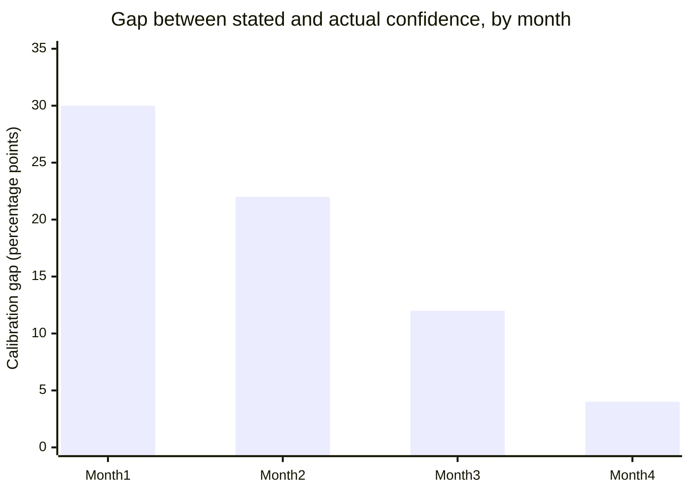

import LevelIntro from "../../../components/LevelIntro.astro";
import Checkpoint from "../../../components/Checkpoint.astro";

L2 established the loop — predict, observe, compare, adjust — as the
actual mechanism behind calibration, distinct from just doing a task
repeatedly. This level runs that loop through a full technical
judgment scenario: an engineer's track record of estimates, tracked
and checked against real outcomes over months, and what specifically
changed as a result.

<LevelIntro
  items={[
    "A full predict-and-check log for task estimates and debugging hypotheses",
    "How a real overconfidence incident gets caught and corrected",
    "What changes when feedback is slow, or the domain is noisy",
  ]}
/>

## What does a calibration log for technical judgment actually look like?

"Good technical judgment" is often described as something senior
engineers just _have_ — a gut feel earned from years of experience.
L2 already complicated that story: raw years don't guarantee
calibration, the predict-and-check loop does. **What does actually
running that loop look like for the two most common technical
judgment calls — how long something will take, and how confident to
be in a debugging hypothesis?**

Tomás, three years into his role, starts keeping a short log every
time he makes either kind of call. Before starting a task, he writes
down a completion-confidence estimate: _"80% confident I'll finish
this by Friday."_ Before trying a fix, he writes down a hypothesis
confidence: _"70% confident the root cause is the connection pool
timeout, not the retry logic."_ He doesn't act any differently in the
moment — he still starts the task, still tries the fix — but he now
has an explicit "before" number to check against the "after."

| Month | Estimates logged | "80% confident" calls: actual hit rate | Pattern             |
| ----- | ---------------- | -------------------------------------- | ------------------- |
| 1     | 6                | 50%                                    | Badly overconfident |
| 2     | 7                | 58%                                    | Still overconfident |
| 3     | 6                | 68%                                    | Improving           |
| 4     | 5                | 76%                                    | Close               |

By month 4, Tomás's "80% confident" calls are landing right around
80% of the time — the gap that started at 30 points has nearly closed.
Nothing about the _tasks_ got easier over those four months; what
changed is that Tomás now has real feedback on what "80% confident"
should feel like, calibrated against his own actual track record
instead of a vague sense of certainty.

<Checkpoint question="Tomás's log mixes two different kinds of predictions — task-duration estimates and debugging root-cause hypotheses. Does that weaken the log, since they're not really the same skill?">

No — this is actually closer to the real thing calibration training
targets. Calibration isn't tied to one narrow task; it's a property of
_how a person maps their gut feeling of certainty to a number_, and
that mapping tends to transfer across different kinds of calls within
a domain they know well. What matters for the log isn't that every
entry is the same type of question — it's that every entry has an
explicit "before" number and a checkable "after" outcome. Mixing
duration estimates and hypothesis confidence actually gives Tomás more
data points per month to calibrate against, faster, than restricting
himself to only one narrow question type would.

</Checkpoint>

## What did overconfidence actually cost, and what changed?

Early in month 1, before Tomás started logging anything, he pushed a
configuration change to production, telling his lead: _"I'm 95%
confident this is safe, it's a one-line timeout bump."_ It caused a
20-minute outage — the timeout interacted with a retry storm nobody
had modeled. Reviewing his (newly-started) log a few weeks later,
Tomás noticed something specific: his _general_ confidence calls were
only mildly overconfident (the month-1 row above, 80% stated vs. 50%
actual), but his **95%-confident** calls specifically — the "this is
basically certain" tier — were landing right only about 65% of the
time across the handful he could reconstruct. **The failure wasn't
"Tomás is overconfident" in general. It was concentrated at the very
top of his confidence scale — exactly where a wrong call is also most
likely to be trusted without a second look.**

That's a more specific, more useful finding than "be more careful."
It told Tomás exactly what to change: treat his own "95% confident"
label as unreliable and requiring a second pair of eyes, while trusting
his "70% confident" label more than he had been (it turned out to be
close to accurate all along). The fix wasn't generic caution — it was
recalibrating one specific part of his confidence scale, based on a
specific pattern the log surfaced that a vague "try to be more humble"
resolution would have missed entirely.

<Checkpoint question="After the outage, could Tomás have fixed this just as well by resolving to 'be more careful' about high-stakes changes, without keeping the log?">

Not as precisely. "Be more careful" is untargeted — it doesn't tell
Tomás _which_ of his confidence levels are the unreliable ones, so it
either makes him second-guess calls that were already well-calibrated
(wasted effort, and it erodes trust in his own judgment generally) or
still misses the specific 95%-tier problem if his attention drifts
elsewhere under pressure. The log gave him a specific, falsifiable
finding — his 95%-confident calls specifically ran hot — which is
exactly the kind of thing only the predict-and-check loop surfaces.
Generic caution is a mood; a calibration log is a diagnosis.

</Checkpoint>

## What changes if the feedback isn't fast or clean?

Tomás's examples so far — Friday deadlines, a fix either working or
not — resolve within days. **What happens to this same loop when the
prediction is something like "this architecture will still be easy to
extend in two years," where the feedback is both slow and murky?**

Two things get harder at once, and they compound:

- **Slow feedback shrinks the number of loop cycles a career can even
  fit.** Tomás can log a task-duration estimate every few days —
  dozens of cycles a year. A two-year-horizon architectural bet gets
  maybe half a cycle a year, if that. Calibration on fast-feedback
  calls (estimates, hypotheses) can visibly improve within months,
  the way Tomás's did; calibration on slow-feedback calls (architecture,
  hiring, long-term technical strategy) improves so slowly that most
  engineers never accumulate enough resolved predictions to know if
  their gut feel on those calls is any good at all.
- **Noisy outcomes make "was I right?" itself ambiguous.** A migration
  either finished by Friday or it didn't — clean signal. Whether an
  architecture "held up" two years later is entangled with team
  turnover, changed requirements, and decisions made by people who
  weren't there for the original bet — a genuinely confounded signal,
  not a clean pass/fail. Even someone diligently logging these
  predictions has a much harder time running the "compare" step
  honestly, because the actual outcome doesn't cleanly settle the
  question the prediction asked.

The practical response isn't to give up on calibrating slow, noisy
judgment calls — it's to deliberately manufacture faster, cleaner
proxies for them. Tomás can't get real two-year feedback on an
architecture bet quickly, but he can log and check _sub-predictions_
that resolve fast and correlate with it: "I'm 75% confident this
interface will need to change within the next two features we build
against it" resolves in weeks, not years, and each one it gets right
or wrong is real evidence about the same underlying judgment.

**This same distinction generalizes past architecture.** A
customer-facing bet ("will this feature get adopted") and an internal
tooling bet ("will this refactor reduce future bug rate") both suffer
the same slow/noisy problem for different reasons — one because market
response takes time and is confounded by marketing and timing, the
other because "future bug rate" is hard to attribute to one refactor
among many changes. The fix is the same in both cases: find the
fastest, cleanest proxy prediction that still tests the same judgment,
and log that instead of waiting for the slow, murky final answer.

**What would a fast, clean proxy prediction look like for a bet you're
currently sitting on that won't resolve for months — and what makes it
a fair stand-in for the real question, rather than a different
question entirely?**

## Extending past this one example

Tomás's log happened to be about database migrations and one
production outage — but nothing about the loop is specific to that
domain. **What would the same predict → observe → compare → adjust
log look like applied to code review** ("70% confident this PR
introduces a race condition" — checked against whether it actually
did, once traced through carefully) **or to estimating a colleague's
remaining runway on a stuck task** ("60% confident they'll be unblocked
by end of day" — checked against whether they were)? The mechanism
doesn't change; only what counts as a clean, checkable outcome does.
That's the actual skill this unit is teaching — not "be right about
migrations," but building and trusting a personal track record, on
whatever technical calls a role actually requires making under
uncertainty.
