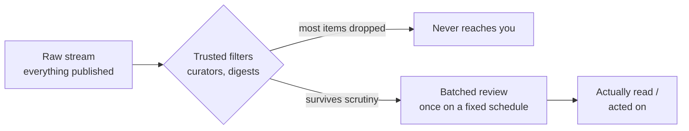

import LevelIntro from "../../../components/LevelIntro.astro";
import Checkpoint from "../../../components/Checkpoint.astro";

L1 showed Diego's one hour a week beating Elena's ten, on the same field.
Here's the actual model behind that gap — why more raw checking produces
less real knowledge, and what a small trusted-filter system does
differently.

<LevelIntro
  items={[
    "The volume-vs-attention mismatch",
    "The funnel: raw stream → trusted filters → actually read",
    "Signal-vs-hype heuristics: recency, regression, track record",
  ]}
/>

## Why does more checking produce less real knowledge?

In a genuinely fast-moving field, the volume of material produced always
outpaces the attention any one person has to give it — that gap doesn't
close as the field grows, it widens. Once that's true, checking more
often doesn't get you closer to "caught up," because "caught up" isn't
reachable; it just means more of your fixed attention gets spent on
whatever happens to be loudest at the moment you looked, rather than on
whatever actually turns out to matter.

That's the core mismatch: **attention is a small, fixed budget; volume in
a fast field is effectively unbounded.** Elena's mistake wasn't laziness
or carelessness — it was applying a strategy (read more of the raw
stream) to a problem that more reading can't solve, because the stream
grows faster than any reading pace can match. The fix isn't reading
faster. It's filtering harder, before reading starts.

## What does a curation system actually look like?

Instead of reading the raw stream directly, a curation system puts one or
more trusted filters between the flood and your attention — people or
sources whose job (formal or informal) is to already have read the raw
volume and surface only what survived a week's worth of scrutiny.

The funnel does two things at once: it shrinks the volume (most of what's
published never needs to reach you at all), and it adds a delay (a claim
has to survive at least a little scrutiny before a curator repeats it).
Elena skipped both — she read the raw stream directly, with no volume
reduction and no delay, so loud-but-unproven claims reached her with the
same weight as claims that had already been checked out.

<Checkpoint question="Diego's curators read the same raw flood Elena does — so isn't he just adding an extra step, seeing the same information later? What does the funnel actually change, not just delay?">

It changes what reaches him, not just when. The funnel's middle step
doesn't just relay the raw stream on a lag — it drops most of it. Diego
never sees the four claims that fizzled, because his curators didn't
repeat them; he isn't seeing the same five claims Elena saw, just later,
he's seeing a different, much smaller set that already survived a week of
scrutiny. The delay is what makes the drop possible (there's no way to
tell a fizzle from a real finding the moment it's published), but the
drop — not the delay by itself — is the actual value.

</Checkpoint>

## How do you tell signal from hype before there's proof either way?

Even with good filters, some hype gets through — a curator can be
convinced by something that later doesn't hold up. Three heuristics help
sort signal from hype in the moment, before final proof exists:

| Heuristic                  | What it says                                                                                                                                        | Why it works                                                                                                                                                                                 |
| -------------------------- | --------------------------------------------------------------------------------------------------------------------------------------------------- | -------------------------------------------------------------------------------------------------------------------------------------------------------------------------------------------- |
| **Recency bias check**     | "New" isn't automatically more important than established — ask whether this claim is actually more significant, or just more recent                | Most fields have a steady stream of new items; treating newness itself as significance guarantees chasing whatever showed up today, regardless of substance                                  |
| **Regression to the mean** | The loudest early claims are, on average, overstated — the most extreme-sounding version of any finding tends to moderate as more evidence comes in | Early reports are more likely to come from whoever framed a result most dramatically, not from whoever assessed it most carefully; time and replication pull loud claims back toward reality |
| **Track-record trust**     | Weight a source by whether its past "this matters" calls actually held up, not by how confident or fluent it sounds right now                       | Confidence and fluency are free to fake; a track record of being right before is the one thing that's expensive to fake                                                                      |

None of these guarantee catching every fizzle or never missing a real
early signal — they're heuristics, not proof. What they do is shift the
odds: a claim that's both brand-new and from a source with no track record
of being right before is exactly the profile of Elena's four fizzles, and
exactly what a track-record-weighted filter routinely drops before it
ever reaches a batched review.

<Checkpoint question="A brand-new source posts a dramatic, headline-grabbing claim about a finding in the field. By the recency and track-record heuristics above, should this automatically be dismissed as hype?">

Not automatically dismissed — down-weighted. The heuristics describe
odds, not certainties: most loud, brand-new, no-track-record claims turn
out to be overstated, but not all of them, and some genuine early
findings really do come from a first-time source before they build a
track record at all. The practical move isn't "ignore it," it's "don't
let it in through the fast lane" — let it sit and see whether it survives
a week, gets picked up by a source with an actual track record, or
quietly gets walked back the way four of Elena's five claims did. The
heuristic buys time before belief, not a permanent verdict.

</Checkpoint>

## What this level covers next

L3 walks through one real week in a fast-moving field with a flood of
items — some ignored outright, some worth a quick skim through a trusted
filter, one that turns out to matter weeks later, and one loud claim that
doesn't pan out — showing the actual triage decisions in order, plus what
changes when you're new to a field with no trusted curators yet, and how
to calibrate the batching interval when missing something early has real
cost.
