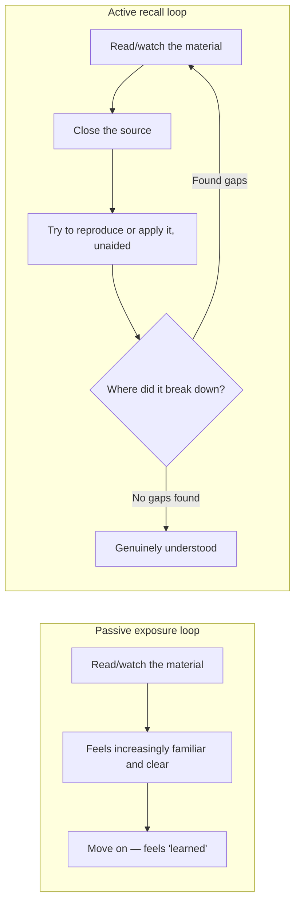

## Two different loops that feel identical from the inside

The passive loop is comfortable and produces a real subjective feeling of "getting it" — that feeling is genuine, not faked, which is exactly what makes it deceptive. The active loop is uncomfortable by design: it's supposed to surface exactly where the understanding breaks, and it only stops when that search comes up empty, not when it starts feeling smooth.

## Why the fluency illusion happens

Re-reading a passage a second or third time makes the _processing_ easier — your brain recognizes the words, the structure, the flow, faster than the first pass. That processing ease is a real, measurable phenomenon (perceptual fluency), and it produces a real feeling of increased understanding. But processing ease and retrievability are different things: being able to recognize a correct explanation when you see it again is a much weaker skill than being able to produce that explanation from nothing, and the fluency illusion is specifically the mistake of treating the first as evidence for the second.

## The Feynman technique as a forcing function

Explain the concept in plain language, to an imagined audience with no background — with no looking at the source while doing it, since the entire point is testing what's retrievable from memory, not what's recognizable when read again. Then scan the explanation for two specific tells: a term used without ever explaining what it actually means (jargon substituting for a mechanism), and any point where the explanation resorts to "and then it just works" (a hand-wave marking exactly where the understanding runs out). Wherever either tell shows up, that's precisely what to study next — not the whole topic again, just that gap. Only once the explanation runs clean, with no jargon-as-placeholder and no hand-waves, is the concept actually understood.

The technique's real value isn't the explaining itself — it's that every specific place the explanation breaks down is a **precise diagnostic** of what to study next, which is far more efficient than re-reading an entire chapter hoping the unclear part sinks in this time.

## Where this shows up on this very site

The exercise system in this curriculum (`exercises.json`, self-graded quizzes and code exercises) is a direct application of this unit's claim: reading L1/L2/L3 is the exposure step, and the exercises exist specifically because reading isn't the same as knowing — an exercise forces retrieval (answer without re-reading, run code without copying the solution) the same way the Feynman technique does, and the spaced-repetition re-exam (`spaced-repetition.ts`) exists because even successful retrieval today doesn't guarantee it's still retrievable in a month without reinforcement.
