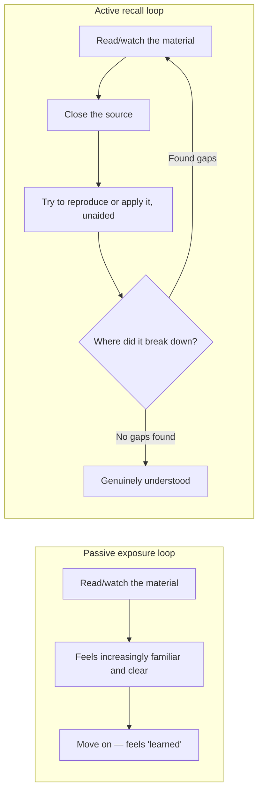

## If rereading and getting tested cold both count as "studying," what's actually different about them?

Take Priya's 7-times table from L1. Before looking at the diagram below: if
Monday's rereading and Wednesday's cold quiz are both ways of "studying,"
why did one produce a 90% confidence and the other a 40% score?

The two loops share a first step — read the material — and diverge immediately
after. The passive loop closes the loop on a _feeling_ ("that felt smooth,
I've got it"). The active loop closes it on a _result_ ("I either produced
7×8 correctly with nothing in front of me, or I didn't"). Priya's Monday
night was five trips around the passive loop; Wednesday's quiz was the first
time anyone ran the active loop on her at all.

The passive loop is comfortable, and the "getting it" feeling it produces is
genuine, not faked — which is exactly what makes it deceptive. The active
loop is uncomfortable by design: it's supposed to surface exactly where the
understanding breaks, and it only stops when that search comes up empty, not
when it starts feeling smooth.

## Why does rereading make something feel more understood, even when it isn't?

Rereading a passage a second or third time makes the _processing_ easier —
recognizing the words, the structure, the flow, faster than the first pass.
That processing ease is a real, measurable phenomenon (perceptual fluency),
and it produces a genuine feeling of increased understanding. But processing
ease and retrievability are different things: being able to recognize "56"
as the right answer when you see it printed next to "7×8" is a much weaker
skill than producing "56" with nothing printed at all — and the fluency
illusion is specifically the mistake of treating the first as evidence for
the second.

| &nbsp;                     | Perceptual fluency (Monday)                     | Retrievability (Wednesday)                          |
| -------------------------- | ----------------------------------------------- | --------------------------------------------------- |
| What it tracks             | How easy the material is to process on the page | Whether it can be produced with nothing on the page |
| Grows with rereading?      | Yes, reliably                                   | Not necessarily                                     |
| What it felt like to Priya | Increasingly confident                          | Exposed a specific gap                              |

## Given that the "getting it" feeling is unreliable, how do you convert it into an honest test?

Explain the thing in plain language, to an imagined audience with no
background — with no looking at the source while doing it, since the entire
point is testing what's retrievable from memory, not what's recognizable
when read again. Then scan the explanation for two specific tells: a term
used without ever explaining what it actually means (jargon standing in for
a mechanism), and any point where the explanation resorts to "I just know
it" or "it's automatic" (a stall marking exactly where retrieval ran out).
Wherever either tell shows up, that's precisely what to restudy next — not
the whole table again, just that gap. Only once the explanation runs clean,
with no jargon-as-placeholder and no stalls, is the thing actually
understood.

The technique's real value isn't the explaining itself — it's that every
specific place the explanation breaks down is a **precise diagnostic** of
what to study next, which is far more efficient than rereading the entire
chapter hoping the unclear part sinks in this time.

## Does this claim only apply to formal studying — and does this site actually practice what it teaches here?

The exercise system in this curriculum (`exercises.json`, self-graded
quizzes) is a direct application of this unit's claim: reading L1/L2/L3 is
the exposure step, and the exercises exist specifically because reading
isn't the same as knowing — answering a question without re-reading the
level first forces the same kind of retrieval Priya's Wednesday quiz forced
on her. The spaced-repetition re-exam (`spaced-repetition.ts`) exists for
the same reason a single Wednesday quiz wouldn't have been the end of the
story: a successful retrieval today doesn't guarantee it's still retrievable
in a month without reinforcement.
