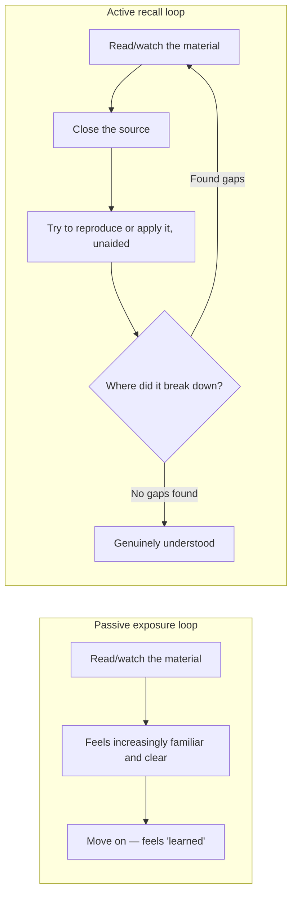

import LevelIntro from "../../../components/LevelIntro.astro";
import Checkpoint from "../../../components/Checkpoint.astro";

L1 named the trap: exposure and understanding feel the same from the
inside, because both produce a sense of familiarity, even though only one
of them survives being tested cold. L2 works out why rereading specifically
produces that false confidence, and the one technique that turns the
feeling into an honest test.

<LevelIntro
  items={[
    "The passive-exposure loop vs. the active-recall loop",
    "Perceptual fluency vs. retrievability",
    "The Feynman technique, step by step",
  ]}
/>

## If rereading and getting tested cold both count as "studying," what's actually different about them?

Take Priya's 7-times table from L1. Before looking at the diagram below: if
Monday's rereading and Wednesday's cold quiz are both ways of "studying,"
why did one produce a 90% confidence and the other a 40% score?

The two loops share a first step — read the material — and diverge immediately
after. The passive loop closes the loop on a _feeling_ ("that felt smooth,
I've got it"). The active loop closes it on a _result_ ("I either produced
7×8 correctly with nothing in front of me, or I didn't"). Priya's Monday
night was five trips around the passive loop; Wednesday's quiz was the first
time anyone ran the active loop on her at all.

Quick vocabulary bridge before the technical terms:

| Term               | Plain meaning                                  | 7×8 example                                 |
| ------------------ | ---------------------------------------------- | ------------------------------------------- |
| Familiarity        | "I have seen this before"                      | The row looks familiar                      |
| Perceptual fluency | The page feels easier because you have seen it | Reading "7×8 = 56" feels smooth             |
| Recognition        | You can pick the right thing when it is shown  | Seeing 56 and thinking "yes, that is right" |
| Retrievability     | You can pull it from memory without help       | Saying 56 with no page                      |
| Production         | You can use it in the real task                | Answering a cold quiz question              |

The passive loop is comfortable, and the "getting it" feeling it produces is
genuine, not faked — which is exactly what makes it deceptive. The active
loop is uncomfortable by design: it's supposed to surface exactly where the
understanding breaks, and it only stops when that search comes up empty, not
when it starts feeling smooth.

<Checkpoint question="Priya's dad could have just asked her 'do you feel ready?' on Wednesday instead of quizzing her cold. Using the passive-vs-active loop distinction above, why would that question alone have been a worse signal than the actual quiz — even though Priya would have answered it honestly?">

Because "do you feel ready?" only samples the passive loop's output — the
feeling of fluency — and that feeling was already inflated by five smooth
rereads, regardless of what Priya could actually produce unaided. Priya
answering honestly doesn't fix this; her honest self-report on Monday was
90%, and that number was itself the illusion, not a lie. Only the active
loop — closing the source and forcing an unaided answer — generates
information the passive loop structurally cannot: whether the material is
retrievable, not just whether it feels familiar. A feeling-based question
and a retrieval-based question aren't the same test at different
confidence levels; they're measuring two different things entirely.

</Checkpoint>

## Why does rereading make something feel more understood, even when it isn't?

Rereading a passage a second or third time makes the _processing_ easier —
recognizing the words, the structure, the flow, faster than the first pass.
That processing ease is a real, measurable phenomenon (perceptual fluency),
and it produces a genuine feeling of increased understanding. But processing
ease and retrievability are different things: being able to recognize "56"
as the right answer when you see it printed next to "7×8" is a much weaker
skill than producing "56" with nothing printed at all — and the fluency
illusion is specifically the mistake of treating the first as evidence for
the second.

| &nbsp;                     | Perceptual fluency (Monday)                     | Retrievability (Wednesday)                          |
| -------------------------- | ----------------------------------------------- | --------------------------------------------------- |
| What it tracks             | How easy the material is to process on the page | Whether it can be produced with nothing on the page |
| Grows with rereading?      | Yes, reliably                                   | Not necessarily                                     |
| What it felt like to Priya | Increasingly confident                          | Exposed a specific gap                              |

## Given that the "getting it" feeling is unreliable, how do you convert it into an honest test?

Explain the thing in plain language, to an imagined audience with no
background — with no looking at the source while doing it, since the entire
point is testing what's retrievable from memory, not what's recognizable
when read again. Then scan the explanation for two specific tells: a term
used without ever explaining what it actually means (jargon standing in for
a mechanism), and any point where the explanation resorts to "I just know
it" or "it's automatic" (a stall marking exactly where retrieval ran out).
Wherever either tell shows up, that's precisely what to restudy next — not
the whole table again, just that gap. Only once the explanation runs clean,
with no jargon-as-placeholder and no stalls, is the thing actually
understood.

The technique's real value isn't the explaining itself — it's that every
specific place the explanation breaks down is a **precise diagnostic** of
what to study next, which is far more efficient than rereading the entire
chapter hoping the unclear part sinks in this time.

<Checkpoint question="Someone explains photosynthesis out loud and says: 'plants take in sunlight and water, and then... it's basically magic, they just make energy.' Using the two tells described above, what does this reveal, and what should this person do next?">

This is a stall, not an explained mechanism — "it's basically magic" is the
tell that retrieval ran out at exactly that point, the same way Priya's
"I just know it" would have marked a fact she hadn't actually secured. The
useful move isn't to reread the whole photosynthesis chapter from the top;
it's to go straight back to whatever explains the actual conversion step
sunlight and water go through to become usable energy, since that's the
precise spot the explanation broke down, not the parts before it that came
out cleanly.

</Checkpoint>

## Does this claim only apply to formal studying — and does this site actually practice what it teaches here?

The exercises in this curriculum are a direct application of this unit's
claim: reading L1/L2/L3 is the exposure step, and the questions exist
because reading is not the same as knowing. Answering without re-reading
the level first forces the same kind of retrieval Priya's Wednesday quiz
forced on her. The later re-exam schedule uses the same idea as
[spaced repetition](/learning-craft/spaced-repetition/): one successful
retrieval today does not guarantee it will still be retrievable in a
month without reinforcement.
