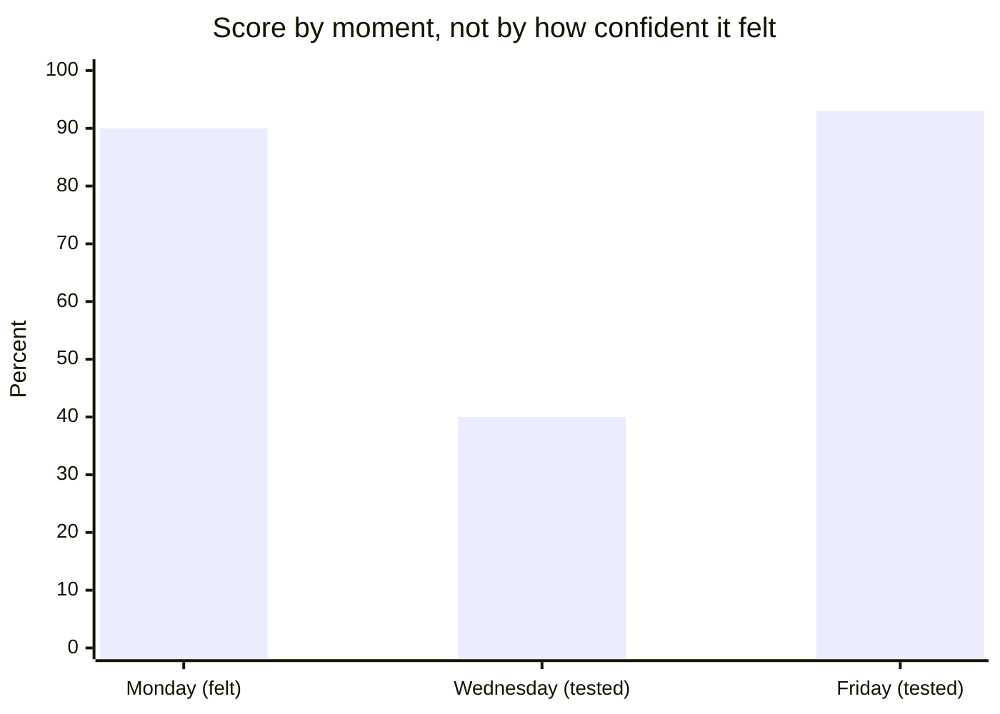

import Scenario from "../../../components/Scenario.astro";
import LevelIntro from "../../../components/LevelIntro.astro";
import Checkpoint from "../../../components/Checkpoint.astro";

<Scenario label="The scenario">
  <Fragment slot="facts">
    

      
📖 Monday: read the table 5×, felt 90% ready

      
❓ Wednesday: quizzed cold — 6/15 (40%)

      
🎯 The 9 misses cluster: 7×6 through 7×12

      
🔁 Wed night + Thu: 3 short flashcard sessions, misses only

      
🏁 Friday retest: 14/15 (93%)

    

  </Fragment>

Priya has a 7-times-table quiz Friday. Monday night she reads the table five
times and feels 90% ready. Wednesday, her dad quizzes her cold — no sheet,
15 questions — and she gets 6 right: 40%. She has Wednesday night and
Thursday left before Friday's quiz.

</Scenario>

Watch what the cold quiz actually revealed, and what Priya does with that information over the next two days.

<LevelIntro
  items={[
    "Following the illusion and the fix through a real 5-day timeline",
    "Why the cold quiz's number matters more than the miss count",
    "The testing effect: the research behind why retrieval beats rereading",
  ]}
/>

## Step 1 — the fluency-illusion version, Monday night

Asked how she's doing after her fifth read-through, Priya says: "I've got the
7-times table down, I could do the whole thing." That statement _sounds_
confident and would probably pass a casual check-in from a parent glancing
over — which is exactly the danger, because "I could do the whole thing" was
never actually tested. It was inferred from how smoothly the page read.

## Step 2 — Wednesday's cold quiz forces the honest version

Her dad reads out 15 problems with no sheet in front of her. She gets 6
right immediately and without hesitation — 7×1, 7×2, 7×3, and similar. On
nine, she stalls, guesses, or says "wait, give me a second" before landing on
the wrong number. The misses cluster around the middle and later facts:
7×6, 7×7, 7×8, 7×9, 7×10, 7×11, and 7×12 each trip her at least once. The
score is 6/15 — 40%, half of what Monday night's confidence predicted.

**Why does 40% matter more than "she got some wrong"?** Because it's a
number, not a feeling — it's the first piece of information in this whole
process that didn't come from how the material felt to process. Every signal
before Wednesday (increasing smoothness, "I've got this") came from
_perceptual fluency_, not from anything that actually tested retrieval.

## Step 3 — the misses aren't random, and that's the useful part

If Priya's dad had just said "study more," that's a vague instruction
covering the whole 7-times table, including facts she already has cold. But
the nine misses aren't spread evenly — they cluster around the middle and
later multiplications that get less honest retrieval practice when someone
reads straight through the table start to finish every time. That clustering
_is_ the diagnostic: it says "restudy these weak facts," not "reread the
whole table again," which is a much smaller, much more targeted task.

<Checkpoint question="Suppose Priya's dad had instead told her 'just reread the whole table two more times before Friday' after seeing the 40%. Using what Step 3 established about the misses clustering, why would that instruction have wasted some of her limited time between Wednesday and Friday?">

Rereading the whole table treats all fifteen facts as equally weak, but the
cold quiz already showed that six of them — the low, early facts — were
already solid; Priya answered those immediately and without hesitation. Time
spent rereading those six is time not spent on the nine that actually failed,
and Priya only has two days left before Friday. The cold quiz didn't just
produce a score, it produced a map of exactly where the gap sits, and
ignoring that map to reread everything evenly throws away the one useful
thing Wednesday's test provided.

</Checkpoint>

## Step 4 — Wednesday night and Thursday: three short active-recall sessions

Instead of rereading the full table again, Priya makes a small flashcard set
for the missed facts and runs three short sessions (about ten minutes each)
across Wednesday night and Thursday: shuffle the cards, say the answer
out loud before flipping, set aside any card she got right twice in a row.
This is slower and more frustrating than rereading would have been — getting
7×12 wrong out loud, twice, feels worse in the moment than smoothly rereading
"7×12 = 84" off a page. That discomfort is a real cost of the method, not a
sign it isn't working; a harder, slower retrieval attempt is what's actually
building the connection that a smooth reread never tests.

## Step 5 — Friday's retest

Friday, quizzed cold again on all 15: she gets 14 right, missing only 7×12
once before self-correcting. 14/15 — 93%. The gain didn't come from more
total study time (Wednesday and Thursday's sessions were half an hour total,
far less than five full readings); it came from spending that time on
retrieval, aimed at the specific four facts the cold quiz had already
identified as weak.

The Monday bar is a feeling, not a score — it's included because it's the
number Priya would have reported if nobody had tested her, and it's the
number the fluency illusion produces by default whenever a test never
happens.

## At a glance

| &nbsp;                   | Monday (rereading)         | Wednesday (cold quiz)                | Thu/Fri (targeted recall)             |
| ------------------------ | -------------------------- | ------------------------------------ | ------------------------------------- |
| **Method**               | Read the table 5× in a row | Quizzed with no sheet, 15 questions  | Flashcards on the 4 missed facts only |
| **What it measures**     | How smooth the page felt   | What's actually retrievable, unaided | Whether the specific gap closed       |
| **Result**               | 90% felt ready             | 40% actually correct                 | 93% actually correct                  |
| **Effort, subjectively** | Low, comfortable           | Uncomfortable — exposed the gap      | Uncomfortable but short and targeted  |

## Why this isn't just a study tip

The pattern above — active retrieval producing more durable, more accurately
self-assessed learning than passive re-exposure, even though re-exposure
_feels_ more productive in the moment — is one of the most replicated
findings in cognitive psychology, generally called **the testing effect** or
**retrieval practice**. Across decades of study-technique research, the
consistent finding is that learners asked to predict how well they'll
remember material after rereading it reliably _overestimate_ their actual
later recall compared to learners who tested themselves instead — Priya's
90%-vs-40% gap isn't an unusual overshoot, it's close to the typical size of
that mismatch. This is also why cramming — repeated passive review right
before a test, with no retrieval — can produce a decent short-term score
while producing worse long-term retention than the same total time spent on
spaced, active recall: a good score right after cramming rewards exactly the
illusion this unit is about.

In simpler terms: researchers have compared "read it again" with
"try to remember it before looking." The second option often feels worse
while you are doing it, but it gives a better signal and usually leaves a
stronger memory later. This unit is about both understanding now and
remembering later: first prove you can produce the idea without help, then
revisit it over time so it does not fade.

<Checkpoint question="A student crams the night before an exam, rereading their notes over and over with no self-testing, and gets a strong score the next morning. Does that score disprove the testing-effect research above — doesn't it show rereading worked fine?">

No — it shows rereading can still produce a good short-term score, which is
exactly what the research above predicts, not what it contradicts. The
testing effect is a claim about durability over time, not about tomorrow
morning: cramming can look identical to genuine understanding on an exam
taken immediately afterward, and that's precisely what makes it a trap
rather than a counterexample — a good score right after cramming rewards
the same fluency illusion this whole unit is about. The real difference
would show up if you retested that student a month later with no further
review, the way this site's spaced-repetition schedule deliberately does,
rather than the night after the exam when the illusion is still fresh.

</Checkpoint>

## Failure modes

| Failure                                                      | What it looks like                                                                                                                            | The fix                                                                                                                                   |
| ------------------------------------------------------------ | --------------------------------------------------------------------------------------------------------------------------------------------- | ----------------------------------------------------------------------------------------------------------------------------------------- |
| Practicing alone and never catching the stalls               | Explaining silently in your own head, smoothing over the exact spot that would have stalled                                                   | Explain out loud to someone (even someone with no background) who can ask "wait, why?"                                                    |
| Treating one successful retest as permanent                  | Passing Friday's quiz and assuming the 7-times table is now "done" forever                                                                    | Memory decays — a re-check weeks later (this site's spaced-repetition re-exam) catches the fade before it matters                         |
| Substituting a confident-sounding phrase for the actual fact | "I just know 7×12 now" without being able to say 84 on demand                                                                                 | Confidence in a phrase isn't the same as producing the number — test the actual output                                                    |
| Restudying everything instead of the specific gap            | Rereading the whole table again after Wednesday's quiz, wasting time on the 9 already solid                                                   | Let the cold-test misses point to exactly what needs the targeted recall, not the rest                                                    |
| Applying this only to school material                        | Assuming the illusion is a "studying for a test" problem, not something that shows up learning a recipe, an instrument, or a new tool at work | The same gap between "I've watched/read this" and "I can do this unaided" shows up anywhere skill is being built, not just in a classroom |

## Beyond this example

The 7-times table is one case, not the whole territory — a few questions to
test whether the model actually transferred, not just the specific numbers
above:

- What would "closing the source and reproducing it unaided" even mean for
  a skill that isn't a fixed set of facts — learning to make your
  grandmother's bread recipe, say, where there's no single right answer to
  recite, just a result that either works or doesn't? What would the
  equivalent of Wednesday's cold quiz look like there?
- Priya's misses clustered around four specific facts. If a cold test on
  something you're learning came back with errors scattered evenly across
  everything instead of clustering anywhere, what would that suggest about
  whether you're ready for targeted recall yet, versus needing another full
  pass first?
- What changes if the stakes are higher than a Friday quiz — an exam you
  genuinely can't retake, or a skill you'll need under pressure with no time
  to check? Does the discomfort of active recall become more worth paying
  for, or does something else about the plan need to change too?
