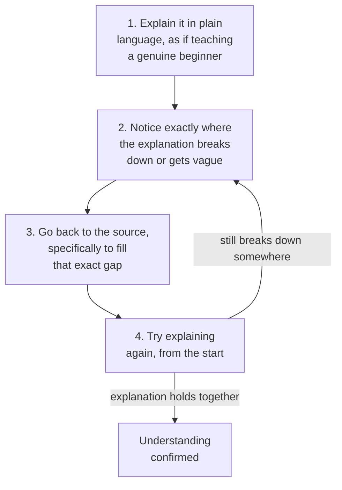

## Why rereading feels productive without actually being productive

**If someone rereads a confusing paragraph three times and it starts to
feel clear, haven't they learned it?** Not necessarily — repeated
exposure makes text feel more _familiar_, and familiarity is easy to
mistake for understanding. Recognizing a sentence as "yes, that's right"
requires far less mental work than generating that same explanation
without the sentence in front of you. Rereading trains recognition; it
doesn't test recall or application, which is what's actually needed later
when the source text isn't there to lean on.

## The four-step loop, precisely

**Why does the loop specifically require going back to the _exact_ gap,
rather than rereading the whole source again?** Because rereading
everything re-triggers the same familiarity effect across material that
was never actually the problem — targeting only the specific point where
the explanation broke down is what makes the second attempt a genuine
test of whether that particular gap got filled, not just a repeat of the
first pass.

## Why plain language specifically, not just "explain it out loud"

**Would explaining the same idea using the source's own technical
vocabulary work just as well?** No — reusing unexplained jargon can hide
the exact same gap the technique is meant to expose. If a term is used
without being unpacked, it's often standing in for understanding that
isn't actually there yet; forcing plain language (imagining a listener
who doesn't know the jargon either) makes it much harder to paper over a
gap with a borrowed word.

## Recognition vs. recall, side by side

|                             | Recognition (rereading)                    | Recall (teach-back)                                          |
| --------------------------- | ------------------------------------------ | ------------------------------------------------------------ |
| What's being tested         | "Does this look right to me?"              | "Can I generate this myself?"                                |
| Mental effort required      | Low                                        | High                                                         |
| What repeated exposure does | Increases familiarity, feels like progress | Doesn't help directly — only attempting the explanation does |
| What it reveals             | Almost nothing about actual gaps           | Exactly where the explanation breaks down                    |

## What "the explanation breaks down" actually looks like

**How does someone actually notice a gap while explaining, rather than
just plowing through vaguely?** It usually shows up as a specific,
noticeable moment: reaching for a word like "somehow" or "basically," or
realizing the explanation has looped back to restating the original claim
rather than explaining why it's true. These are the concrete signals that
the loop's second step is watching for — not a vague overall feeling of
difficulty, but a locatable point in the explanation itself.

## The generalizable lesson

**Is this really just a studying trick, or a broader principle?** The
underlying move — testing understanding by generating it, not by
recognizing it — applies to any situation where fluency with source
material can be mistaken for genuine understanding: reviewing your own
notes right before a decision, or nodding along in a meeting to an
explanation you could actually restate. Teach-back works precisely
because generation is a harder, more honest test than recognition, in
any domain it's applied to.
