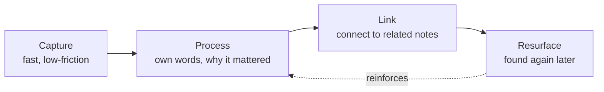

import LevelIntro from "../../../components/LevelIntro.astro";
import Checkpoint from "../../../components/Checkpoint.astro";

L1 named the two ways a note system fails: capturing too passively, or
organizing so heavily you stop capturing. Here's the loop that avoids both.

<LevelIntro
  items={[
    "The capture → process → link → resurface loop",
    "Why a copy-paste note and an own-words note differ in value",
    "What makes a note actually get found again",
  ]}
/>

## What does a note need to do, beyond existing?

A note that sits unread forever provided zero value no matter how accurate
it was — so the real question isn't "did I write this down," it's "will
this be useful to a future version of me who doesn't remember writing it."
That requires four separate steps, not one:

- **Capture** happens in the moment — during a talk, mid-article, in a
  meeting. It has to be fast, or you stop doing it. A phrase or a rough
  quote is enough; polish comes later, if at all.
- **Process** happens shortly after, ideally the same day: read the raw
  capture and rewrite it in your own words, stating why it mattered to you
  specifically. This step is what separates a note from a photocopy.
- **Link** happens at the same time as processing, or in a short periodic
  review pass: connect the new note to related notes you already have.
  This is what makes the collection more than a list — it becomes a web
  where one note can lead you to another you'd forgotten you had.
- **Resurface** is the payoff, and it isn't a single mechanism — it can be
  following a link from something you're already looking at, rereading old
  notes when starting something related, or a periodic review pass. Any of
  the three counts; what matters is that it happens at all.

<Checkpoint question="Priya's note system skips a dedicated 'review everything weekly' step most of the time — she mostly just links new notes to old ones and occasionally rereads a note when starting something related. Is her system missing the resurfacing step?">

No. Resurfacing doesn't require a formal review ritual — it just requires
_some_ path back to the note when it's needed. Following a link from a
related note she's already looking at, or rereading an old note because a
new problem reminded her of it, both count as resurfacing; they're just
triggered by need instead of by a calendar. A system only has a genuine gap
here if _none_ of these paths exist — if the only way back to a note is
remembering its exact wording and searching for it, the way Tom's system
works.

</Checkpoint>

## Why does the same source material produce such different notes?

The difference isn't how much time was spent capturing — it's what
happened to the capture afterward. Here's the same piece of content
(a negotiation-course point about "anchoring") run through both paths:

|                                 | Copy-paste capture                                                                                                                                     | Own-words, linked note                                                                                                                                                                      |
| ------------------------------- | ------------------------------------------------------------------------------------------------------------------------------------------------------ | ------------------------------------------------------------------------------------------------------------------------------------------------------------------------------------------- |
| **What's written**              | "Anchoring: the first number stated in a negotiation heavily influences the final outcome, even when it's arbitrary." (pasted verbatim from the slide) | "Anchor early, even with a rough number — I kept waiting for 'more info' before naming a price and let the other side anchor instead. That's the mistake I made with the Kessler contract." |
| **Processing done**             | None — a direct copy                                                                                                                                   | Rewritten in own words, tied to a real, specific past mistake                                                                                                                               |
| **Linked to**                   | Nothing                                                                                                                                                | A note on the Kessler contract negotiation; a note on "sunk cost fallacy" from a different course                                                                                           |
| **Findable by**                 | Searching the exact word "anchoring" in a 45-page document                                                                                             | Following a link from either the Kessler note or the sunk-cost note, or searching a short, distinctive note                                                                                 |
| **Recall speed 6 months later** | Slow — re-reads the definition, has to reconstruct why it mattered                                                                                     | Fast — the note already states why it mattered, in language already familiar                                                                                                                |

Both notes are factually correct. Only one of them is fast to use later,
because only one of them did the work of connecting the fact to something
already meaningful.

## Why not just organize everything perfectly as you capture it?

Because real-time perfect filing is exactly what kills capture. If every
note has to be assigned a category, cross-referenced, and reformatted
before you're "allowed" to move on, you'll stop taking notes on the third
day — the friction is too high for the moments notes actually get taken in
(mid-conversation, mid-talk, on a commute). The fix used by systems that
actually survive contact with reality is to **decouple the steps in time**:
capture fast and messy in the moment, then process and link in a short,
separate pass later — daily or every few days, not instantly. The backlog
of unprocessed captures is allowed to exist briefly; what isn't allowed is
letting it grow forever, because an unprocessed capture provides the same
zero value as no capture at all.

<Checkpoint question="A friend says their note system is 'better organized' than Priya's because every note has a folder, three tags, and a cross-reference table filled in at the moment of capture. Is a more heavily organized system automatically a better one?">

Not necessarily — it depends whether that organizing overhead is why they
still take notes six months in, or why they quietly stopped. Heavier
real-time structure isn't free: every extra field to fill in at capture
time is friction at exactly the moment friction is most likely to kill the
habit. If the friend's system holds up and they're still capturing
regularly, the extra structure is earning its cost. If they've quietly
stopped adding new notes because it's become a chore, the system is worse
by the only measure that matters — whether it keeps working. Priya's
looser link-based approach isn't inherently superior; it's a different
point on the same capture-vs-organize trade-off, chosen because it's the
one she'll actually keep doing.

</Checkpoint>

## What this unit covers next

L3 walks through Priya's actual note on the anchoring idea — the raw
capture during the talk, the processing pass that turned it into the
own-words version above, the two links she added — and then the exact
moment six months later where one of those links surfaces it, compared
side by side against Tom's raw dump failing to resurface anything at all.
It also covers what changes for fast-moving information that isn't worth
this much investment, and how to triage what's worth processing now versus
later when you're capturing under real time pressure.
