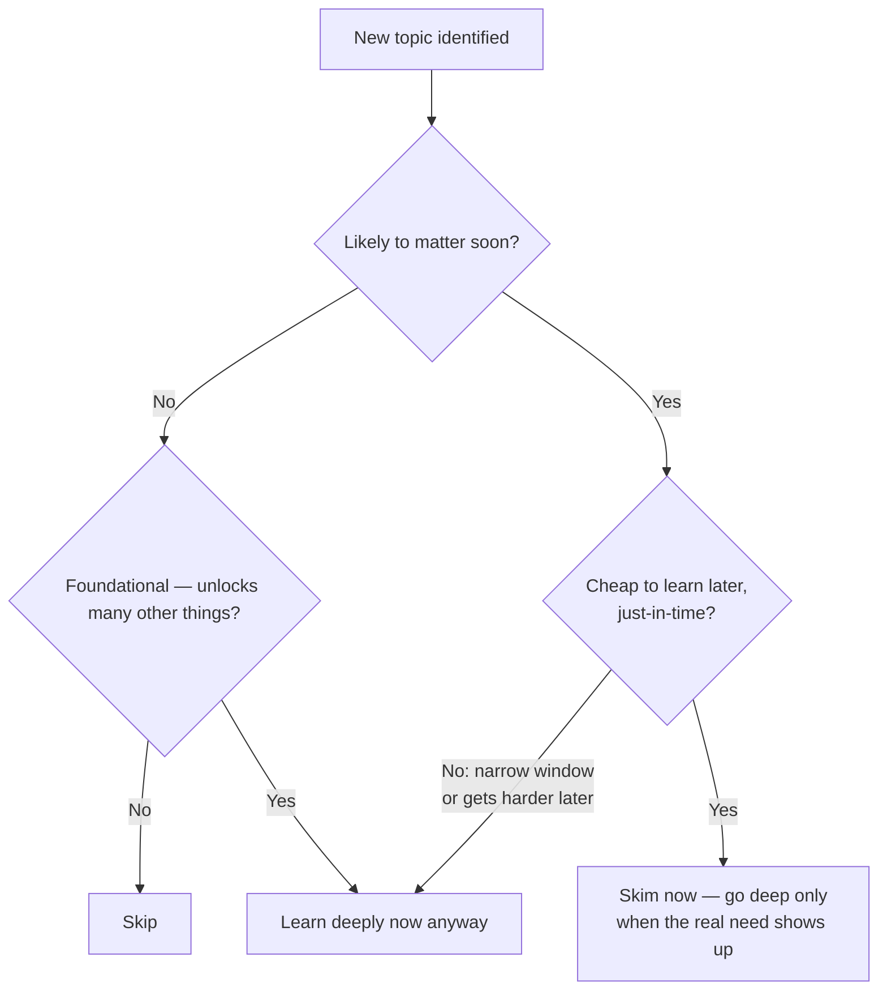

import LevelIntro from "../../../components/LevelIntro.astro";
import Checkpoint from "../../../components/Checkpoint.astro";

L1 showed that Sofia's 15-hours-on-2-topics split beat Marco's even split
across six, using the same total hours. Here's the actual model behind that
split — the two questions she was asking about each topic, and a third one
that can override both.

<LevelIntro
  items={[
    "Why 'learn a little of everything' loses to triage",
    "The two-axis test: likelihood to matter × cost to learn later",
    "When foundational-ness overrides the other two",
  ]}
/>

## Why isn't "learn a little of everything" a safe default?

It feels safe — nothing is completely ignored, so nothing can go
catastrophically wrong. But it's actually the riskier strategy, because it
spends the same fixed budget of hours on everything **regardless of how
much any one topic actually matters.** Depth isn't free: every hour is
drawn from the same pool, so hours given to a topic that turns out
irrelevant are hours taken directly away from a topic that turns out to be
make-or-break. Marco's even split didn't protect him from a bad outcome —
it guaranteed that his most consequential topics (visa paperwork, banking)
got no more attention than his least consequential one (slang), even
though the two were nowhere near equally important.

## What actually decides whether a topic deserves depth?

Two questions, asked of each topic:

1. **How likely is this to actually matter?** Not "could it conceivably
   come up" — almost anything could. How likely is it to matter in
   practice, given the situation you're actually in?
2. **How costly would it be to learn this later, if I skip it now?** Some
   things are cheap to pick up exactly when you need them — a quick
   question to a local, a five-minute lookup. Others have a narrow window
   (a filing deadline) or get genuinely harder to learn later (a skill that
   compounds, where catching up means unlearning bad habits first).

Crossing those two questions gives four zones, not two:

|                        | **Cheap to learn later**                                          | **Costly to learn later**                                  |
| ---------------------- | ----------------------------------------------------------------- | ---------------------------------------------------------- |
| **Likely to matter**   | Just-in-time — skim now, go deep only when the real need shows up | **Deep now** — the highest-value use of study time         |
| **Unlikely to matter** | Skip — not worth even a skim                                      | A cheap skim as insurance, unless foundational (see below) |

Sofia's visa paperwork and bank account both landed in the top-right cell:
likely to matter (she needed both almost immediately) and costly to learn
later (a missed filing deadline or missing documents from home are hard to
fix after the fact). That's exactly where her 15 hours went. Tipping
customs and slang landed in the top-left or bottom-left: either she'd pick
them up naturally on the ground, or a wrong guess in month one cost her
nothing serious.

<Checkpoint question="A topic is unlikely to matter, and would also be genuinely hard to learn later if it turned out you needed it after all — narrow window, real consequences. Which cell of the table does it belong in, and is a plain skim enough?">

It belongs in the bottom-right cell — unlikely to matter, but costly to
learn later if that assessment turns out wrong. A plain skim is a
reasonable default there, but it's the one cell where you should double-check
the "unlikely to matter" judgment itself before committing to just a skim,
precisely because the downside of being wrong is high. This is also the
cell where a topic's foundational-ness (covered next) can tip the decision
all the way to "learn it deeply now anyway," even without more certainty
that it will matter.

</Checkpoint>

## When does "it might be useful" actually earn deep study?

Most of the time, it doesn't — "just-in-case" learning, done on a hunch
that something might come in handy, is usually wasted effort. Most things
that felt like they "might matter" never actually get used, and the hours
spent on them were hours a genuinely likely-to-matter topic didn't get.
This is the trap Marco fell into without realizing it: treating every item
on his list as equally worth a hedge.

But just-in-case learning isn't _always_ wasted — it pays off for a
specific kind of topic: one that's **foundational**, meaning it makes many
other things easier or faster to learn later, whether or not it turns out
to matter on its own. A foundational topic changes the calculus even in
the bottom-right cell of the table above (unlikely to matter, costly to
learn later): its value isn't really about that one topic mattering, it's
about how much everything downstream of it speeds up once it's in place.

For Sofia, the local language basics were arguably foundational — knowing
even rough grammar would make everything else (reading signage, following
the bank's paperwork instructions, understanding a landlord) faster to
pick up. She still only gave it 1.25 hours, because in her situation the
marginal foundational benefit of those hours didn't outweigh finishing her
visa and banking prep — a judgment call, not a formula with one right
answer.

<Checkpoint question="Someone argues that learning to touch-type would be foundational for almost any knowledge-work skill, so it's always worth deep practice time regardless of what else is going on. Is 'this is foundational' by itself enough to justify going deep on something right now?">

Not by itself — foundational-ness is one input into the decision, not an
automatic override of the other two questions. It raises the priority of a
topic that would otherwise be skipped or only skimmed, but it still
competes against everything else for the same limited hours. If the
person is three days from a deadline on something urgent and
likely-to-matter, touch-typing's foundational value doesn't erase that
opportunity cost — it just means touch-typing is a better candidate for
"later, when there's slack in the schedule" than something with no
foundational value at all.

</Checkpoint>

## What this unit covers next

L3 runs the full triage on a longer, more realistic list — nine things
Sofia could learn before her move, scored against all three factors, with
one bet that pays off exactly as predicted and one that doesn't. It also
covers what changes when there's far less time to prepare, and what
changes when you get to revisit the triage partway through, once you're
already on the ground and know more than you did at the start.
