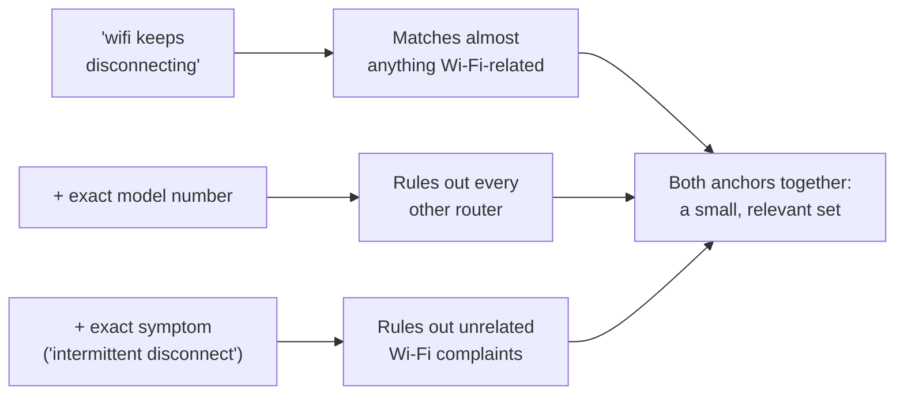

import LevelIntro from "../../../components/LevelIntro.astro";
import Checkpoint from "../../../components/Checkpoint.astro";

L1 showed that Jordan's second search worked because it used the router's
exact model number and the word "firmware" instead of generic phrasing. L2
names that mechanism precisely — what actually makes a search term do that
narrowing work — and works out the loop for finding better terms when you
don't already have them, plus when to stop searching altogether.

<LevelIntro
  items={[
    "What makes a search term an anchor",
    "The search-skim-refine loop",
    "When to go straight to a primary source",
  ]}
/>

## What makes a search term an "anchor"?

**Why does adding the router's exact model number to a search do so much
more work than adding another generic word like "problem" or "help"?**



An **anchor term** is specific enough that it can only reasonably appear in
sources actually about your situation — a model number, an exact error
message, a version number, a precise symptom. A generic word like
"problem," "help," or "broken" adds almost no narrowing power, because it
matches nearly everything. Two or three real anchors combined narrow the
result set far more than either one alone, because a source has to match
_all_ of them to surface.

| Vague words                    | Stronger anchor terms                                       |
| ------------------------------ | ----------------------------------------------------------- |
| "phone problem"                | Phone model + exact message on screen                       |
| "school form"                  | School name + form name + deadline year                     |
| "stomach medicine side effect" | Medicine name + dose + symptom wording                      |
| "math homework help"           | Exact topic + textbook section + problem type               |
| "wifi broken"                  | Router model + "intermittent disconnect" + firmware version |

<Checkpoint question="A search for 'laptop battery draining fast' returns thousands of generic results. Which of these would make the best anchor term to add: 'help,' 'laptop,' or the exact laptop model plus its OS version — and why?">

The exact laptop model plus OS version. "Help" and "laptop" both add almost
no narrowing power — "help" matches nearly any troubleshooting post on the
internet, and "laptop" is already implied by the rest of the query, so
neither rules anything out. The model and OS version are what a source has
to actually match to be relevant at all: a battery-drain thread about a
different laptop, or the same laptop on a different operating system, is
very likely describing a different underlying cause, so those two terms are
the ones doing real filtering work.

</Checkpoint>

## The refinement loop

**If the first search doesn't answer the question, was it wasted?** Not if
it's treated as reconnaissance rather than a single bet:

```text
1. Search with the best terms you currently have
2. Skim results — not for the answer, but for BETTER TERMS:
   exact model/version numbers, error message wording, official
   terminology used by people closer to the actual source
3. Re-search using those better terms as anchors
4. Repeat until either the answer appears, or it becomes clear
   the answer lives in one specific place (see below)
```

Jordan's first search didn't answer the question, but it surfaced two
things worth reusing: the router's exact model number (visible in several
results) and the word "firmware" (used repeatedly by people describing
similar symptoms). Neither was in the first query. Both were in the
second.

When skimming results, you are not opening everything. You are scanning
the visible clues: the title, the short snippet, the site name or URL,
the date if shown, and words that repeat across several relevant-looking
results. If three results all use a term you did not know, that term may
be the domain vocabulary your next query needs.

## When to stop searching and go to the source directly

**Is there a point where more searching is the wrong move entirely?** Yes
— when the question is really "what does this specific tool/product/spec
actually do," the authoritative answer usually lives in exactly one place:
the official documentation, the changelog, the manufacturer's support
page, the spec itself. Searching _around_ that source (blog posts
summarizing it, forum threads guessing at it) adds a layer of possible
error the source itself doesn't have.

"Official" is not magic, though. The official page can still be old,
written for a different country, or about a different model/version. The
reason to go there first is that it removes one layer of guessing; you
still check whether the page actually matches your exact situation.

| Signal                                                                                      | Suggests                                                               |
| ------------------------------------------------------------------------------------------- | ---------------------------------------------------------------------- |
| The question is "what's everyone's general experience with X"                               | Broad search is appropriate                                            |
| The question is "what does this specific tool/version/spec actually say"                    | Go to the official source directly                                     |
| Search results keep citing or linking back to one page                                      | That page IS the source — go read it directly instead of the summaries |
| The vague search keeps surfacing a specific proper noun (a model, a version, an error code) | Use it as the next query's anchor                                      |

<Checkpoint question="You search 'is [app] down' and every result you find is a blog post or forum thread guessing based on user reports. What does the table above suggest you do instead, and why is it better than reading a fifth guessing post?">

Go straight to the source that would actually know: the app or service's
own status page, if one exists, rather than a sixth secondhand guess. Every
guessing post is a layer of possible error the primary source doesn't
have — someone summarizing or speculating about an outage can be wrong or
out of date in a way an official status page, updated by the people who
can see the actual infrastructure, cannot. Once search results are all
pointing at the same underlying uncertainty rather than adding new
information, more searching just re-reads that uncertainty in different
words instead of resolving it.

</Checkpoint>

## The generalizable lesson

**Is a bigger vocabulary the real skill here, or something else?** Not
exactly — it's the habit of treating a bad first result as _information
about what the right terms are_, rather than a dead end, and recognizing
early when the honest answer is "stop searching, go read the primary
source" instead of trying a fourth slightly-different phrasing of the same
vague question.
