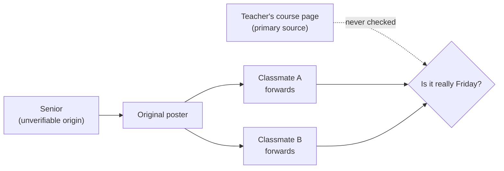

import Scenario from "../../../components/Scenario.astro";

<Scenario>
  <Fragment slot="facts">
    
The claim

    
"The final is moved to Friday" — you have practice tonight and won't have time to study if that's true.

    
Who's repeating it

    

      
💬 Original poster — "my cousin's friend goes there, heard it from a senior"

      
🔁 Two classmates — both just forwarded the same screenshot

    

    
One click away

    

      🏫 The teacher's official course page — never checked
    

  </Fragment>

A rumor lands in your class group chat: "I heard the final got moved to Friday!" Three people have now repeated it. You have practice tonight, and if the exam really is Friday, tonight is your only study time.

| What you know                                         | What you don't know                                                      |
| ----------------------------------------------------- | ------------------------------------------------------------------------ |
| Three people in the chat say it's true                | Whether any of them actually checked, or just repeated the first message |
| The teacher posts the real schedule on the class page | Whether it's been updated                                                |

**Before reading on: does "three people are saying it" make the rumor three times more likely to be true — or could all three be repeating the exact same unchecked claim?**

</Scenario>

It could go either way — and the only way to know which is to look at where each person actually got it, not how many of them said it.

- **A primary source** is the original: the actual spec, the actual paper, the actual source code, the person who did the thing, the teacher's own posted schedule. **A secondary source** describes or interprets a primary source: a blog post explaining a spec, a summary of a paper, a classmate repeating what they heard. Neither is inherently better — but they fail in different ways, and knowing which one you're reading changes how much independent verification it needs.
- Secondary sources introduce a **compounding interpretation gap**: each layer between you and the primary source is a chance for simplification, error, or staleness to creep in, and errors introduced early tend to get copied forward by later secondary sources that cite each other rather than the original — a wrong claim can end up looking well-corroborated purely because many sources repeat it, not because any of them independently verified it.
- **Credibility signals worth checking**, roughly in order of reliability: does the source cite/link the actual primary source (checkable), is the author identifiable and has relevant standing (checkable), does the information match what you can independently verify against the primary source (the strongest signal, when available), how recently was it written relative to how fast the subject changes.
- **Recency matters differently depending on the domain** — a five-year-old explanation of TCP fundamentals is still accurate; a five-year-old comparison of framework performance or a security advisory almost certainly isn't. Checking a source's age is only useful once you know how fast the specific claim's domain actually moves.
- **The corroboration trap**: multiple sources agreeing is weak evidence if they all ultimately trace back to the same original (possibly wrong) claim — real corroboration means independent primary verification, or clearly independent authors who did their own primary-source checking, not just multiple people who happen to say the same thing. Three classmates forwarding the same screenshot is one claim, not three.
- This unit isn't "always go read the primary source for everything" — that's not realistic given time constraints, and secondary sources exist precisely because they're often faster and sufficient. It's about calibrating _how much_ independent verification a claim needs based on how much it matters and how compounded the sourcing chain already looks.
- The practical skill: before trusting a specific, consequential claim, ask three questions — is this a primary or secondary source, can I trace it back to something I could independently verify, and does the domain move fast enough that its age matters — and let the answers determine how much more checking is worth doing.

The rumor above isn't really "confirmed by three people" — it's one claim, forwarded twice, with a one-click check still sitting unopened:

| #   | Question                                                      | What it decides                                    |
| --- | ------------------------------------------------------------- | -------------------------------------------------- |
| 1   | Is this a primary or a secondary source?                      | How much interpretation has already happened to it |
| 2   | Can I trace it back to something I could independently check? | Whether "checking" is even possible right now      |
| 3   | How fast does this domain go stale, and how old is this?      | Whether age itself is a red flag here              |
