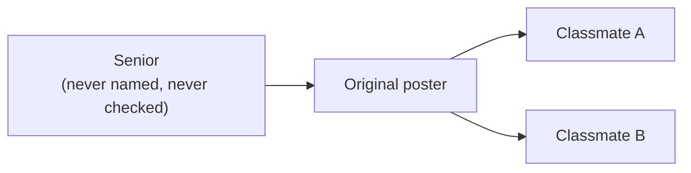
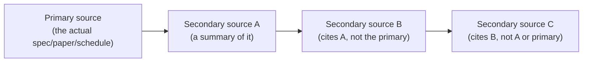
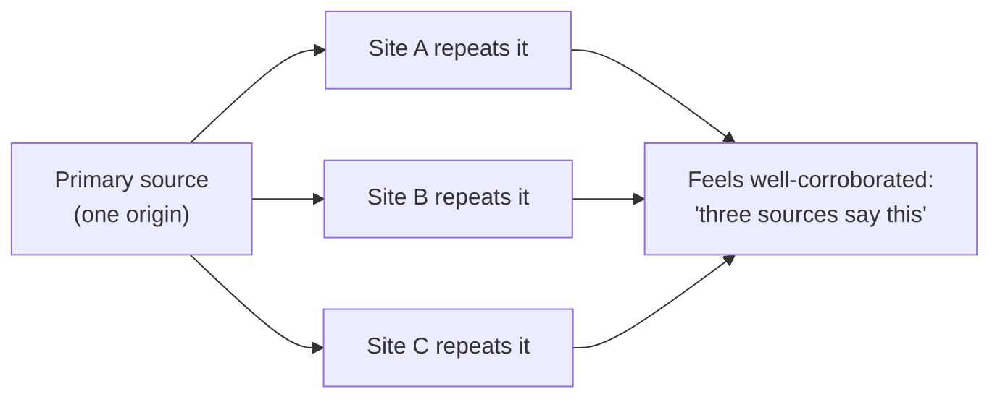
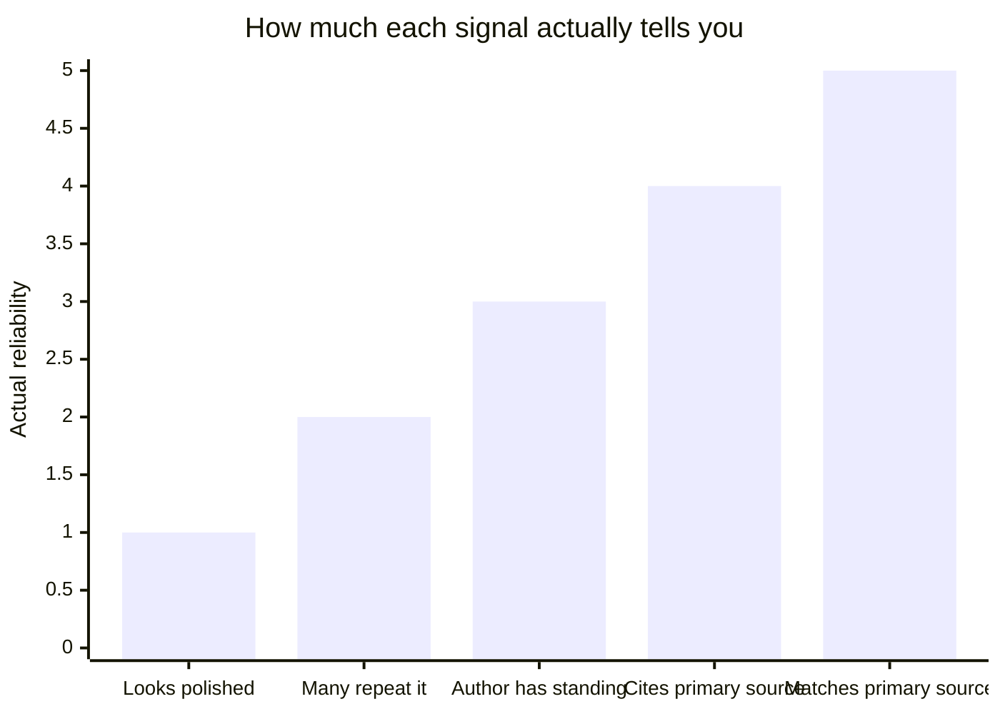

## Why does "three people said it" feel more convincing than "one person said it," even when it shouldn't?

The exam rumor from L1 has three people repeating it. Picture it as a diagram of who actually said what, instead of just a headcount:

**Only one arrow actually starts a new claim — Poster.** Classmate A and Classmate B don't add new information; they forward the same unverified message. Three people "saying" it is really one claim, copied twice. This is the corroboration trap, and it's the reason a headcount of sources is a bad substitute for tracing where each one actually got their information.

## Distance from the primary source, visualized

Every step away from the primary source is a place where the claim can quietly change shape. What does that look like when it's not a three-person group chat, but a chain of write-ups each citing the one before it?

Each arrow is a real opportunity for something to be simplified, misread, or subtly changed — and critically, **C never touched the primary source at all**. If A introduced a small error while summarizing (a common, non-malicious occurrence — summarizing always loses some precision), B and C both inherit it, and neither is positioned to catch it, because neither ever compared against the original.

In everyday terms, this is how "the exam is Monday morning" can become
"the exam is Monday" and then "the exam is sometime this week." No one
had to lie. Each person kept the part they noticed and dropped a piece of
precision the next person may have needed.

## If corroboration can be an illusion, how do you tell real agreement from copied agreement?

You have to check what each source is actually citing — not just that they agree.

Notice this diagram looks almost identical to the group-chat one above, just with more boxes and fancier labels — that's the point. If A, B, and C all trace back to the _same_ origin (rather than three independent people independently verifying against the primary source), "three sources agree" is much weaker evidence than it feels like. This is exactly why the _count_ of sources agreeing matters much less than whether they're actually independent, which requires checking what each one is actually citing, not just that multiple pages say the same thing.

## So which signals are actually worth checking, and which ones just feel convincing?

| Signal                                                               | Reliability                                                                                          |
| -------------------------------------------------------------------- | ---------------------------------------------------------------------------------------------------- |
| Matches what you can independently verify against the primary source | Strongest — this is the actual check, not a proxy for one                                            |
| Cites/links the specific primary source, checkably                   | Strong — lets you verify yourself, even if you haven't yet                                           |
| Author is identifiable with relevant, checkable standing             | Moderate — relevant expertise correlates with accuracy, but isn't proof of it in this specific claim |
| Many sources say the same thing                                      | Weak on its own — only strong if you've confirmed the sources are actually independent               |
| Looks professionally produced / well-written                         | Weakest — production quality is unrelated to factual accuracy                                        |

The ranking matters because the weakest signals (production quality, sheer repetition — a slick-looking forwarded screenshot, a rumor with three names attached) are also the _easiest_ ones to notice at a glance, which is exactly why they're the ones most likely to substitute for real verification if a reader isn't deliberately checking the stronger signals instead.

## Does a source's age tell you anything on its own?

Not without knowing how fast the specific domain moves. A multiplication
table does not go stale quickly; a bus schedule, store price, weather
forecast, or class deadline can go stale in hours or days. The same rule
applies in technical domains: a five-year-old article correctly
explaining how TCP's three-way handshake works is still entirely correct
today, because the mechanism hasn't changed; a five-year-old article
benchmarking framework performance or describing a still-open security
vulnerability is very likely stale, because both areas change on a
timescale of months, not years. Even the exam-schedule rumor has a
recency angle: a screenshot from this morning is far more likely to be
current than one that's been recirculating since last week, in a class
where the schedule has already changed once. The practical question isn't
"how old is this" in isolation, it's "how fast does this specific kind of
claim typically go stale," checked against the actual age.
