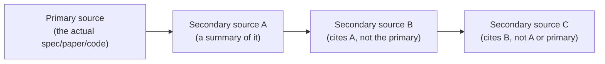
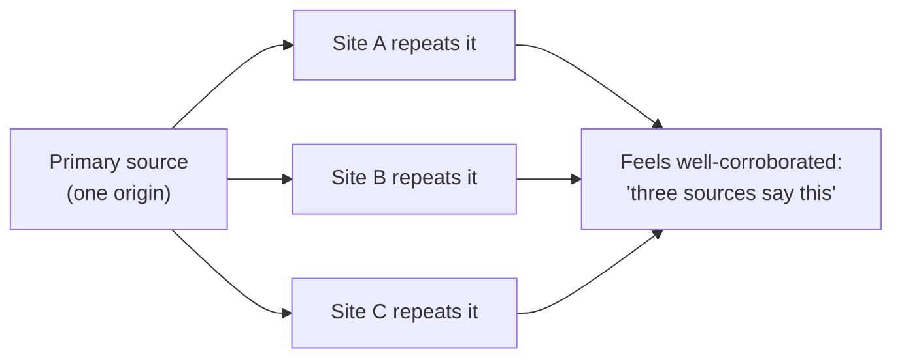

## Distance from the primary source, visualized

Each arrow is a real opportunity for something to be simplified, misread, or subtly changed — and critically, **C never touched the primary source at all**. If A introduced a small error while summarizing (a common, non-malicious occurrence — summarizing always loses some precision), B and C both inherit it, and neither is positioned to catch it, because neither ever compared against the original. This is the compounding-interpretation-gap mechanism from L1, made visual.

## The corroboration trap, concretely

If A, B, and C all trace back to the _same_ origin (rather than three independent people independently verifying against the primary source), "three sources agree" is much weaker evidence than it feels like — it's really one claim, repeated three times, not three independent checks converging on the same answer. This is exactly why the _count_ of sources agreeing matters much less than whether they're actually independent, which requires checking what each one is actually citing, not just that multiple pages say the same thing.

## Credibility signals, ranked by actual reliability

| Signal                                                               | Reliability                                                                                          |
| -------------------------------------------------------------------- | ---------------------------------------------------------------------------------------------------- |
| Matches what you can independently verify against the primary source | Strongest — this is the actual check, not a proxy for one                                            |
| Cites/links the specific primary source, checkably                   | Strong — lets you verify yourself, even if you haven't yet                                           |
| Author is identifiable with relevant, checkable standing             | Moderate — relevant expertise correlates with accuracy, but isn't proof of it in this specific claim |
| Many sources say the same thing                                      | Weak on its own — only strong if you've confirmed the sources are actually independent               |
| Looks professionally produced / well-written                         | Weakest — production quality is unrelated to factual accuracy                                        |

The ranking here matters because the weakest signals (production quality, sheer repetition) are also the _easiest_ ones to notice at a glance — which is exactly why they're the ones most likely to substitute for real verification if a reader isn't deliberately checking the stronger signals instead.

## Recency, calibrated to domain velocity

Age alone means nothing without knowing how fast the specific domain moves — a five-year-old article correctly explaining how TCP's three-way handshake works is still entirely correct today, because the mechanism hasn't changed; a five-year-old article benchmarking framework performance or describing a still-open security vulnerability is very likely stale, because both areas change on a timescale of months, not years. The practical question isn't "how old is this" in isolation, it's "how fast does this specific kind of claim typically go stale," checked against the actual age.
