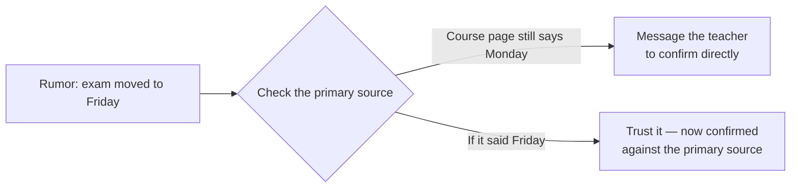

import Scenario from "../../../components/Scenario.astro";

<Scenario label="The scenario">
  <Fragment slot="facts">
    
The claim

    
"The final is moved to Friday" — you have practice tonight and won't have time to study if that's true.

    
Who's repeating it

    

      
💬 Original poster — "my cousin's friend goes there, heard it from a senior"

      
🔁 Two classmates — both just forwarded the same screenshot

    

    
One click away

    

      🏫 The teacher's official course page — never checked
    

  </Fragment>

A rumor lands in your class group chat: "I heard the final got moved to Friday!" Three people have now repeated it. You have practice tonight, and if the exam really is Friday, tonight is your only study time.

</Scenario>

L1 and L2 covered the mechanism — a headcount of sources isn't the same as independent verification. Watch that mechanism play out on an actual claim, end to end, including the part L1/L2 didn't show you: what you actually do about it.

## Tracing the exam rumor to its actual source

**Step 1 — check source independence before anything else.** The original poster says they heard it from "a senior," never named. Both classmates who repeated it forwarded the exact same screenshot from the original poster — neither talked to a senior, a teacher, or anyone else. That's the corroboration trap from L2, made concrete: three people "confirming" the claim collapses to one unnamed, unverifiable origin plus two forwards.

**Step 2 — go to the actual primary source.** The teacher posts the real exam schedule on the class course page, updated whenever it changes. You open it. It still says Monday, last updated two days ago — after the date the rumor claims to have started.

**Step 3 — resolve the gap.** Either the rumor is simply false, or the schedule changed after the senior supposedly heard about it and the course page hasn't caught up yet. Both are checkable: message the teacher directly, or wait for tomorrow's class announcement. Either way, you now know the one-click check (the course page) outweighs the three-person "confirmation," because the three people were never three independent checks.

You didn't need to fully resolve the mystery of who the "senior" was — tracing the claim one level deeper than the group chat (to the actual, checkable primary source) was enough to know the three-person "confirmation" wasn't worth trusting your evening's study plan to.

## When shallow trust is actually the right call

Not every claim needs a full trace — checking a claim back to its primary source is real effort, and spending it on everything you read would make getting through a school day impossible. The calibration question from L1 decides when it's worth it:

- **Low-stakes, easily-reversible claim** ("the cafeteria is serving pizza today"): shallow trust is fine — being wrong costs you a mildly wrong guess, corrected the moment you walk in.
- **High-stakes, hard-to-reverse claim, feeding a real decision** ("the exam is Friday, so tonight is your only study window"): worth tracing back, exactly as done above — the cost of checking the course page is two minutes; the cost of being wrong is walking into Monday's exam unprepared.

## A second trace, where the stakes are much harder to undo

The exam rumor is recoverable even if you get it wrong — worst case, you study on the wrong night. Not every claim you'll evaluate is that forgiving. What changes when being wrong can't just be corrected the next morning?

Before the supplement example, one bridge matters: a study usually has
boundaries. It studied certain people, for a certain amount of time, with
a certain dose or method, and measured a specific outcome. A post can
sound like it is "based on a study" while stretching the study beyond
what it actually tested.

A cousin's family group chat is passing around a post: "New research shows Supplement X reverses vitamin deficiency in kids within a week — my neighbor's pediatrician recommended it to three other families." Your aunt is considering starting her seven-year-old on it instead of the prescribed multivitamin, based on that post.

**Checking source independence first.** The post links to a wellness blog, which cites "a 2019 study." The blog doesn't link the study directly — it links to a different blog post, which also doesn't link it, but names a journal. That's two layers of secondary sourcing before anything resembling a primary source shows up, and neither layer actually checked the other's summary against the original paper.

**Going to the actual primary source.** Searching the named journal for
the study directly turns up the real paper. If searching inside a journal
or official site feels like its own skill, use the anchor-term method
from [search literacy](/learning-craft/search-literacy/): journal name,
supplement name, year, and exact claim. The paper tested the supplement
in adults with a specific, diagnosed deficiency, under medical
supervision, over twelve weeks — not "kids in general," not "within a
week," and not as a replacement for a prescribed treatment. The wellness
blog's summary conflated "helps in a specific, diagnosed, supervised
case" with "reverses deficiency in kids generally," which is a much
broader and untested claim.

**What this means for the actual decision.** Unlike the exam rumor, getting this wrong isn't a bad night's sleep — it's a child going without a treatment a doctor already prescribed, based on a claim that, once traced, doesn't say what the forwarded post says it says. This is exactly the "high-stakes, hard-to-reverse" case from the calibration above: the fifteen minutes it takes to find and skim the actual study is small next to the cost of the decision it's informing. The practical move here isn't diagnosing anything yourself — it's bringing the traced discrepancy back to the actual pediatrician before changing what a child is given.

| &nbsp;                         | Exam rumor                                      | Supplement claim                                                    |
| ------------------------------ | ----------------------------------------------- | ------------------------------------------------------------------- |
| **Layers from primary source** | 1 (group chat → unnamed "senior")               | 2+ (post → blog → another blog → named-but-unlinked study)          |
| **Cost of checking**           | Two minutes on the course page                  | Fifteen minutes searching the named journal                         |
| **Cost of being wrong**        | A worse night of studying, corrected by morning | A child not getting a treatment a doctor already prescribed         |
| **Right response once traced** | Message the teacher, verify directly            | Bring the discrepancy to the actual pediatrician, don't self-decide |

## Failure modes

- **Treating "cites its sources" as sufficient, without checking whether the citation actually resolves back to something checkable.** The wellness blog naming a journal without linking it _looks_ like a citation but isn't actually verifiable at a glance — a real citation should let a reader trace it, not just gesture at where it could theoretically be found.
- **Assuming author expertise settles a specific factual claim.** Even a source that mentions "a pediatrician recommended it" can be repeating a broader claim than any one pediatrician actually verified for that specific case — credibility of the messenger is a reasonable prior that shifts probability, not a substitute for checking the specific claim against its primary source when the stakes justify it (the same distinction covered from a different angle in `security/security-mindset`'s misused-authority discussion).
- **Confusing "I couldn't quickly find a primary source" with "there isn't one."** Sometimes the practical move is proceeding with appropriately hedged confidence ("multiple people say the exam moved, though none of them checked the course page yet") rather than either fully trusting an unverified claim or refusing to act on anything until it's airtight — calibrated uncertainty, stated honestly, is often the realistic answer under real time constraints.
- **Applying this level of rigor selectively, based on whether a claim is convenient rather than how consequential it is.** It's easy to trace sources carefully when a claim contradicts what you already believe (a rumor that ruins your evening) and skip the check when a claim conveniently confirms it (a rumor that cancels your practice) — the calibration should track the claim's actual stakes and reversibility, not whether verifying it would be comfortable.

## Beyond these two examples

  💬 A group chat rumor, a forwarded post
  &rarr;
  📰 Any claim you're about to act on

Two traces, not the whole territory. A few questions to test whether the model actually transferred, not just these two specific claims:

- What would change about how you traced the exam rumor if, instead of a course page you could check in two minutes, the primary source were something genuinely hard to reach — the teacher is unreachable until tomorrow and there's no course page at all? What's the calibrated move when tracing all the way back simply isn't possible before the decision has to be made?
- The supplement claim had two layers of secondary sourcing before reaching a real study. What would three or four layers change about how much you should trust it, even before you've read a single one of them?
- If the news in the group chat had been worse instead of merely inconvenient — say, a claim that a friend was seriously hurt — would you trace it the same way before reacting, or does urgency change which parts of this process are worth skipping, and which aren't?
