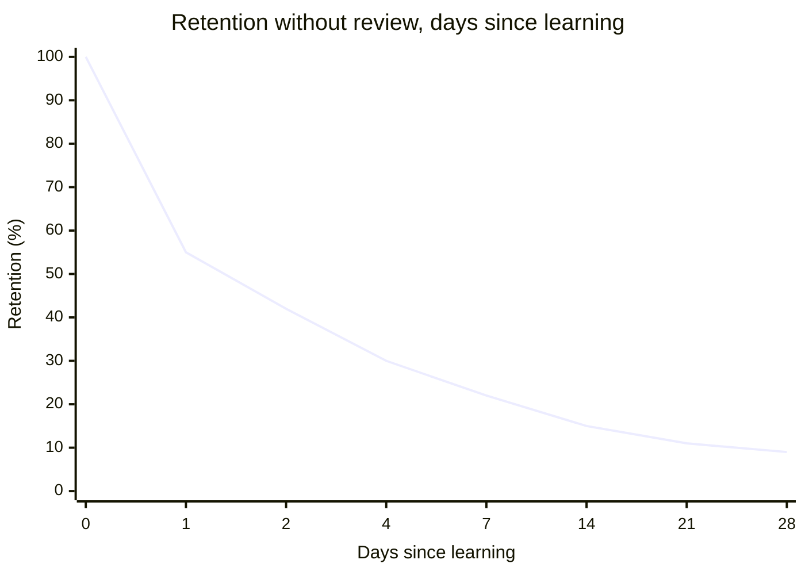

## The forgetting curve, and why review timing matters

**If a memory is going to fade anyway, does it matter exactly when you
review it?** Yes — a memory doesn't fade at a constant rate. Right
after learning something, forgetting is fast; the longer a memory
survives, the slower it decays from there. This means the single most
effective moment to review is right as the memory is about to be
forgotten, not immediately after learning it (too easy, adds little)
and not long after it's already gone (too late, you're relearning from
scratch instead of reinforcing).

Left alone, retention drops steeply in the first day or two, then
levels off into a long, slow decline. A review that lands somewhere in
that steep early drop — before the memory is fully gone, but after
enough time has passed that recalling it takes real effort — is what
resets the curve and, done repeatedly, makes each following decline
flatter than the last.

"Curve" here does not require advanced math. It just means the shape of
how remembering changes over time. "Decay" means the memory gets weaker;
"reset" means a successful review lifts it back up; "flatter" means it
falls more slowly next time.

## How to tell you are near the point of forgetting

You do not need an exact timer. You are close enough when recall is
possible but no longer easy:

| Signal during review                         | What it suggests                                                |
| -------------------------------------------- | --------------------------------------------------------------- |
| You can answer, but only after a pause       | Good spacing — the memory is being pulled back with effort      |
| You remember the first half but need a hint  | Still useful — try before looking, then check the missing piece |
| You instantly know everything with no effort | Probably too soon — little has faded yet                        |
| You cannot even start without rereading      | Probably too late — you may be relearning more than reinforcing |

## Massed practice vs. spaced practice

**Massed practice** (also called cramming) means packing most of the
study into one block. It can work for tomorrow morning, but it leaves
very little protection for next month.

|                             | Massed practice (cramming)                                       | Spaced practice                                                          |
| --------------------------- | ---------------------------------------------------------------- | ------------------------------------------------------------------------ |
| When review happens         | All at once, in one session                                      | Spread out, timed near each point of forgetting                          |
| How it feels while studying | Smooth — the material still feels fresh each time you look at it | Harder — recalling something you're starting to forget takes real effort |
| Retention right after study | High                                                             | High                                                                     |
| Retention weeks later       | Low — nothing interrupted the decay after the session ended      | Much higher — each spaced review reset and flattened the decay           |

The "feels harder" row is not a downside to work around — it's the
actual mechanism. The mental effort of pulling up a fading memory is
what strengthens it; a review that feels effortless (because it
happens too soon, while the memory is still fresh) does much less to
reinforce it.

## Active recall is a separate ingredient from spacing

**If Diego reviewed his flashcards on the right schedule but just
reread each word and its definition instead of trying to recall the
definition first, would he get the same result?** No — spacing and
active recall are two separate levers, not one. Spacing controls
_when_ review happens; active recall controls _what kind_ of review it
is. Rereading a word passively, even at a perfectly spaced interval,
produces weaker retention than genuinely trying to recall the
definition first and only checking afterward — the retrieval attempt
itself is what does most of the strengthening, not just seeing the
material again.

## The generalizable lesson

**Does this only apply to vocabulary words?** No — the same two levers
apply to any material meant to be retained over time: technical
concepts, historical facts, a new language, procedures at work. The
practical version of this unit's lesson is the same in every case:
review close to the point you'd otherwise forget, and make each review
an attempt to recall before checking, rather than a passive reread.
