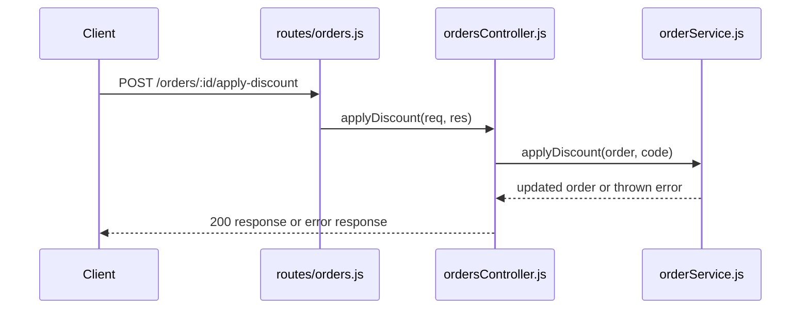

import LevelIntro from "../../../components/LevelIntro.astro";
import Checkpoint from "../../../components/Checkpoint.astro";

L1 named the three moves — entry point, tracing, tests first — as a short
list of vocabulary. L2 shows why folder structure actively misleads you
about where to start, and works out exactly what question each of the
three techniques answers that the other two don't.

<LevelIntro
  items={[
    "Why folder structure isn't execution order",
    "What each technique answers, and what it misses",
    "Why tests are read before implementation",
  ]}
/>

## Folder structure is not a map of what runs first

**If you open a repo and see `routes/`, `controllers/`, `services/`,
`models/`, and `tests/` folders — which one should you read first?**
None of them, in that alphabetical order — folder structure describes
how code is _organized_, not the order it actually _executes_ in for
a given request. The real execution order is a chain determined by
what calls what:

This chain — router to controller to service — is the actual path a
request takes, and it's what you need to follow, not the alphabetical
folder listing. Reading `models/` before you've even found the route
that triggers the bug spends time on code that may never come up in
the actual trace.

| Layer      | Plain role                                                     |
| ---------- | -------------------------------------------------------------- |
| Router     | Recognizes the URL and method, then sends the request onward   |
| Controller | Translates web details like `req`, `res`, `params`, and `body` |
| Service    | Applies the actual business rule, such as changing an order    |

For HTTP basics like request, response, method, and status code, this
connects to [HTTP request/response basics](/web/http-request-response-basics/).
You do not need that whole unit first, but it explains the web words this
example uses.

## Three techniques, three different questions

**If exploring a whole codebase up front doesn't work, what's the
minimum set of things worth doing instead?** Three techniques, each
answering something the others don't:

| Technique            | Question it answers                                                   | What it doesn't tell you                                                                        |
| -------------------- | --------------------------------------------------------------------- | ----------------------------------------------------------------------------------------------- |
| Find the entry point | Where does this specific kind of request first reach the code?        | What that code actually does once execution moves past it                                       |
| Trace execution      | What's the real sequence of function calls this one request triggers? | Whether that sequence is the _correct_ or _intended_ behavior                                   |
| Read the tests first | What is this code _supposed_ to do, according to whoever wrote it?    | Whether the current implementation actually matches that intent (that's what tracing tells you) |

Notice these three are complementary, not redundant — entry point
narrows _where_ to start looking, tracing tells you _what actually
happens_, and tests tell you _what's supposed to happen_. Skipping
any one of them leaves a gap: tracing without reading tests first
means you understand the current behavior but not whether it's a bug
or a feature; reading tests without tracing means you know the intent
but not whether the code lives up to it.

<Checkpoint question="Suppose tracing execution shows that a discount code gets pushed into an order's appliedDiscounts list with no check for whether it's already there. Does that fact alone tell you this is a bug rather than intended behavior?">

No. Tracing only tells you what the code currently does — in this case,
it confirms nothing stops a duplicate push. It says nothing about whether
that's a mistake or a deliberate choice someone made for a reason you
don't know yet. To tell the difference, you still need to check what the
tests (or the bug report itself) say this code is supposed to do. Tracing
narrows down where the behavior lives; it doesn't establish whether that
behavior is correct.

</Checkpoint>

## Why tests are read before implementation, not after

**Why start with the test file instead of jumping straight into
`orderService.js`?** A test suite, when it exists, is usually the
most concentrated, example-driven description of intended behavior
in the entire codebase — more reliable than a comment (which can go
stale) and more concrete than a docstring (which describes intent in
prose, not in a checkable example). A test like `expect(() =>
applyDiscount(order, "FAKE")).toThrow()` tells you two things at
once: unknown codes should be rejected, _and_ the codebase's
established pattern for rejecting bad input (throwing, in this case)
— a pattern worth matching when you write your own fix, rather than
inventing a different error-handling style that clashes with the rest
of the file.

<Checkpoint question="A comment above the discount function says 'duplicate discount codes are rejected,' but there's no test that actually checks this, and the current code doesn't reject them either. Which source should you trust about what the code is really supposed to do — the comment, or the absence of a test?">

Neither should be trusted blindly, but the missing test is the more
useful signal. The comment only tells you what someone once intended or
hoped to be true — it doesn't run, and nothing forces it to stay accurate
as the code changes around it. The absence of a test tells you something
more actionable: this exact behavior was never pinned down with a
checkable example, which is precisely the kind of gap where a real bug
hides. The right move isn't to trust the comment's claim at face value —
it's to treat the comment as a hint about intended behavior and then add
the missing test that actually verifies it.

</Checkpoint>

## Failure modes at this level

- **Starting with the folder tree instead of a specific request.**
  Without a concrete trigger (a specific request, a specific bug
  report) to trace, "explore the codebase" has no natural stopping
  point — you can read indefinitely without ever converging on the
  part that matters.
- **Tracing execution but skipping the tests.** You'll understand
  what the code currently does, but not whether that's the bug itself
  or intended behavior — you risk "fixing" something that was never
  broken, or missing that the bug is exactly the thing the tests
  already describe as wrong.
- **Trusting comments over tests when they conflict.** A comment can
  describe what the author _intended_ to write; a test describes what
  the code is _actually checked_ to do. When they disagree, the test
  is closer to ground truth, since it runs and fails if violated —
  the comment doesn't.

  For example, a comment might say "duplicate discounts are rejected,"
  while the test file only checks "unknown discounts are rejected." The
  comment tells you what someone hoped was true; the missing test tells
  you which behavior still needs a real, runnable check.
