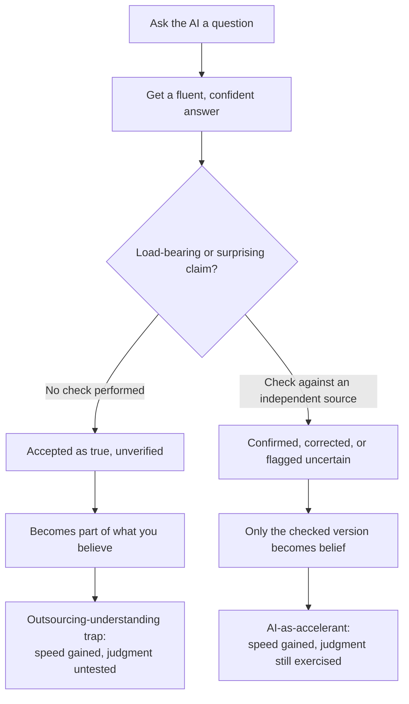

import LevelIntro from "../../../components/LevelIntro.astro";
import Checkpoint from "../../../components/Checkpoint.astro";

L1 showed the same wrong AI answer landing very differently for Ravi and
Ines — same question, same fluent answer, one thirty-second check as the
only difference. L2 looks at why an AI can be fluently wrong in the first
place, and turns "check the claim" from a one-off instinct into a
repeatable habit loop.

<LevelIntro
  items={[
    "Why AI text generation optimizes for plausible, not verified",
    "The outsourcing-understanding trap vs. the accelerant loop",
    "A verification habit you can actually run, every time",
  ]}
/>

## Why can a fluent answer still be wrong?

**If an AI assistant can write a grammatically perfect, specific,
confident paragraph about infant nutrition, doesn't that paragraph have
to be built on something true?** No — and this is the core thing to
internalize. A large language model is trained to predict the most
plausible next words given the text so far, based on enormous amounts of
writing it was trained on. Most writing about a topic tends to be
roughly accurate, so most of the time plausible-sounding and true line
up closely enough that the difference doesn't matter. But nothing in
that process checks a specific claim against a current, authoritative
source before the words get generated. Confidence, fluency, and
specificity are all properties of _how convincingly the text reads_ —
none of them are a signal that the claim was verified.

This is exactly what happened to the honey answer in L1: it wasn't
generated by looking up current pediatric guidance and reporting it.
It was generated by producing the most statistically plausible-sounding
completion of "is honey safe for a baby," which landed on an old,
common, and wrong version of the fact — worded with the same confidence
a correct answer would have carried.

<Checkpoint question="The AI in L1's scenario could have added a made-up citation, like 'according to pediatric nutrition guidelines' — does adding a source name to an answer make the claim inside it verified?">

No. Naming a source, real or fabricated, is still just more plausible-sounding
text generated the same way as the rest of the answer — it doesn't mean
that source was actually consulted or that the claim matches what it
says. A cited-sounding answer should be treated as a pointer to go check,
not as proof already delivered. The verification step is opening the
actual source and confirming it says what the AI claimed it says — not
just noticing that a source was named.

</Checkpoint>

## Passive acceptance vs. active verification

The difference between Ravi and Ines wasn't intelligence or expertise —
it was which column of this table their evening fell into:

| Moment                            | Passive acceptance                                       | Active verification habit                                                  |
| --------------------------------- | -------------------------------------------------------- | -------------------------------------------------------------------------- |
| Right after the AI answers        | The answer sounds informed, so it's treated as settled.  | The answer is treated as a draft claim, not yet a fact.                    |
| A surprising or high-stakes claim | Gets the same light treatment as a low-stakes one.       | Gets extra scrutiny — an independent source is checked before acting.      |
| A cited source or "reasoning"     | Its presence alone feels like proof.                     | The actual source gets opened and compared against the claim.              |
| A month later                     | The claim quietly became "something I know," unverified. | Only checked claims became "something I know" — the rest stayed tentative. |

## The outsourcing-understanding trap vs. AI as an accelerant

Both loops start in the exact same place: asking an AI a question. What
happens next is what determines whether the AI made someone's
understanding faster and sounder, or replaced it with something that
only feels like understanding:

**Notice what the accelerant loop does not remove.** It still uses the
AI for the fast first draft of an answer — that speed is real and worth
keeping. What it adds back is the one step the trap skips: a specific,
independent check on the claims that actually matter, before they
become part of what a person believes and acts on.

<Checkpoint question="A friend asks the same AI a low-stakes trivia question — 'what year did a particular movie come out' — just out of curiosity, no decision resting on the answer. Does the verification habit mean they should stop and independently check that too, every time?">

Not necessarily — scaling scrutiny to the stakes is part of the habit, not a
separate exception to it. A load-bearing claim (one a real decision, a
grade, someone's safety, or money rests on) earns a check before it's
trusted. A passing trivia fact with nothing riding on it usually doesn't
need the same treatment — checking everything with equal intensity isn't
sustainable and isn't really the point. The skill is noticing which
claims are load-bearing, not applying maximum suspicion uniformly to
every sentence an AI produces.

</Checkpoint>

## Failure modes at this level

- **Treating a cited-sounding answer as already verified.** A named
  source is a place to go check, not a substitute for checking.
- **Verifying nothing, or verifying everything.** Neither extreme is the
  habit — the habit is noticing which specific claims are load-bearing
  or surprising, and checking those.
- **Confusing "this explanation made sense to me" with "this claim is
  true."** Following an explanation and finding it plausible is a much
  lower bar than confirming the underlying facts are correct — the same
  gap the illusion of competence produces when self-testing recall,
  except here the thing being trusted came from outside, not from
  memory.
