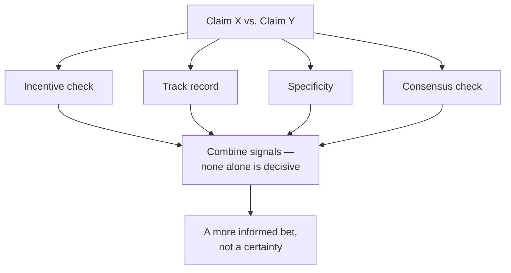

## Why no single signal is enough on its own

**If one credibility signal (say, incentive) looked bad for a
claim, would that alone be enough to dismiss it?** No — every signal
below can be misleading in isolation, which is exactly why weighing
credibility means combining several of them, not finding the one
that settles it:

## Incentive check: what does this person gain if I believe them?

**Does a financial incentive automatically mean someone is lying?**
No — but it changes how much a claim should weigh on its own,
because an incentive gives a reason for a mistake (even an honest
one) to consistently point in a profitable direction. In the car
scenario: a mechanic who repairs brakes for a living has an
incentive that points toward finding brake problems, even if they're
not being dishonest — this doesn't prove the brake diagnosis is
wrong, but it means the diagnosis alone, from that source, deserves
less weight than the same diagnosis from someone with no stake in
the outcome.

## Track record: has this source been right before, in checkable ways?

**If you've never used either mechanic before, is track record just
unavailable as a signal?** Mostly, in this scenario — but track
record generalizes beyond personal history: a shop's independent
reviews, a pattern of past diagnoses that turned out to be
correct or incorrect, are still track record even if it's not your
own direct experience. The key question is whether the track record
is actually checkable (specific past claims that were later verified
true or false) rather than just a vague reputation ("everyone says
they're good").

## Specificity: does the claim name a checkable mechanism?

**Between "it's your brakes" and "it's a loose heat shield rattling
against the exhaust," which claim gives you more to work with, even
if you can't verify either yourself?** The second one — not because
detail automatically means truth, but because a specific, named
mechanism is falsifiable in a way a vague claim isn't. "It's your
brakes" could mean pads, rotors, calipers, or something else
entirely, and offers nothing you could check even in principle. "A
loose heat shield rattling against the exhaust" names an exact
physical cause you (or anyone) could look for.

## Consensus vs. individual claim: does independent agreement exist?

**If a third mechanic, at a third shop, is asked and independently
says "heat shield" without hearing the other two's diagnoses, what
does that add?** Real signal — not because three people are always
right where two were wrong, but because _independent_ agreement
(different people, different incentives, no coordination) is much
harder to produce by accident than one confident voice repeating
itself. A single expert restating their own claim more forcefully
is not the same as several separately-consulted experts converging
on the same answer.

## Failure modes at this level

- **Treating any one signal as fully decisive.** A specific claim
  from someone with a bad incentive, or a vague claim with no
  incentive problem, both still need to be weighed against the other
  signals — no single one settles the question alone.
- **Confusing confidence with any of these signals.** How certain
  someone sounds is not the same as their incentive, their track
  record, their specificity, or independent consensus — confidence is
  cheap to produce and easy to fake, deliberately or not.
- **Requiring certainty before acting.** The goal of weighing these
  signals is a better-informed decision, not proof — in the car
  scenario, there's no version of this process that guarantees the
  right answer without actually knowing about cars; it just shifts
  the odds.
