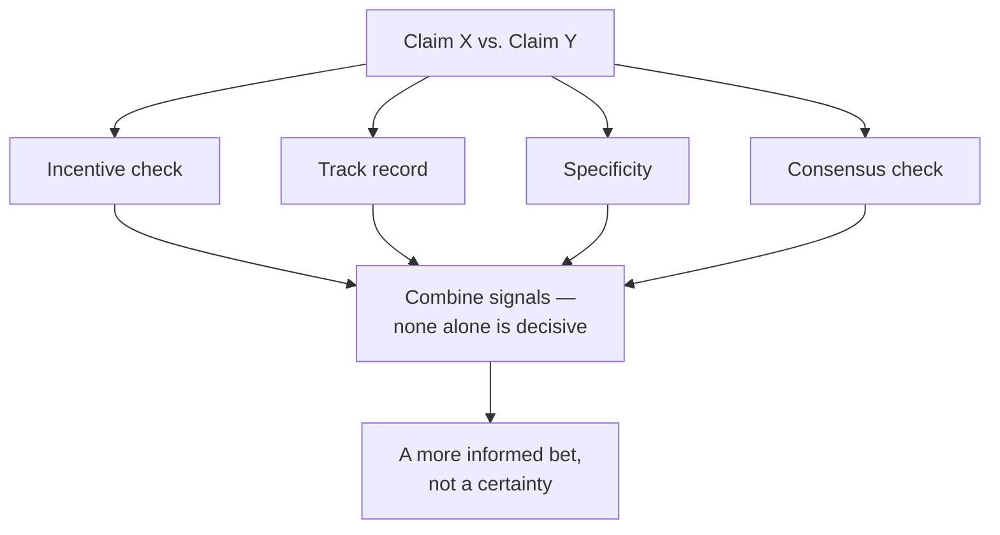

import LevelIntro from "../../../components/LevelIntro.astro";
import Checkpoint from "../../../components/Checkpoint.astro";

L1 named five credibility signals and the car-mechanic scenario they apply
to. L2 works through each signal on its own — what it tells you, what it
doesn't, and why none of them is enough by itself.

<LevelIntro
  items={[
    "How each signal is checked, one at a time",
    "Why incentive and specificity aren't proof of anything",
    "What independent consensus adds that a repeated claim doesn't",
  ]}
/>

## Why no single signal is enough on its own

**If one credibility signal (say, incentive) looked bad for a
claim, would that alone be enough to dismiss it?** No — every signal
below can be misleading in isolation, which is exactly why weighing
credibility means combining several of them, not finding the one
that settles it:

## Incentive check: what does this person gain if I believe them?

**Does a financial incentive automatically mean someone is lying?**
No — but it changes how much a claim should weigh on its own,
because an incentive gives a reason for a mistake (even an honest
one) to consistently point in a profitable direction. In the car
scenario: a mechanic who repairs brakes for a living has an
incentive that points toward finding brake problems, even if they're
not being dishonest — this doesn't prove the brake diagnosis is
wrong, but it means the diagnosis alone, from that source, deserves
less weight than the same diagnosis from someone with no stake in
the outcome.

<Checkpoint question="A friend who sells solar panels tells you your roof is a great candidate for solar. A neutral home inspector, with no stake in whether you install anything, says the same thing. Does the incentive check mean you should believe the inspector and dismiss the friend?">

No — dismissing the friend's claim outright would be over-applying the
signal. The incentive check doesn't say an interested party is wrong; it
says their claim, on its own, carries less weight than it would from
someone with no stake in the outcome, because their circumstances give a
reason for an error to consistently favor their interest. The inspector's
agreement is genuinely stronger evidence precisely because it comes from
someone with nothing to gain either way, but the friend's claim isn't
worthless — it's just a weaker input that needs the other signals
(specificity, track record, consensus) to carry more of the weight before
you'd act on it with confidence.

</Checkpoint>

## Track record: has this source been right before, in checkable ways?

**If you've never used either mechanic before, is track record just
unavailable as a signal?** Mostly, in this scenario — but track
record generalizes beyond personal history: a shop's independent
reviews, a pattern of past diagnoses that turned out to be
correct or incorrect, are still track record even if it's not your
own direct experience. The key question is whether the track record
is actually checkable (specific past claims that were later verified
true or false) rather than just a vague reputation ("everyone says
they're good").

Useful track record is concrete: "three customers say this shop diagnosed
a loose part, another shop confirmed it, and the cheap repair fixed the
noise." Weak track record is vague: "people online say they're honest."
The first gives you a pattern that could be checked; the second is just
reputation fog with nicer packaging.

## Specificity: does the claim name a checkable mechanism?

**Between "it's your brakes" and "it's a loose heat shield rattling
against the exhaust," which claim gives you more to work with, even
if you can't verify either yourself?** The second one — not because
detail automatically means truth, but because a specific, named
mechanism is falsifiable in a way a vague claim isn't. "It's your
brakes" could mean pads, rotors, calipers, or something else
entirely, and offers nothing you could check even in principle. "A
loose heat shield rattling against the exhaust" names an exact
physical cause you (or anyone) could look for.

Falsifiable does not mean false. It means there is a clear way the claim
could fail: if the heat shield is not loose, that specific explanation
loses weight. A vague claim is harder to test because it can slide around
afterward: "brakes" could mean too many different parts.

<Checkpoint question="Two weather forecasters both say 'expect rain tomorrow.' One adds 'a cold front moves through around 2pm, bringing 60% chance of rain between 1 and 4pm.' The other just repeats 'rain tomorrow' with more confidence the second time you ask. Which forecaster's claim is more specific, and why does that make it more useful even before tomorrow arrives?">

The first forecaster's claim is more specific, because it names a
mechanism (a cold front) and a checkable window (1 to 4pm, 60% chance) —
tomorrow will either match that window and probability roughly or it
won't, so the claim can be judged against what actually happens. The
second forecaster's repeated "rain tomorrow, and I'm sure of it" adds
confidence but no new information — confidence is not specificity, and
repeating a vague claim more forcefully doesn't make it any more
checkable than it was the first time. Specificity matters before the
outcome is known because it tells you, in advance, exactly what you'd
need to see to consider the claim right or wrong — a vague claim can
always be read as having been correct after the fact.

</Checkpoint>

## Recency: does age matter for this claim?

Recency is a signal only when the relevant facts change fast enough. A
mechanic's diagnosis of the same rattling car from yesterday is not very
stale; a ten-year-old review of a shop's honesty might still be useful if
the same people run it; a ten-year-old medical guideline or software
benchmark may be dangerously outdated. The question is not "is this old?"
by itself. The question is "does this kind of claim go stale quickly?"

## Consensus vs. individual claim: does independent agreement exist?

**If a third mechanic, at a third shop, is asked and independently
says "heat shield" without hearing the other two's diagnoses, what
does that add?** Real signal — not because three people are always
right where two were wrong, but because _independent_ agreement
(different people, different incentives, no coordination) is much
harder to produce by accident than one confident voice repeating
itself. A single expert restating their own claim more forcefully
is not the same as several separately-consulted experts converging
on the same answer.

## Failure modes at this level

- **Treating any one signal as fully decisive.** A specific claim
  from someone with a bad incentive, or a vague claim with no
  incentive problem, both still need to be weighed against the other
  signals — no single one settles the question alone.
- **Confusing confidence with any of these signals.** How certain
  someone sounds is not the same as their incentive, their track
  record, their specificity, or independent consensus — confidence is
  cheap to produce and easy to fake, deliberately or not.
- **Requiring certainty before acting.** The goal of weighing these
  signals is a better-informed decision, not proof — in the car
  scenario, there's no version of this process that guarantees the
  right answer without actually knowing about cars; it just shifts
  the odds.
