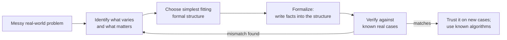

import LevelIntro from "../../../components/LevelIntro.astro";
import Checkpoint from "../../../components/Checkpoint.astro";

L1 showed the payoff: the same spreadsheet facts, restructured as a
graph, made a cycle-detection algorithm applicable where eyeballing a
column never could. This level works through _how_ to pick that
structure — and the central judgment call that decides whether the
model actually helps or quietly makes things worse.

<LevelIntro
  items={[
    "What makes an abstraction good: exactly the relevant properties, nothing else",
    "Two ways to get it wrong, on the same underlying problem",
    "The workflow: identify what varies, choose a structure, verify against reality",
  ]}
/>

## What makes an abstraction good?

**If a model is supposed to simplify a messy problem, why can adding
more detail to it make things worse instead of better?**

A formal model is good exactly when it captures every property the
question at hand depends on, and nothing more. That "nothing more" is
not laziness — extra detail has a real cost: it makes the model harder
to build, harder to verify, and harder to reason about, and every
detail that isn't load-bearing for the question is a place a bug or a
false intuition can hide.

Take the deploy-order question from L1 again: "in what order can these
14 services safely start up?" Two ways to model it badly, using the
_same_ underlying services:

**Under-abstraction.** Model each service as just a name, with no
edges at all — a flat list. The list answers "what services exist,"
but not "does starting `billing` before `accounts` break anything."
The property the question actually needs (dependency order) was
discarded, so the model can't answer the question it was built for —
it silently answers an easier, different question instead.

**Over-abstraction.** Model each service with its full deployment
history, every past incident, current CPU load, and the name of its
on-call engineer, in addition to its dependencies. None of that is
needed to answer "what order is safe to start in" — it's real
information about the services, just not information the _deploy-order
question_ depends on. Every extra field is one more thing that has to
stay correct, one more place two engineers' mental models of "the
graph" can silently diverge, and one more reason nobody fully trusts
what the model says.

**Just right**, for this specific question: each service as a node,
one directed edge per "needs" relationship. Nothing about CPU load or
who's on call changes whether `billing` can start before `accounts` —
so none of it belongs in _this_ model. A different question ("which
team should we page first during an incident") might need a
completely different, and differently-scoped, model of the exact same
14 services.

<Checkpoint question="A team wants to model 'which services are safe to deploy in parallel this week' versus 'which services are safe to deploy in parallel ever.' Do these two questions justify the same graph model, or two different ones?">

Two different ones, even though the underlying services are the same.
"This week" depends on which services currently have in-flight
migrations, feature flags, or maintenance windows — time-bound facts
that change day to day. "Ever" depends only on the structural
dependency edges, which are stable. Cramming both into one model means
either the stable graph gets polluted with fields that go stale within
days, or the time-bound one gets treated as permanent structure it
isn't. The question being asked determines what belongs in the model —
not "everything true about the services."

</Checkpoint>

## A workflow for choosing a formal structure

```text
1. Identify what actually varies and what the question actually
   depends on (not everything true about the situation — only what
   the specific question needs).
2. Survey the real-world "shape": relationships between discrete
   things? phases with rules about what follows what? limited
   resources being fit together? a rule that must always hold?
3. Choose the simplest formal structure whose known operations
   already answer the question (see the table below).
4. Formalize: write the messy facts into that structure explicitly
   (nodes/edges, states/transitions, variables/constraints, or
   rules), so the structure — not memory — now holds the facts.
5. Verify the model against a handful of real cases you already know
   the answer to, before trusting it on cases you don't.
```



Step 5 matters as much as step 3. A graph built from a spreadsheet
that had a typo in one "needs" cell will confidently give a wrong
answer — formalizing doesn't remove the need to check the model
against reality, it just moves _where_ mistakes get caught: from
"nobody notices for six months" to "the verification step catches it
before the model is trusted broadly."

## Four structures, in more depth

**Graphs** fit anything phrased as "X relates to / depends on / points
to Y": service dependencies (L1, L3), import graphs, org charts,
social networks, road networks. The payoff is reachability, cycles,
shortest/cheapest path, and ordering — all well-studied, all
available off the shelf once the facts are in graph form.

**State machines** (their own unit, `state-machines`) fit anything
phrased as "this thing moves through named phases, and only some
transitions are legal": an order's lifecycle (placed → paid → shipped
→ delivered), a upload widget's status, a document's approval flow.
The payoff is that illegal combinations become _structurally_
impossible to represent, not just something nobody's supposed to type.

**Constraint sets** fit anything phrased as "fit these things together
under limits": scheduling shifts so nobody double-books, packing jobs
onto machines without exceeding capacity, assigning reviewers so no
one reviews their own PR. The payoff is a solver that can find a valid
assignment — or prove none exists — instead of a human trying
combinations by hand and eventually missing one.

**Mathematical relations / rule sets** fit business rules phrased as
"if this holds, that must hold too": a discount rule, a tax
calculation, an eligibility check with several interacting conditions.
The payoff is that consequences can be derived mechanically and
checked for contradictions, instead of trusting that every code path
independently re-implements the rule the same way.

<Checkpoint question="A messy problem is 'in what order can these onboarding steps happen, given some steps require others to finish first, and a couple of steps are mutually exclusive (can never both run).' Which of the four structures fits best, and which one would technically 'work' but throw away the mutual-exclusion information?">

A **graph** (specifically, dependency edges plus a topological sort)
fits the "requires" half well, the same mechanism as L1/L3's service
dependencies. But "mutually exclusive" isn't a dependency edge — it's
a constraint that a plain graph has no natural way to express, so a
graph-only model would silently drop it and let an invalid order slip
through. A **constraint set** (ordering constraints plus explicit
"not both" constraints) captures both facts at once, which is why real
scheduling problems like this one are usually modeled as constraints,
not as a graph alone.

</Checkpoint>
