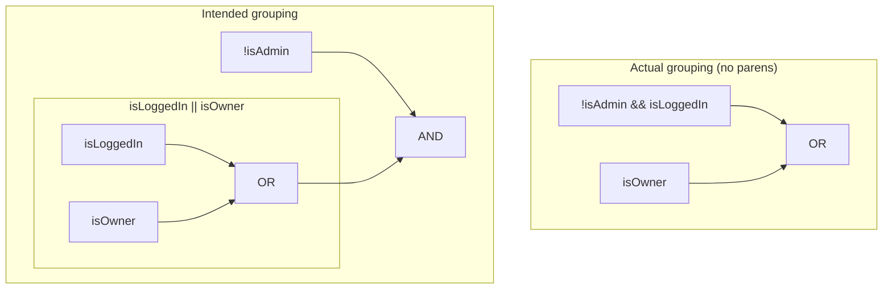

import LevelIntro from "../../../components/LevelIntro.astro";
import Checkpoint from "../../../components/Checkpoint.astro";

L1 named the key terms — operator precedence, truth tables, De Morgan's
laws — without yet walking through why the buggy code actually diverges
from the intended rule. L2 works through that divergence step by step,
using the same `isAdmin`/`isLoggedIn`/`isOwner` example.

<LevelIntro
  items={[
    "How && and || precedence groups an unparenthesized expression",
    "Proving two expressions differ with a full truth table",
    "Deriving a correct negation with De Morgan's laws",
  ]}
/>

## Precedence: why `&&` grabs its operands first

**If `!isAdmin && isLoggedIn || isOwner` doesn't mean "not admin, and
(logged in or owner)," what does it actually mean?** Without
parentheses, `&&` binds tighter than `||` — exactly the way `*` binds
tighter than `+` in `2 + 3 * 4`. That means the expression is really
grouped as `(!isAdmin && isLoggedIn) || isOwner`, not
`!isAdmin && (isLoggedIn || isOwner)`. The difference is where
`isOwner` attaches: in the actual code, `isOwner` being true makes the
_whole_ expression true, regardless of `isAdmin` — there's no way for
`!isAdmin` to veto it.

"Binds tighter" means "gets grouped first." Parentheses are the manual
version of that grouping: solve what is inside them before combining it
with the rest, just like arithmetic.

**Is this just a quirk of this one example, or a general rule?** General:
`!` evaluates first, then every `&&` in the expression, then every
`||` — left to right within the same precedence level. Any expression
mixing `&&` and `||` without parentheses follows this same fixed order,
which is exactly why relying on it to match a spoken sentence's natural
grouping is risky — English "and"/"or" don't carry a fixed precedence
the way the operators do.

<Checkpoint question="Given the fixed rule '! first, then every &&, then every ||,' how would isReady || isAdmin && !isBlocked actually group, without adding any parentheses yourself?">

It groups as `isReady || (isAdmin && !isBlocked)`. `!` evaluates first,
turning `!isBlocked` into its own value before anything else happens.
Then `&&` grabs its operands next, pulling `isAdmin` and the
now-negated `isBlocked` together into one unit. Only after both of
those are resolved does `||` combine that unit with `isReady`. The
fact that `isReady` was written first, on the left, doesn't matter —
precedence groups by operator strength, not by reading order, the same
way `2 + 3 * 4` groups the multiplication first even though the `+`
appears earlier in the line.

</Checkpoint>

## Proving the difference with a truth table

**How do you know the two versions actually differ, instead of just
looking different?** Testing a few example inputs by hand can miss the
one combination where they diverge — a truth table checks _every_
combination, which is the only way to be certain.

There are three yes/no inputs, and each has two possible values, so
there are `2 x 2 x 2 = 8` rows to check.

| isAdmin | isLoggedIn | isOwner | `!isAdmin` | `isLoggedIn \|\| isOwner` | Actual: `(!isAdmin && isLoggedIn) \|\| isOwner` | Intended: `!isAdmin && (isLoggedIn \|\| isOwner)` |
| ------- | ---------- | ------- | ---------- | ------------------------- | ----------------------------------------------- | ------------------------------------------------- |
| true    | true       | true    | false      | true                      | **true**                                        | **false**                                         |
| true    | true       | false   | false      | true                      | false                                           | false                                             |
| true    | false      | true    | false      | true                      | **true**                                        | **false**                                         |
| true    | false      | false   | false      | false                     | false                                           | false                                             |
| false   | true       | true    | true       | true                      | true                                            | true                                              |
| false   | true       | false   | true       | true                      | true                                            | true                                              |
| false   | false      | true    | true       | true                      | true                                            | true                                              |
| false   | false      | false   | true       | false                     | false                                           | false                                             |

The highlighted rows are exactly the bug: an admin (`isAdmin: true`) who
owns the document (`isOwner: true`) gets `true` from the actual code —
edit access — when the intended rule says `false`, because `!isAdmin`
alone should have vetoed it. Several other rows show the versions
agreeing, which is exactly why some manual testing missed the bug: a
non-admin owner behaves the same under both versions.

Take the row `isAdmin=true`, `isLoggedIn=false`, `isOwner=true` slowly:
`!isAdmin` becomes `false`, but the actual grouping still ends with
`false || true`, which is `true`. The intended grouping ends with
`false && true`, which is `false`. Same facts, different grouping,
different access decision.

## Negating a compound condition: De Morgan's laws

**Suppose the intended rule (`!isAdmin && (isLoggedIn || isOwner)`)
now needs a "why can't I edit this" message — the _negation_ of that
whole condition. Can you just flip every `&&` to `||` and negate each
piece?** Not quite — De Morgan's laws say the operator that flips
depends on which operator you started with:

| Original      | Negation     |
| ------------- | ------------ |
| `!(A && B)`   | `!A \|\| !B` |
| `!(A \|\| B)` | `!A && !B`   |

Negating `!isAdmin && (isLoggedIn || isOwner)` means negating an `&&`
of two things, so by the first row, it becomes
`isAdmin || !(isLoggedIn || isOwner)`. That inner `!(isLoggedIn ||
isOwner)` is itself a negated `||`, so by the second row it becomes
`!isLoggedIn && !isOwner`. Put together: `isAdmin || (!isLoggedIn &&
!isOwner)`.

<Checkpoint question="Using the same two De Morgan rows, what does !(isAdmin || isSuspended) become — and which row applies first?">

It becomes `!isAdmin && !isSuspended`. The starting expression is a
negated `||` (`isAdmin || isSuspended` wrapped in `!`), so the second
row applies directly and in one step: `!(A || B)` becomes `!A && !B`.
There's no nested structure here to peel apart in a second step, unlike
the `!isAdmin && (isLoggedIn || isOwner)` example above, which needed
two applications because it had an `&&` on the outside and an `||`
nested inside it. The lesson generalizes: which row applies is decided
by the operator actually sitting at the top of the expression being
negated, not by which operators appear anywhere inside it.

</Checkpoint>

## The generalizable lesson

**Is this really specific to `isAdmin`/`isLoggedIn`/`isOwner`, or does
it generalize?** It generalizes to any boolean expression mixing `&&`
and `||` without parentheses, and to negating any compound condition —
the specific variable names don't matter. Two habits prevent both
classes of bug: parenthesizing mixed `&&`/`||` expressions explicitly
rather than relying on precedence to match intent, and deriving a
negation mechanically via De Morgan's laws (or a truth table, for a
small enough expression) rather than by rewriting the sentence in
your head.
