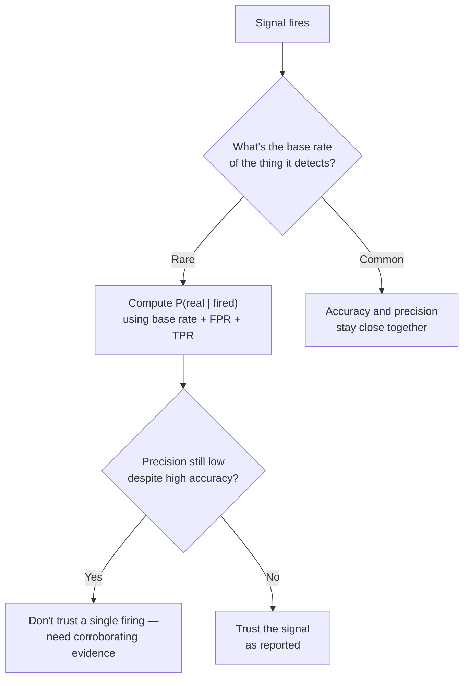

import LevelIntro from "../../../components/LevelIntro.astro";
import Checkpoint from "../../../components/Checkpoint.astro";

L1 found that a "95% accurate" alert was actually right only 28% of the
time it fired, because the event it watches for is rare. **That's the
base rate fallacy, and L2 works through exactly why the math comes out
that way. But first, a companion trap that shows up just as often:
seeing two numbers move together and assuming one causes the other.**
Both traps let a number that looks rigorous stand in for the harder
question a real investigation would ask.

<LevelIntro
  items={[
    "Three reasons a real correlation isn't causation — confound, reverse causation, coincidence",
    "The base rate calculation, worked with real counts, that explains L1's 28%",
    "A repeatable loop for not trusting a signal's accuracy number on its own",
  ]}
/>

## Correlation vs. causation: three ways a real correlation can mislead

**Two metrics really are moving together — the correlation itself isn't
in question. So why might "A causes B" still be the wrong conclusion?**
Three distinct answers, each needing a different fix:

| Pattern               | What's actually happening                                                                                                                | Example                                                                                                                                                                  |
| --------------------- | ---------------------------------------------------------------------------------------------------------------------------------------- | ------------------------------------------------------------------------------------------------------------------------------------------------------------------------ |
| **Confound**          | A third factor independently drives both measured quantities                                                                             | Fires with more trucks dispatched also have more damage — not because trucks cause damage, but because bigger fires cause both                                           |
| **Reverse causation** | The causal arrow points the opposite way from the obvious reading                                                                        | A city with more police officers has a higher crime rate — not because police cause crime, but because high crime led the city to hire more police                       |
| **Coincidence**       | No causal link at all — the correlation is a statistical accident, or both series share an unrelated trend (like "increasing over time") | The number of Nicolas Cage films released in a year tracks the number of pool drownings that year — both just happen to move together over the same decade, nothing more |

The fix is different for each: a confound needs a **shared cause
identified and controlled for**; reverse causation needs the **timeline
checked** (which changed first?); coincidence needs a **plausible
mechanism asked for** (can anyone describe _how_ A would physically or
economically cause B?) — and if nobody can, that's the tell.

<Checkpoint question="A blog post says 'teams that use more Slack channels ship more features, so creating more channels increases shipping speed.' Which of the three patterns is the most likely explanation, and what's the fix?">

The most likely explanation is a confound, not a direct causal link.
Team size is a strong candidate for the shared cause: a bigger team
naturally creates more Slack channels (more sub-projects, more people
wanting their own space) _and_ ships more features (more people writing
code), without channel count causing either. The fix isn't a stronger
correlation or a bigger sample — it's checking whether the relationship
between channel count and shipping speed survives once team size is held
roughly constant. If small teams with many channels don't actually ship
faster than small teams with few, the "channels cause shipping speed"
story falls apart, which is exactly what a confound looks like once it's
tested for directly.

</Checkpoint>

## The base rate fallacy: the calculation behind L1's 28%

**L1 asserted the alert is right only 28% of the time it fires, despite
being "95% accurate." Where does that number actually come from?** Walk
it with real counts instead of just percentages — out of 1,000 checks:

| Group                           | Count             | Alert fires? | Reasoning                          |
| ------------------------------- | ----------------- | ------------ | ---------------------------------- |
| Real incidents                  | 20                | —            | Base rate: 2% of 1,000             |
| ...and the alert catches        | 19                | Yes          | True positive rate: 95% of 20      |
| ...and the alert misses         | 1                 | No           | 5% of real incidents go undetected |
| Not a real incident             | 980               | —            | 98% of 1,000                       |
| ...and the alert stays quiet    | 931               | No           | 95% of 980 (correctly quiet)       |
| ...and the alert fires anyway   | 49                | Yes          | False positive rate: 5% of 980     |
| **Total alerts fired**          | **68**            |              | 19 real + 49 false                 |
| **Real, given the alert fired** | **19 / 68 ≈ 28%** |              | The number that actually matters   |

In plain-text formula form, this is Bayes' theorem for a binary signal:

```text
P(real | alert fires)
  = P(real AND alert fires) / P(alert fires)
  = (base_rate * true_positive_rate)
    / (base_rate * true_positive_rate
        + (1 - base_rate) * false_positive_rate)
```

**Why does a 5% false positive rate matter more than the detector's 95%
true positive rate here?** Because there are so many more real "nothing
happened" checks (980) than real "something happened" checks (20) — a
small false-positive _rate_ applied to a huge pool of non-events produces
more total false alarms (49) than a huge true-positive _rate_ applied to
a tiny pool of real events produces true alarms (19). The detector isn't
lying about being "95% accurate" — that number describes how it behaves
_given_ a real incident. It says nothing about what fraction of _fired
alerts_ are real, which depends just as much on how rare the event is as
on how good the detector is.



<Checkpoint question="If the detector's false positive rate dropped from 5% to 1% (keeping the 2% base rate and 95% true positive rate the same), would precision improve a little or a lot — and why?">

A lot — because false positives, not true positives, are the dominant
term in the denominator when the event is this rare. At 5% FPR: 49 false
alarms against 19 true ones (68 total, 28% precision). At 1% FPR: false
alarms drop to roughly 9.8 (1% of 980), against the same 19 true
positives — about 29 total alerts, and precision jumps to roughly 66%.
Cutting the false positive rate by 5x nearly _tripled_ precision, while
the true positive rate never changed. This is the practical lesson
underneath the math: for a rare event, the false positive rate — not the
headline "accuracy" — is usually the number worth improving first.

</Checkpoint>

## The two traps, side by side

Both traps share a fix: **stop trusting the summary number, and ask what
it's actually built from.** A correlation coefficient doesn't say
anything about mechanism, direction, or a third cause — go find those
directly. An "accuracy" percentage doesn't say anything about how rare
the event is — go compute precision using the actual base rate before
deciding how much to trust a single firing.

L3 turns both of these into real, runnable code: a spurious correlation
computed from synthetic data with a genuine shared confound, controlled
for directly; and a reusable base rate calculator applied to L1's own
numbers — plus what happens to that calculator's output as a detector
gets "more accurate" without the base rate improving, which turns out to
be a much smaller win than it sounds.
