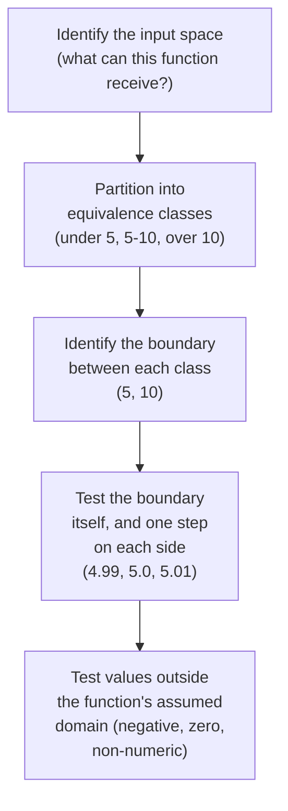
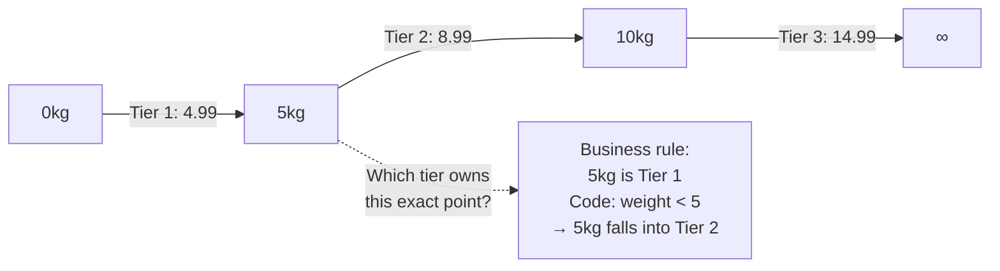

import LevelIntro from "../../../components/LevelIntro.astro";
import Checkpoint from "../../../components/Checkpoint.astro";

L1 showed one boundary bug living at a single point — `weight = 5` — and
named the vocabulary for talking about it precisely: edge case, boundary
condition, equivalence class, invariant. L2 turns that vocabulary into a
repeatable process for finding boundaries in any function, and shows where
an invariant check does and doesn't help.

<LevelIntro
  items={[
    "The 5-step process for mapping an input space",
    "Reading tiers as a number line to see where bugs hide",
    "What an invariant like monotonicity does and doesn't catch",
  ]}
/>

## From "pick a few values" to "map the input space"

**If picking one value per tier isn't enough, is the fix just "write
more tests"?** No — writing ten more interior values (2.1kg, 3.7kg,
8.2kg...) would still miss the exact `5.0` boundary; more of the same
kind of test doesn't cover a different kind of input. The fix is a
different process, not more repetitions of the same one:

You can do the process by hand for any rule:

1. What data enters the rule?
2. Which values are valid, invalid, empty, or missing?
3. Where does the answer change?
4. Does the exact boundary belong to the lower group or the higher group?
5. Which value will you test just before, exactly on, and just after the
   boundary?

**Why test the boundary and one step on each side, rather than just
the boundary value itself?** Because a boundary bug can go either
direction — the exact value might be handled correctly while the
step just below or above it isn't (or vice versa) — testing all
three (`4.99`, `5.0`, `5.01`) is what actually distinguishes a `<`
bug from a `<=` bug from correct code.

"One step" depends on the kind of value. If the system measures weight
to two decimals, `4.99`, `5.00`, and `5.01` are useful. If the rule uses
whole years of age, the useful values around age 12 are `11`, `12`, and
`13`.

<Checkpoint question="Why does step 5 of the process ask for three values around a boundary (just before, exactly on, just after) instead of just the exact boundary value alone?">

Because a boundary bug can live on either side of the comparison, and
testing only the exact value can't tell you which side is wrong. If a
function uses `weightKg < 5` when the rule means "5 and under," testing
only `5.0` shows you the wrong tier — but you still wouldn't know whether
the fix is to change `<` to `<=`, or whether the boundary itself should
sit somewhere else entirely, without also seeing how `4.99` and `5.01`
behave relative to it. The three values together show the shape of the
comparison, not just whether one point happens to be wrong.

</Checkpoint>

## Reading the shipping tiers as a number line

**Where exactly does the shipping-cost bug from L1 live, visually?**
Right at the seam between two equivalence classes — the number line
makes it obvious once drawn, even though it's easy to miss in code
that only shows comparison operators:

The bug isn't anywhere inside `0–5` or `5–10` — every interior value
of both ranges behaves exactly as intended. It exists at exactly one
point: `5`, where the code's `<` and the business rule's "and under"
disagree. **This is why boundary-focused testing finds bugs that
proportionally more interior testing never will** — the bug's entire
"surface area" is a single point, and no number of interior samples
gets closer to hitting it.

Inclusive means the boundary is included: "5kg and under" includes
exactly `5`. Exclusive means the boundary is not included: "under 5kg"
stops before `5`.

## What common edge-case categories actually are

**Beyond boundaries, what other categories of input does "typical
testing" tend to skip?** A short, memorable checklist — not
exhaustive, but covering the inputs bugs disproportionately hide in:

| Category           | Example for the shipping function | Why it's often skipped                                     |
| ------------------ | --------------------------------- | ---------------------------------------------------------- |
| Zero               | `weight = 0`                      | Feels "too trivial" to test explicitly                     |
| Negative           | `weight = -3`                     | Assumed impossible, but nothing stops it at the type level |
| Exact boundary     | `weight = 5`, `weight = 10`       | Interior test values comfortably avoid it                  |
| Just past boundary | `weight = 5.01`, `weight = 10.01` | Same reason — feels redundant with the boundary test       |
| Maximum / extreme  | `weight = 10000`                  | "Realistic" test data rarely includes it                   |
| Empty / missing    | no weight provided at all         | Often assumed to be validated somewhere else               |

For a form, empty/missing means the box was left blank. Non-numeric
means the box contains text like `"five"` where the rule expects a
number like `5`.

## What an invariant catches — and what it doesn't

**If "shipping cost should never decrease as weight increases" is
true for the buggy version _and_ the fixed version, is checking that
invariant a waste of time?** No — it's still valuable for catching a
_different_ class of bug (a tier accidentally priced lower than a
cheaper tier, a sign error, a reversed comparison) — it's just not
the tool that catches _this specific_ bug, because the boundary bug
doesn't violate monotonicity at all: `weight < 5` moving `5.0` into
the next tier still produces a higher (not lower) price, so the
"never decreases" property holds throughout, even though the price
charged at exactly `5.0` is still wrong relative to the business
rule.

That "never decreases" property is often called **monotonicity**. The
plain-language version is enough here: as weight goes up, price should
stay the same or go up, never down.

**This is the core lesson of this level:** invariants are powerful
because they hold across an entire input space rather than a handful
of examples, but a specific invariant only catches the specific class
of bug it's actually sensitive to — it isn't a substitute for
identifying and directly testing the boundaries a bug is actually
likely to hide at.

<Checkpoint question="A function's output is monotonic across its entire tested range — price never decreases as weight increases. Does that prove the function assigns every weight to the correct tier?">

No. Monotonicity only says the trend goes the right direction overall;
it says nothing about whether each specific input lands in the tier the
business rule actually intends. The shipping bug is the proof: `weight
= 5.0` moving into the more expensive tier still keeps price going up
as weight goes up, so the invariant holds at exactly the point where the
function is wrong. An invariant holding increases confidence about the
one property it actually measures — it doesn't generalize to "therefore
the logic is correct everywhere," because a different, unrelated bug
could easily coexist with a perfectly intact invariant.

</Checkpoint>

## Failure modes at this level

- **Treating "I tested one value per case" as equivalent to "I
  tested every case."** The interior of an equivalence class and its
  boundary are different inputs with potentially different behavior
  — one doesn't stand in for the other.
- **Assuming an invariant that holds proves correctness.** An
  invariant holding across every tested input increases confidence
  but only rules out the specific class of bug that invariant is
  actually capable of detecting.
- **Testing the boundary value but not one step past it (or vice
  versa).** A `<` vs. `<=` bug is only visible by comparing behavior
  _across_ the boundary, not by testing either side alone.
