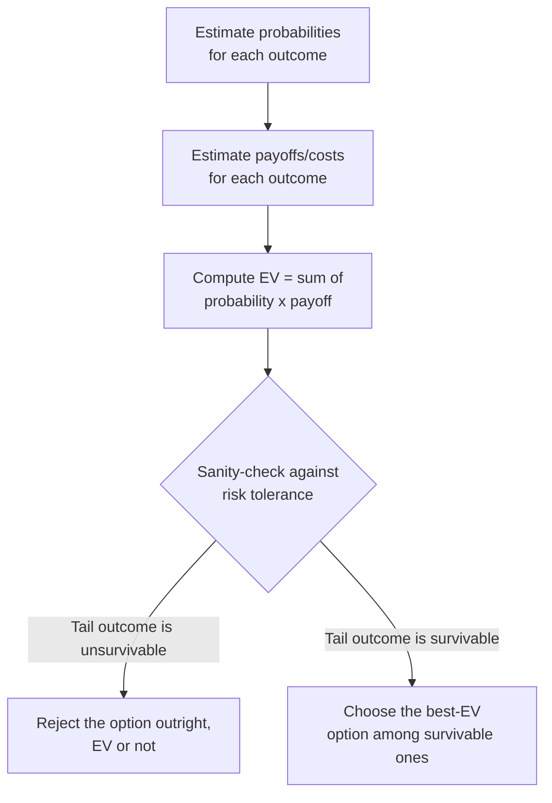

import LevelIntro from "../../../components/LevelIntro.astro";
import Checkpoint from "../../../components/Checkpoint.astro";

L1 computed expected value for both migration strategies and found
big-bang cutover cheaper on average — $13,600 versus $17,300. **If
big-bang cutover really is cheaper on average, why would anyone still
choose the more expensive staged rollout?** This level answers that,
because the answer is the single most important idea in this unit: EV
is the right tool for a decision you make repeatedly, and a dangerously
incomplete tool for a decision you make once and might not survive.

<LevelIntro
  items={[
    "The formula, applied cleanly to a full worked table",
    "Why a good expected value can still be the wrong real-world choice",
    "How to get probabilities and payoffs when there's no clean data to read them off",
  ]}
/>

## The formula, worked cleanly

For a decision with outcomes `o1, o2, ..., on`, each with a probability
`p` and a payoff/cost `v`:

```text
EV = (p1 × v1) + (p2 × v2) + ... + (pn × vn)
```

In words: multiply each outcome's probability by its payoff (or cost,
if negative), then add all of those products together.

The loop this unit runs on, every time:



A second worked example, to see the mechanics apply beyond the migration
scenario — deciding whether to invest two engineer-weeks hardening a
flaky payment-retry path before a big sales push:

| Outcome                              | Probability | Cost if it happens                       | Contribution to EV |
| ------------------------------------ | ----------- | ---------------------------------------- | ------------------ |
| Skip hardening, no incident          | 90%         | $0                                       | $0                 |
| Skip hardening, incident during push | 10%         | $50,000 (lost sales + on-call + cleanup) | $5,000             |
| **EV of skipping hardening**         |             |                                          | **$5,000**         |
| Do hardening (guaranteed cost)       | 100%        | $16,000 (two engineer-weeks)             | $16,000            |
| **EV of doing hardening**            |             |                                          | **$16,000**        |

By EV alone, skipping the hardening work is cheaper — $5,000 expected
cost versus a guaranteed $16,000. **Before accepting that conclusion,
what's missing from this table that the migration example in L1 already
hinted at?**

<Checkpoint question="The hardening table above says 'skip it' is cheaper by expected value. What question does this table not answer, that would change whether skipping is actually the right call?">

The table only asks "what's the average cost," not "can this business
survive the 10% outcome if it happens." If a $50,000 incident during the
exact week of the sales push would also cost a major customer's trust, or
blow through a contractual SLA that triggers a much larger penalty not
captured in the $50,000 figure, then the 10% outcome isn't just "more
expensive on average" — it's a scenario the business might not recover
from regardless of how unlikely it is. EV tells you the average outcome
across many repetitions of this exact bet; it says nothing about whether
you can survive a single bad draw. That's precisely the gap the next
section names directly.

</Checkpoint>

## The pitfall: EV is a long-run average, not a survival guarantee

**Why does "expected value" even use the word "expected" if the actual
outcome is never going to be exactly that number?** Because EV is a
_long-run average_ — the number you'd converge toward if you repeated the
exact same bet thousands of times and averaged the results. A single
decision doesn't get to repeat thousands of times. It happens once, and
whatever the actual outcome is, you live with that one draw, not the
average of every draw you didn't take.

This is the difference between a bet you can survive being wrong on and
a bet you can't. Consider three versions of the same underlying gamble:

- **A casino, playing a game with a 2% house edge, one hand at a time.**
  Any single hand has real variance, but the casino plays millions of
  hands. Its actual revenue converges tightly around the expected value
  because the law of large numbers smooths out the variance across that
  many repetitions. EV is exactly the right frame here.
- **An insurer pricing car insurance across 200,000 policyholders.**
  Any one driver might total a car this year; the insurer doesn't care
  which one — it cares about the average payout across all 200,000,
  which EV predicts accurately at that scale.
- **A startup with $400,000 in the bank, choosing whether to take a bet
  with a 90% chance of a $150,000 gain and a 10% chance of losing
  $500,000 outright.** EV = (0.9 × $150,000) + (0.1 × −$500,000) =
  $135,000 − $50,000 = **$85,000 positive expected value** — a genuinely
  good bet, on paper. But the startup doesn't get to play this bet a
  thousand times and let the average work out. It plays it once. The
  10% branch doesn't cost "$50,000 on average" — it costs $500,000 in
  the one timeline where it happens, which is more cash than the company
  has, meaning that branch isn't a cost, it's the end of the company.
  **A decision-maker who cannot survive a tail outcome should reject
  that option even when its expected value looks attractive — because
  the "average" they'd need many repetitions to actually realize isn't
  available to them. They only get the one draw.**

This is why the migration decision in L1 isn't fully settled by "big-bang
cutover has better EV." A 20% chance of a multi-hour outage during a
high-visibility migration might carry costs the simple dollar figure
doesn't capture — a major customer walking away, an SLA penalty far
larger than cleanup cost, a regulator-facing incident. If any of those
are true, the right response isn't to recompute EV with better numbers
(though that helps) — it's to ask a categorically different question
first: **can we survive the worst outcome on this option's table at all,
regardless of how unlikely it is?**

<Checkpoint question="A colleague says: 'EV of $85,000 is positive, so by definition this is a good bet — you're just being risk-averse if you turn it down.' What's the actual flaw in that reasoning?">

The flaw is treating "positive expected value" as equivalent to "correct
choice," when EV only tells you what happens on average across many
repetitions of an identical bet — a fact about the long run, not about
this one instance. A one-shot decision doesn't get the benefit of the
long run; it gets exactly one draw from the distribution, and if that one
draw can be a company-ending $500,000 loss, the average of many draws the
company will never actually take is not the relevant number. This isn't
"being risk-averse" in some vague emotional sense — it's a structurally
correct objection: EV silently assumes repeatability, and a decision-maker
who can't survive the tail outcome is right to weight survivability above
the average, because for them there is no average to converge to.

</Checkpoint>

## Where the probabilities and payoffs actually come from

**Every example so far handed you clean probabilities — 95%, 20%, 10%.
Real decisions rarely come with numbers already attached. Where do they
come from?** Three sources, in order of how often they're actually
available:

1. **Real historical data**, when it exists — "the last 12 migrations of
   this size had 1 bad outcome," or "our payment-retry path has failed
   during 3 of the last 40 high-traffic events." This is the strongest
   input, and worth checking for before estimating anything.
2. **A disciplined rough estimate**, built the same way
   `logic/fermi-estimation` builds a quantity estimate — decompose the
   probability into smaller, more defensible judgments instead of pulling
   one number from thin air. "How likely is a bad cutover?" decomposes
   into "how many similar cutovers has this team done," "how much has
   the schema changed since the last one," "is there a tested rollback
   path" — each individually more reasonable to put a number on than the
   final probability itself.
3. **A reference class** — a similar decision made before, even in a
   different context, used as an anchor. "Our last three big-bang
   database cutovers: two went fine, one had a 4-hour outage" gives a
   rough base rate (about 33%) before adjusting up or down for what's
   different this time (better tooling this time — adjust down; a more
   complex schema this time — adjust up).

**A rough, disciplined estimate — reasoned through the way
`fermi-estimation` reasons through a quantity — beats refusing to
quantify the decision at all.** Refusing to put a number down doesn't
remove the uncertainty; it just hides it behind an unexamined gut feeling
that's much harder to challenge or improve than an explicit, arguable
20%. The goal isn't false precision — nobody should defend "exactly 20%,
not 19% or 21%" — it's getting close enough to compare options honestly,
and being explicit enough that someone else can push back on a specific
number instead of a vague mood.

## The two-step process, put together

1. **Compute EV honestly**, using the best available probabilities and
   payoffs (real data where it exists, disciplined estimates otherwise).
2. **Before ranking by EV, filter out any option whose worst realistic
   outcome you cannot survive** — a hard constraint, applied first, not a
   tiebreaker applied after. Only rank the surviving options by EV.

L3 turns this two-step process into real, runnable code: computing EV
for a set of options, computing each option's worst-case tail alongside
it, and applying a risk-tolerance filter that can flip which option gets
recommended.
