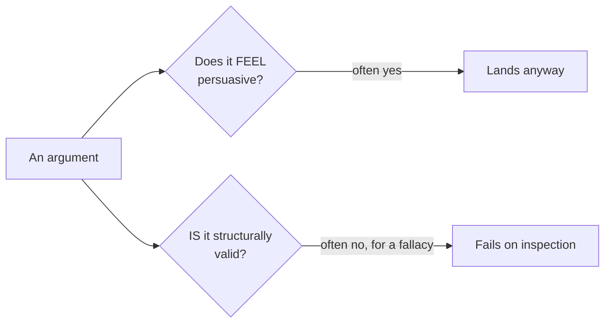

import Scenario from "../../../components/Scenario.astro";

<Scenario>
  <Fragment slot="facts">
    

      

        4 of 6
        showed up last Friday
      

      

        

      

    

    

      
💼 One friend had a work deadline

      
😅 One friend just forgot

    

    
Voices in the chat

    

      
📢 "Either we commit every week, or admit it's over"

      
🙅 "So guilt-trip anyone who's ever busy?"

      
👉 "Jamie only says that because Jamie picks the games"

    

  </Fragment>

Six friends have run a Friday game night for over a year. Last week, two
people missed it — one had a work deadline, one just forgot — and attendance
dropped to 4 of 6. In the group chat, someone writes: **"Either we commit to
showing up every week, or we admit game night is over and stop pretending."**
Before anyone can respond to that calmly, the thread spirals: people start
defending themselves, questioning each other's commitment, and predicting
the whole friendship is unraveling.

| Message in the chat                                          | Something's off — but what? |
| ------------------------------------------------------------ | --------------------------- |
| "Either we commit every week, or admit it's over."           | ?                           |
| "So you want us to guilt-trip anyone who's ever busy?"       | ?                           |
| "Jamie only says that because Jamie always picks the games." | ?                           |

**Before reading on: nobody in this thread is lying, and nobody's acting in bad faith. So what's actually wrong with each of these three messages?**

</Scenario>

None of the three speakers is being dishonest. Each message even sounds reasonable in the moment. What's wrong isn't the honesty — it's the _structure_ of the reasoning.

- A **fallacy** is a specific, nameable pattern of flawed reasoning — naming one isn't pedantry, it's precision. "That's a false dichotomy" identifies exactly what's wrong; "that doesn't sound right" doesn't.
- **False dichotomy**: presenting two options as the only possibilities when a third (or more) genuinely exists. "Either we commit every week, or admit it's over" quietly rules out sending a reminder text, alternating who hosts, or just shrugging off the occasional missed week — without ever actually ruling those out.
- **Straw man**: arguing against a weaker, distorted version of someone's actual position, then treating that as if it refuted the real one. "So you want us to guilt-trip anyone who's ever busy?" responds to a claim nobody made — the actual proposal was a reminder text, not guilt-tripping.
- **Ad hominem**: attacking the person making a claim instead of the claim itself. "Jamie only says that because Jamie picks the games" might even be true — but it doesn't address whether Jamie's actual point (attendance dipped once, not a trend) is correct.
- **Appeal to authority (misused)**: citing someone's authority on a different question as if it settles this one. "My uncle's a therapist, and he says friend groups always fall apart once people start skipping" borrows real expertise (therapy) to settle a specific, checkable claim (this group, this week) that expertise alone doesn't resolve.
- **Slippery slope**: claiming a small, bounded event inevitably cascades into an extreme outcome, without showing the actual mechanism. "If we let two people skip without consequence, everyone will start skipping and game night will die" asserts a chain of dominoes without establishing why the first one has to knock over the rest.
- These patterns recur specifically because they're _persuasive_ independent of being _valid_ — this unit's practical value is being able to name the exact move happening in a real disagreement, which is what lets you respond to the actual structural problem instead of just feeling like something's off.

Persuasiveness and validity are two different questions about the same argument, and a fallacy is what happens when the first is true and the second isn't:

| Fallacy                       | The move                                                                 | Quick tell                                                           |
| ----------------------------- | ------------------------------------------------------------------------ | -------------------------------------------------------------------- |
| False dichotomy               | Presents two options as the only ones, when a third genuinely exists     | "Either... or..." with an unnamed middle ground sitting right there  |
| Straw man                     | Refutes a distorted, easier-to-beat version of the real position         | The reply argues against something more extreme than what was said   |
| Ad hominem                    | Attacks the person instead of engaging the claim                         | "Of course you'd say that, you're the one who..."                    |
| Appeal to authority (misused) | Cites authority in an unrelated or overly broad domain to settle a claim | An expert's general credibility stands in for checking this one fact |
| Slippery slope                | Claims a bounded step inevitably cascades, with no mechanism shown       | "If we allow this once, we'll have to allow everything"              |
