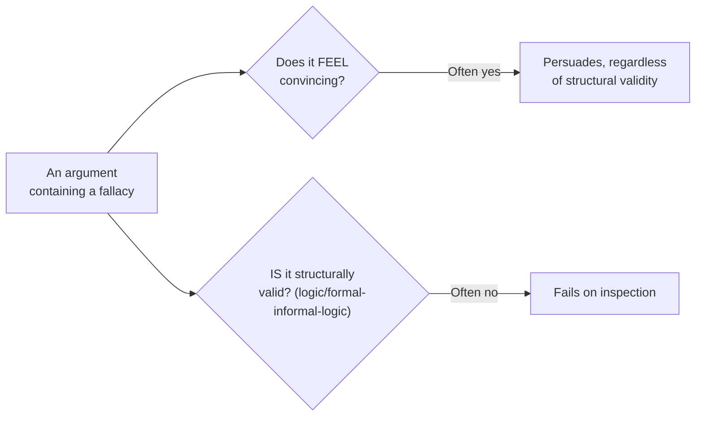

## Why a bad argument can still feel completely convincing

Take the "either we commit every week, or admit it's over" message from L1. Before reading on: if a friend of yours said that to you directly, would your gut reaction be "yeah, fair point" or "wait, is that actually true"? Most people's gut says the first — so what is it about that sentence that makes a false claim feel true on first read?

In this unit, **valid** does not mean "I like it" or "it sounds true."
It means the conclusion is actually supported by the reasons given.
**Persuasive** means it feels convincing. A fallacy is dangerous because
it can be persuasive while still not being valid.



Validity (covered in `logic/formal-informal-logic`) and persuasiveness are separate axes — that's precisely why fallacies are worth memorizing by name: they're recurring shapes that feel persuasive while failing on inspection often enough that recognizing the pattern on sight is more reliable than re-deriving from scratch each time why a given argument feels off.

## Five patterns, with everyday examples

Would the same five patterns show up in a disagreement about something you actually care about, not just this one friend group? Watch for the shape, not the topic:

| Fallacy                       | The move                                                                        | Everyday example                                                                                                            |
| ----------------------------- | ------------------------------------------------------------------------------- | --------------------------------------------------------------------------------------------------------------------------- |
| False dichotomy               | Presenting two options as exhaustive when others exist                          | "Either we commit every week, or admit game night is over" — ignores a reminder text, rotating hosts, a lower bar           |
| Straw man                     | Refuting a distorted, weaker version of the actual position                     | "So you want us to guilt-trip anyone who's ever busy?" in response to "maybe we just need a reminder text"                  |
| Ad hominem                    | Attacking the person instead of the claim                                       | "Jamie only says attendance is fine because Jamie picks the games" — doesn't address whether the claim is correct           |
| Appeal to authority (misused) | Citing authority in an unrelated domain as if it settles this claim             | "My uncle's a therapist, and he says friend groups always fall apart once people skip" — settles nothing about _this_ group |
| Slippery slope                | Claiming a bounded first step inevitably cascades, with no real mechanism shown | "If we let two people skip without consequence, everyone will start skipping and game night will die"                       |

Every example is a real, common shape of an everyday disagreement — not an abstract logic-textbook case — because these patterns show up in family group chats, friend arguments, and casual debates at least as often as in formal ones.

## False dichotomy, made checkable

You can think of a false dichotomy as a possibility-list problem: did
the speaker present the real options, or hide some?

| Claimed options  | Actual options            | Result               |
| ---------------- | ------------------------- | -------------------- |
| Commit weekly    | Commit weekly             | Covered              |
| Admit it is over | Admit it is over          | Covered              |
|                  | Send a reminder text      | Excluded real option |
|                  | Rotate who hosts          | Excluded real option |
|                  | Accept an occasional miss | Excluded real option |

If `C`, `D`, or `E` are real options, then "A or B are the only options"
was incomplete. The code below is just the same check written for people
who program.

```js
// possibility-space.mjs — models "is this dichotomy actually exhaustive?"
function isFalseDichotomy(claimedOptions, actualPossibilities) {
  // A dichotomy is false if the actual possibility space contains
  // something not covered by what was claimed as "the only two options."
  return actualPossibilities.some((p) => !claimedOptions.includes(p));
}

const claimed = ["commit every week", "admit it's over"];
const actual = [
  "commit every week",
  "admit it's over",
  "send a reminder text",
  "rotate who hosts",
  "accept an occasional miss",
];

console.log(isFalseDichotomy(claimed, actual)); // true — three real options were excluded
```

This isn't a claim that every either/or statement is a fallacy — genuine dichotomies exist ("the invite either went out or it didn't"). The fallacy is specifically presenting an _incomplete_ possibility space _as if_ it were exhaustive, and the check is always the same: can you name a third option the claim silently excluded? If yes, the dichotomy was false; if the space genuinely only has two members, it wasn't a fallacy at all.

## Why naming the pattern is the practical payoff

Saying "that feels like a straw man" is a vague objection the other person can dismiss. Saying "the position you're refuting isn't the one I stated — I said we should try a reminder text, not that we should guilt-trip anyone" restates the real position and names exactly where the distortion happened. Which of those two responses is actually more likely to move the group chat back to a real decision instead of a defensive spiral? The name is a shortcut to a precise, specific correction, not a label for its own sake.
